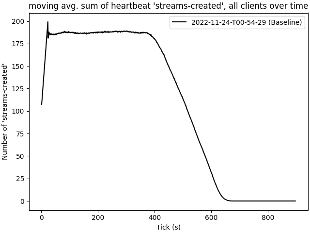

# 2022-11-24-T00-54-29

| Key | Value |
|-----|-------|
| benchmark-sha | c588d55357bb9ee428196734c0c263e740bc9cf8 |
| comment | New TGen baseline |
| compare-to |  |
| compare-to-resolved |  |
| container | debian:bullseye-20220527-slim |
| dry-run | false |
| repeat | 1 |
| results-dir | tgen |
| runtime-args | --parallelism 24 |
| rust-version | rustc 1.65.0 (897e37553 2022-11-02) |
| shadow-label | Baseline |
| shadow-ref | main |
| shadow-sha | 21138058fe3c3d19afc78376500299761df302fd |
| sim-id | 2022-11-24-T00-54-29 |
| sim-to-run | tgennet-1000 |
| tgen-ref | b22a873ef48a1cc82014a76a307e71259fe7a03b |
| timestamp | 1669251269 |
| trigger | workflow_dispatch |
| update-symlink |  |
| workflow-name | Manual TGen Benchmark |

[plots/shadow.results.pdf](plots/shadow.results.pdf)

[plots/tgen.viz.pdf](plots/tgen.viz.pdf)

