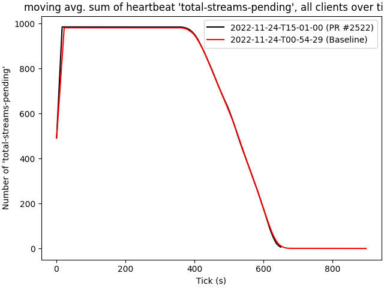

# 2022-11-24-T15-01-00

| Key | Value |
|-----|-------|
| benchmark-sha | 1e0e6aba6745148301be699f46ea828eb48228b0 |
| comment | Prioritize packet events before local events |
| compare-to | 2022-11-24-T00-54-29 |
| compare-to-resolved | 2022-11-24-T00-54-29 |
| container | debian:bullseye-20220527-slim |
| dry-run | false |
| repeat | 1 |
| results-dir | tgen |
| runtime-args | --parallelism 24 |
| rust-version | rustc 1.65.0 (897e37553 2022-11-02) |
| shadow-label | PR #2522 |
| shadow-ref | pull/2522/head |
| shadow-sha | 30da0d2ace500d8b892085647a5060207a3e8808 |
| sim-id | 2022-11-24-T15-01-00 |
| sim-to-run | tgennet-1000 |
| tgen-ref | b22a873ef48a1cc82014a76a307e71259fe7a03b |
| timestamp | 1669302060 |
| trigger | workflow_dispatch |
| update-symlink |  |
| workflow-name | Manual TGen Benchmark |

[plots/shadow.results.pdf](plots/shadow.results.pdf)

[plots/tgen.viz.pdf](plots/tgen.viz.pdf)

