# 2022-12-17-T03-03-52

| Key | Value |
|-----|-------|
| benchmark-sha | 9aea9e28f776f51fb7a478c322efb42711e43ea8 |
| comment | Weekly benchmark of the main branch |
| compare-to | 2022-11-24-T00-54-29, weekly, nightly |
| compare-to-resolved | 2022-11-24-T00-54-29, 2022-12-10-T03-04-25, 2022-12-16-T03-10-22 |
| container | debian:bullseye-20220527-slim |
| dry-run | false |
| repeat | 1 |
| results-dir | tgen |
| runtime-args | --parallelism 24 |
| rust-version | rustc 1.66.0 (69f9c33d7 2022-12-12) |
| shadow-label | Weekly benchmark |
| shadow-ref | main |
| shadow-sha | 894a63ca370db1bff903143d4f25a61b47f30422 |
| sim-id | 2022-12-17-T03-03-52 |
| sim-to-run | tgennet-1000 |
| tgen-ref | c979b74b031fe92ecea70600c8296c00576fcda7 |
| timestamp | 1671246232 |
| trigger | schedule |
| update-symlink | weekly |
| workflow-name | Weekly TGen Benchmark |

[plots/shadow.results.pdf](plots/shadow.results.pdf)

[plots/tgen.viz.pdf](plots/tgen.viz.pdf)

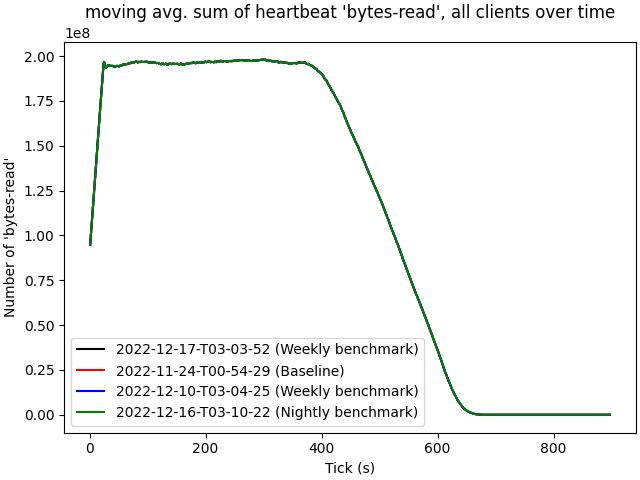

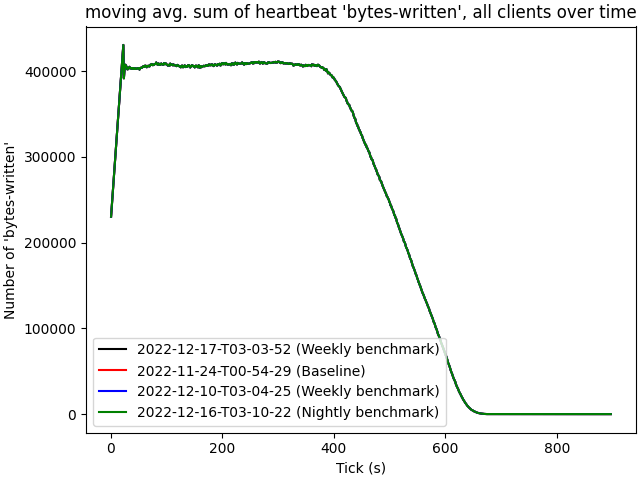

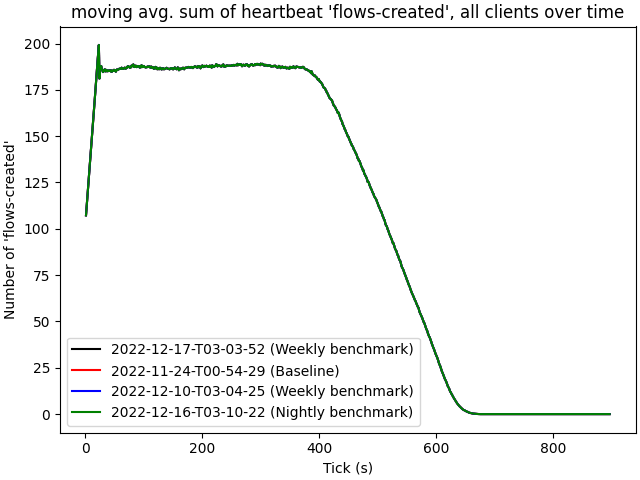

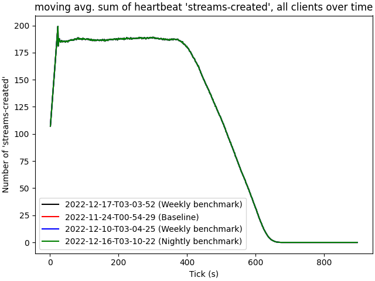

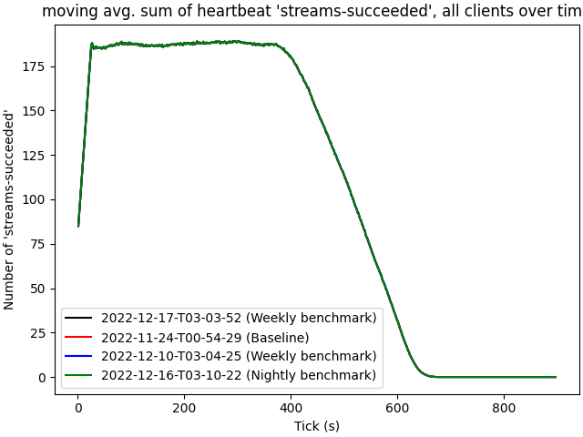

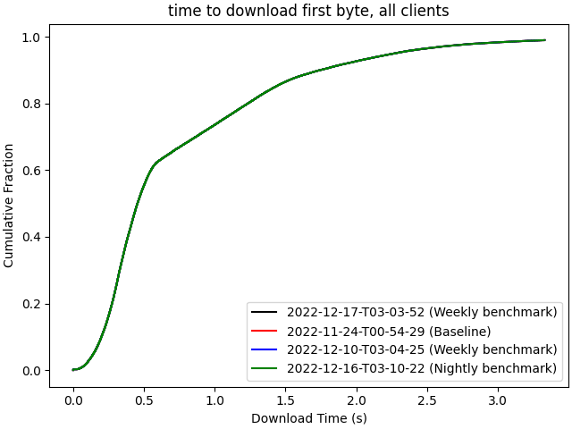

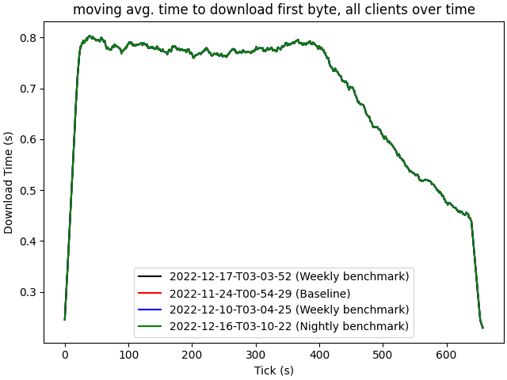

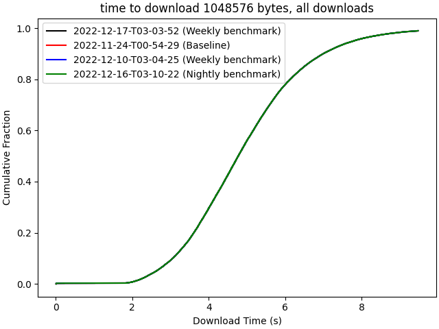

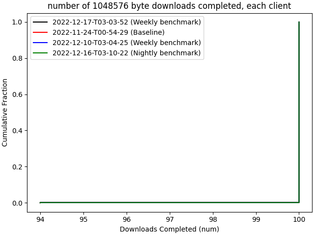

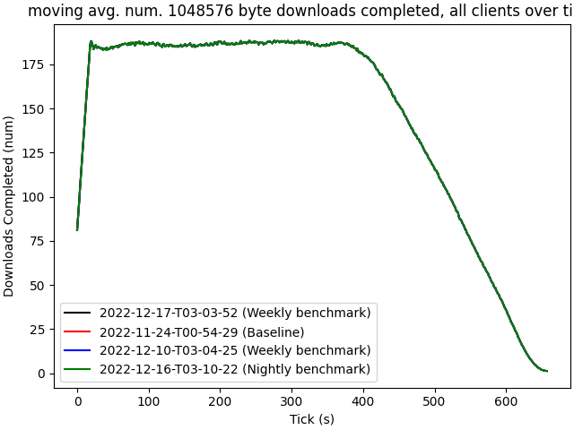

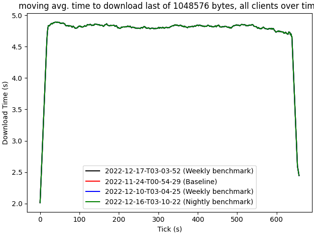

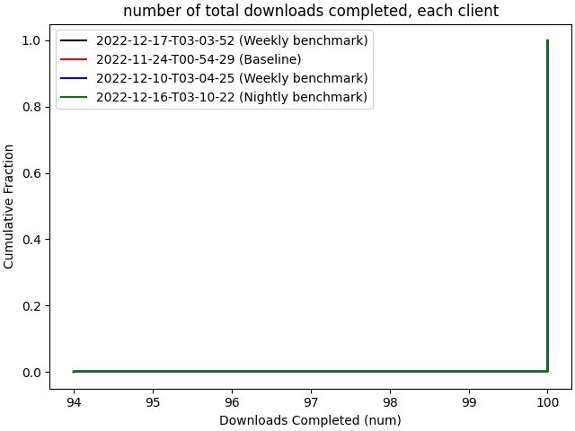

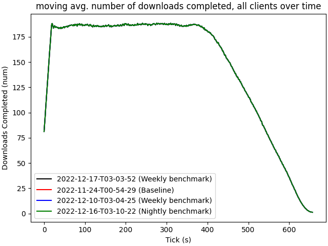

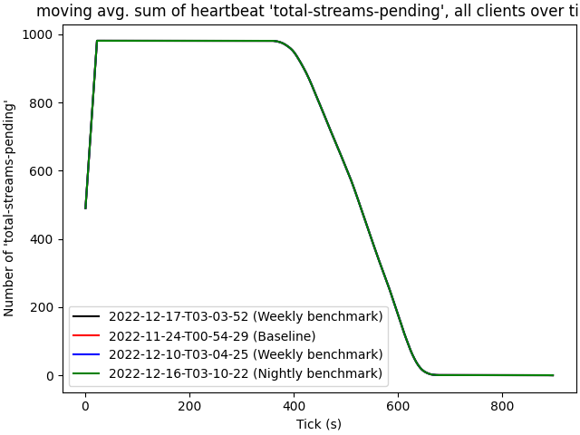
