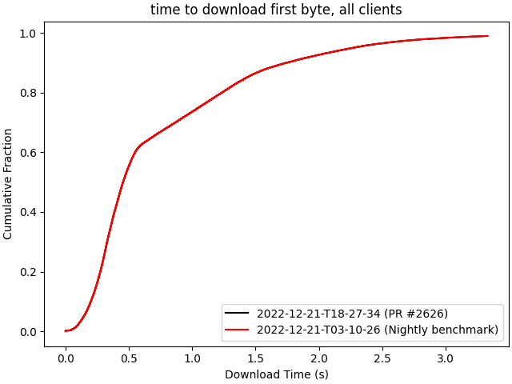
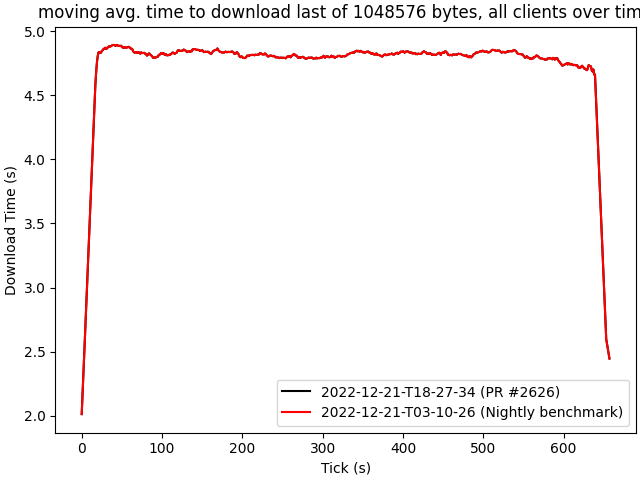

# 2022-12-21-T18-27-34

| Key | Value |
|-----|-------|
| benchmark-sha | 9aea9e28f776f51fb7a478c322efb42711e43ea8 |
| comment | PR undoes change that uses rust socket in network interface |
| compare-to | nightly |
| compare-to-resolved | 2022-12-21-T03-10-26 |
| container | debian:bullseye-20220527-slim |
| dry-run | false |
| repeat | 1 |
| results-dir | tgen |
| runtime-args | --parallelism 24 |
| rust-version |  |
| shadow-label | PR #2626 |
| shadow-ref | pull/2626/head |
| shadow-sha | c4aff6f05afb62b6604b98699b637b3af15d028b |
| sim-id | 2022-12-21-T18-27-34 |
| sim-to-run | tgennet-1000 |
| tgen-ref | c979b74b031fe92ecea70600c8296c00576fcda7 |
| timestamp | 1671647254 |
| trigger | workflow_dispatch |
| update-symlink |  |
| workflow-name | Manual TGen Benchmark |

[plots/shadow.results.pdf](plots/shadow.results.pdf)

[plots/tgen.viz.pdf](plots/tgen.viz.pdf)

