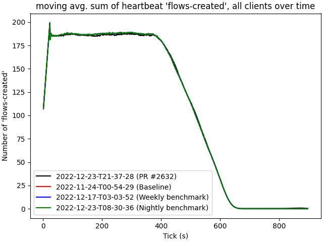

# 2022-12-23-T21-37-28

| Key | Value |
|-----|-------|
| benchmark-sha | 9aea9e28f776f51fb7a478c322efb42711e43ea8 |
| comment | Test Rust packet forwarder |
| compare-to | 2022-11-24-T00-54-29, weekly, nightly |
| compare-to-resolved | 2022-11-24-T00-54-29, 2022-12-17-T03-03-52, 2022-12-23-T08-30-36 |
| container | debian:bullseye-20220527-slim |
| dry-run | false |
| repeat | 1 |
| results-dir | tgen |
| runtime-args | --parallelism 24 |
| rust-version |  |
| shadow-label | PR #2632 |
| shadow-ref | pull/2632/head |
| shadow-sha | 813d8233c549b7aaa82a1248a0da38fbc9612941 |
| sim-id | 2022-12-23-T21-37-28 |
| sim-to-run | tgennet-1000 |
| tgen-ref | c979b74b031fe92ecea70600c8296c00576fcda7 |
| timestamp | 1671831448 |
| trigger | workflow_dispatch |
| update-symlink |  |
| workflow-name | Manual TGen Benchmark |

[plots/shadow.results.pdf](plots/shadow.results.pdf)

[plots/tgen.viz.pdf](plots/tgen.viz.pdf)

