# 2023-01-14-T03-05-46

| Key | Value |
|-----|-------|
| benchmark-sha | 9aea9e28f776f51fb7a478c322efb42711e43ea8 |
| comment | Weekly benchmark of the main branch |
| compare-to | 2022-11-24-T00-54-29, weekly, nightly |
| compare-to-resolved | 2022-11-24-T00-54-29, 2023-01-07-T03-04-45, 2023-01-13-T03-12-14 |
| container | debian:bullseye-20220527-slim |
| dry-run | false |
| repeat | 1 |
| results-dir | tgen |
| runtime-args | --parallelism 24 |
| rust-version |  |
| shadow-label | Weekly benchmark |
| shadow-ref | main |
| shadow-sha | e24a2e03e8330761abd3af3a19cc9817e53801a1 |
| sim-id | 2023-01-14-T03-05-46 |
| sim-to-run | tgennet-1000 |
| tgen-ref | c979b74b031fe92ecea70600c8296c00576fcda7 |
| timestamp | 1673665546 |
| trigger | schedule |
| update-symlink | weekly |
| workflow-name | Weekly TGen Benchmark |

[plots/shadow.results.pdf](plots/shadow.results.pdf)

[plots/tgen.viz.pdf](plots/tgen.viz.pdf)

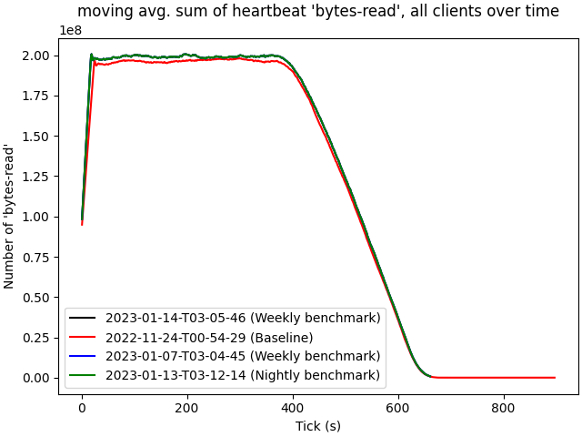

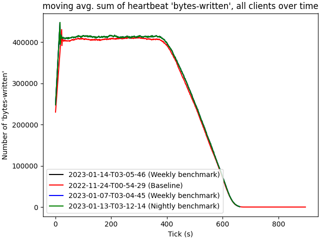

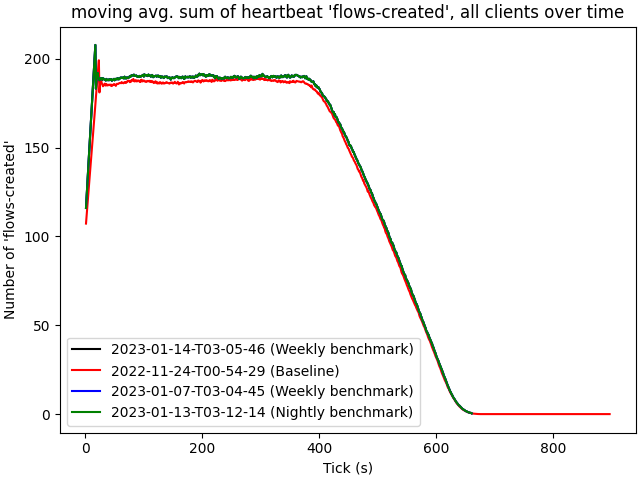

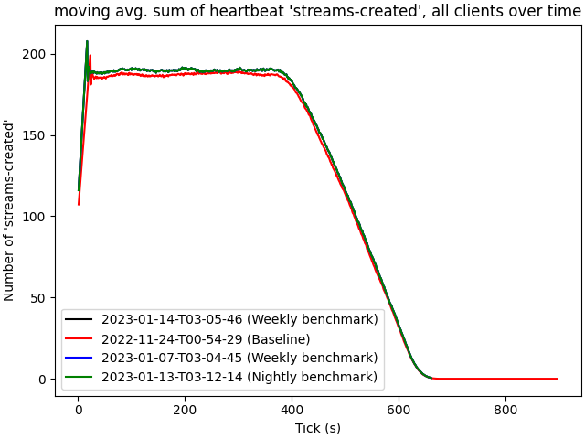

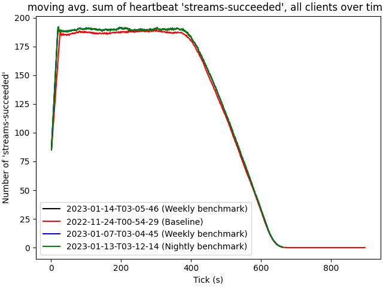

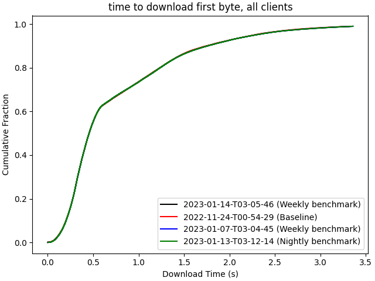

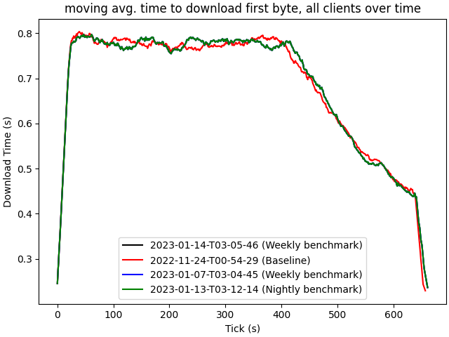

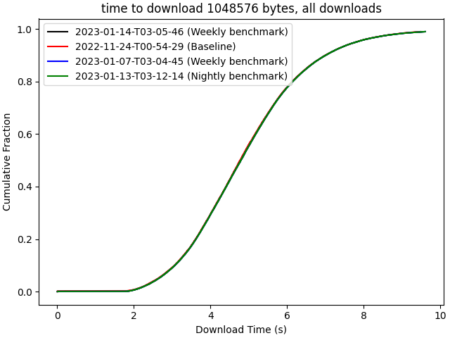

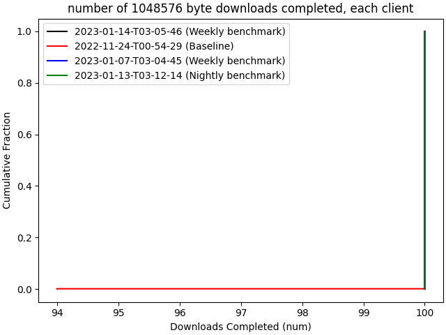

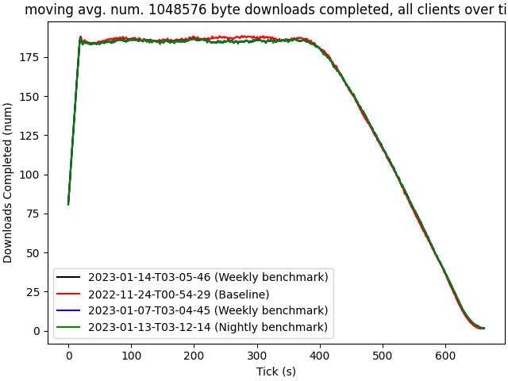

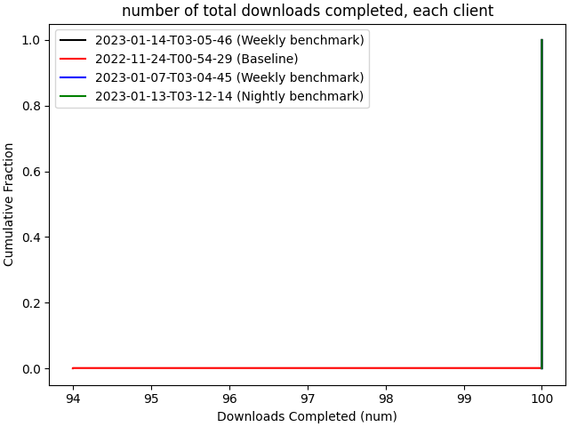

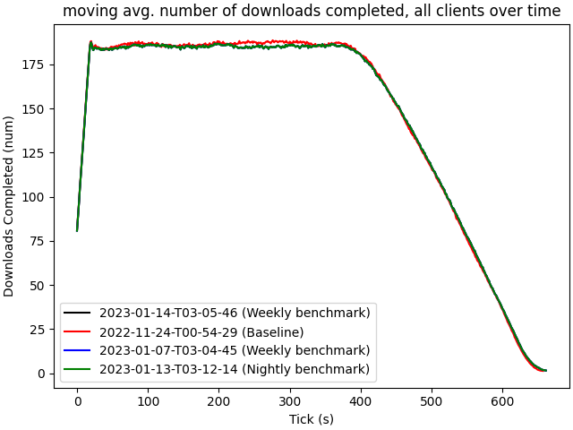

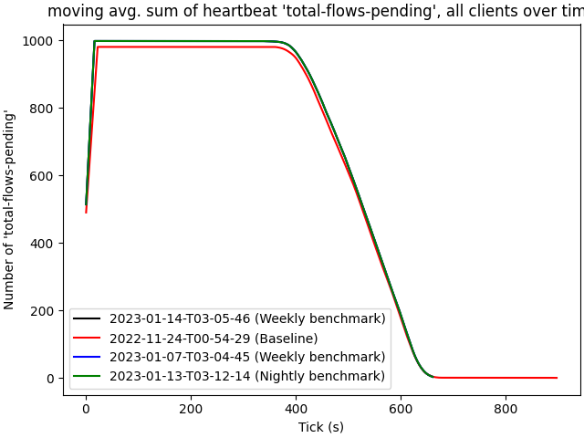

