# 2023-01-24-T03-20-22

| Key | Value |
|-----|-------|
| benchmark-sha | 632f5e9fecd8cd49b315529576df554e8844f1e7 |
| comment | Nightly benchmark of the main branch |
| compare-to | 2022-11-24-T00-54-29, weekly, nightly |
| compare-to-resolved | 2022-11-24-T00-54-29, 2023-01-21-T03-04-51, 2023-01-20-T03-13-13 |
| container | debian:bullseye-20220527-slim |
| dry-run | false |
| repeat | 1 |
| results-dir | tgen |
| runtime-args | --parallelism 24 |
| rust-version |  |
| shadow-label | Nightly benchmark |
| shadow-ref | main |
| shadow-sha | 34fe9d83186fc084257cd3a50e681db754b28fd3 |
| sim-id | 2023-01-24-T03-20-22 |
| sim-to-run | tgennet-1000 |
| tgen-ref | fa98ebdcd309e1e5a3d9596e58dda05efd99c5e7 |
| timestamp | 1674530422 |
| trigger | schedule |
| update-symlink | nightly |
| workflow-name | Nightly TGen Benchmark |

[plots/shadow.results.pdf](plots/shadow.results.pdf)

[plots/tgen.viz.pdf](plots/tgen.viz.pdf)

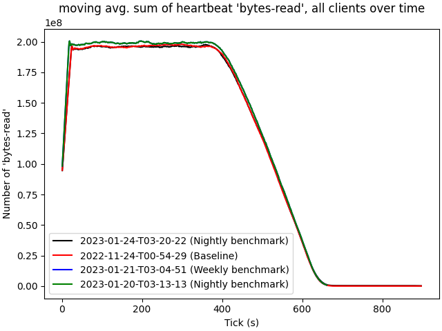

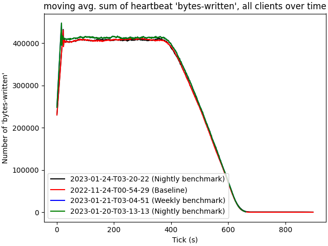

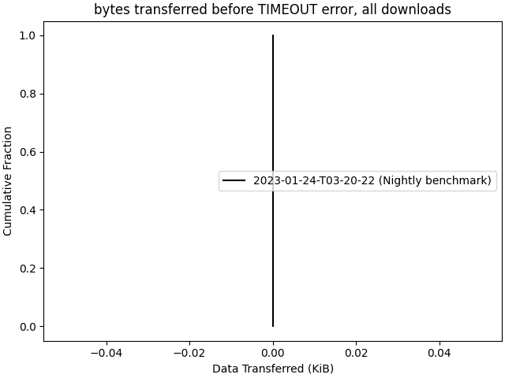

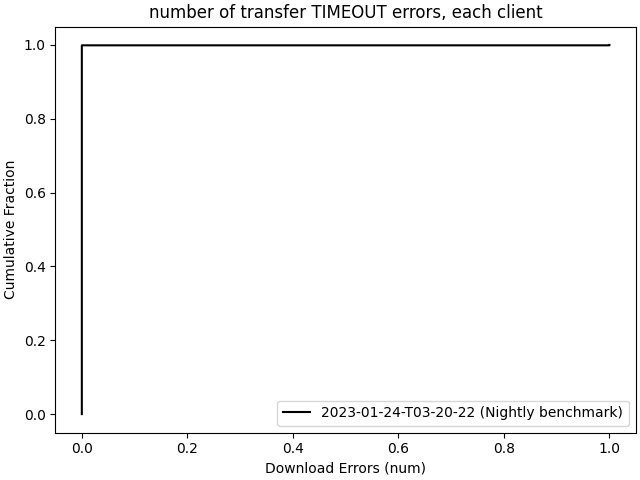

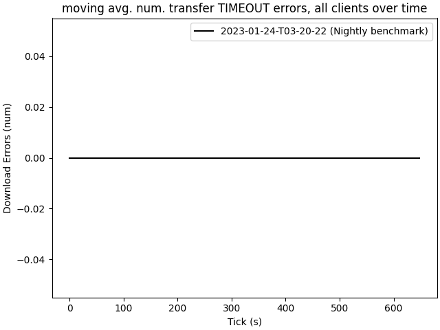

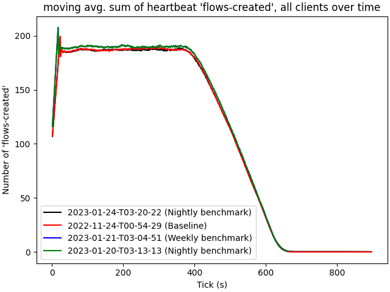

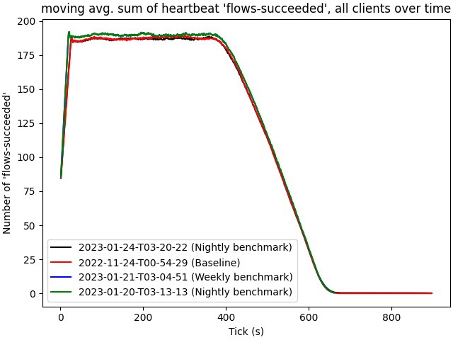

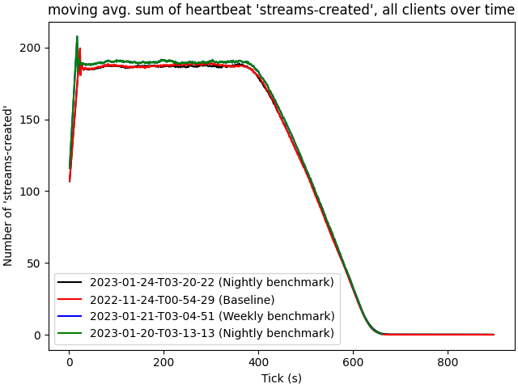

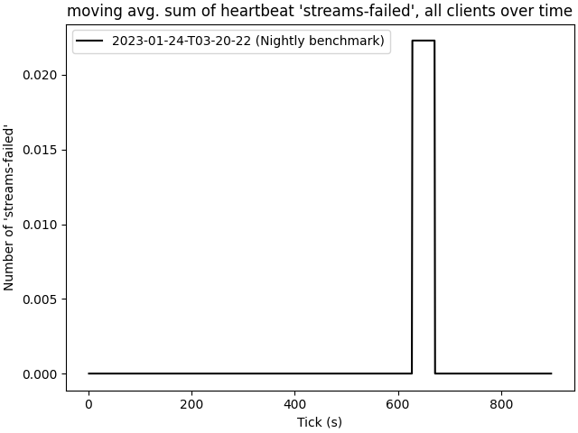

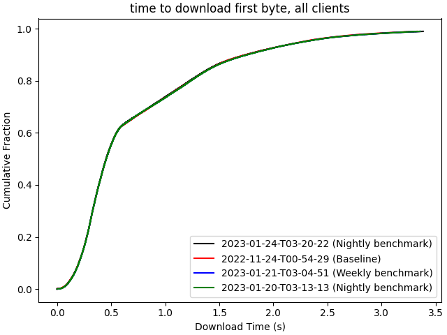

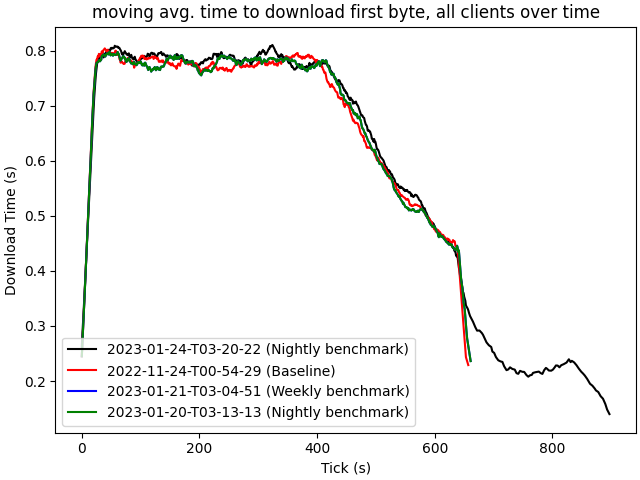

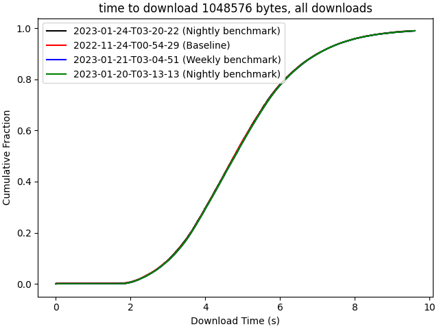

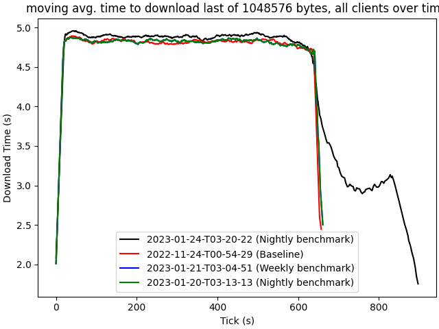

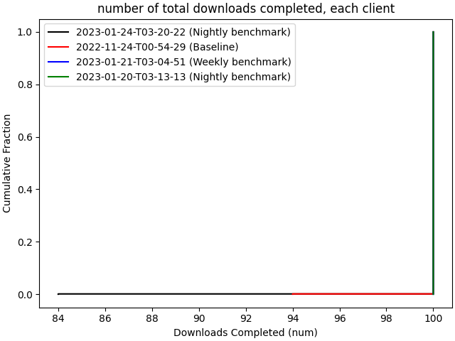

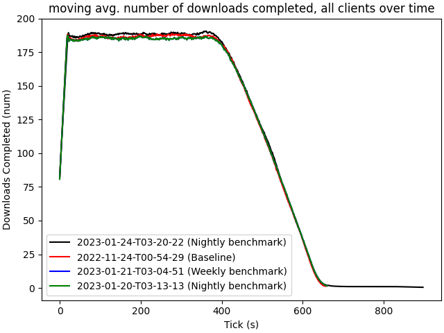

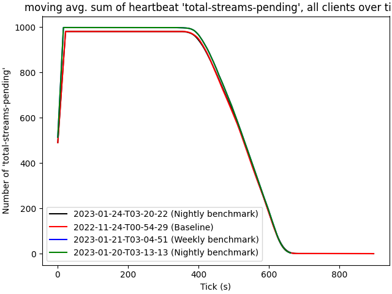
