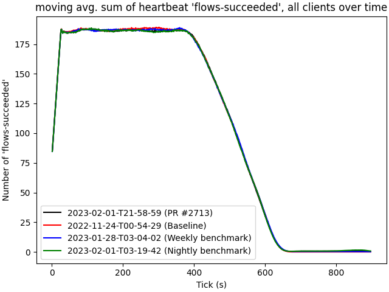
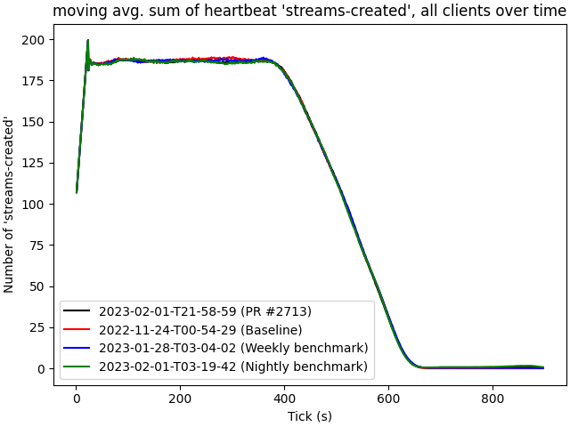

# 2023-02-01-T21-58-59

| Key | Value |
|-----|-------|
| benchmark-sha | 632f5e9fecd8cd49b315529576df554e8844f1e7 |
| comment | "Support rust InetSockets in the network interface" |
| compare-to | 2022-11-24-T00-54-29, weekly, nightly |
| compare-to-resolved | 2022-11-24-T00-54-29, 2023-01-28-T03-04-02, 2023-02-01-T03-19-42 |
| container | debian:bullseye-20220527-slim |
| dry-run | false |
| repeat | 1 |
| results-dir | tgen |
| runtime-args | --parallelism 24 |
| rust-version |  |
| shadow-label | PR #2713 |
| shadow-ref | pull/2713/head |
| shadow-sha | 54907871d0defc57f796be2d43ce2854697abddc |
| sim-id | 2023-02-01-T21-58-59 |
| sim-to-run | tgennet-1000 |
| tgen-ref | fa98ebdcd309e1e5a3d9596e58dda05efd99c5e7 |
| timestamp | 1675288739 |
| trigger | workflow_dispatch |
| update-symlink |  |
| workflow-name | Manual TGen Benchmark |

[plots/shadow.results.pdf](plots/shadow.results.pdf)

[plots/tgen.viz.pdf](plots/tgen.viz.pdf)

