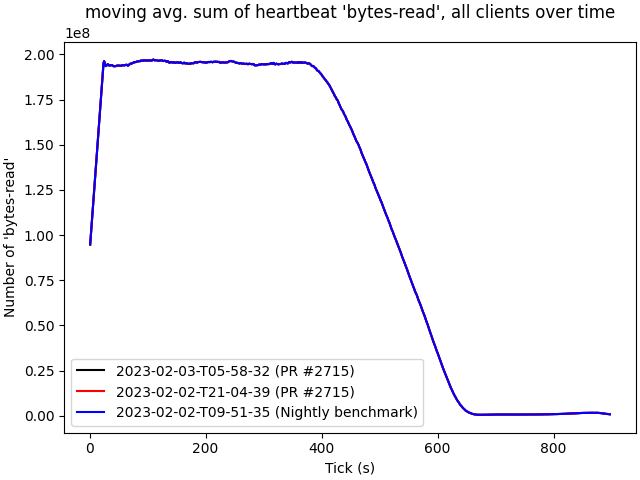

# 2023-02-03-T05-58-32

| Key | Value |
|-----|-------|
| benchmark-sha | 7f8175066999e187de0f48beb43123fdf1020633 |
| comment | "Support Rust listeners on C LegacyFiles" - Using RefCell |
| compare-to | 2023-02-02-T21-04-39, 2023-02-02-T09-51-35 |
| compare-to-resolved | 2023-02-02-T21-04-39, 2023-02-02-T09-51-35 |
| container | debian:bullseye-20220527-slim |
| dry-run | false |
| repeat | 1 |
| results-dir | tgen |
| runtime-args | --parallelism 24 |
| rust-version |  |
| shadow-label | PR #2715 |
| shadow-ref | pull/2715/head |
| shadow-sha | 8725fcb356c5d4f1765b6169c1af34878ab451f0 |
| sim-id | 2023-02-03-T05-58-32 |
| sim-to-run | tgennet-1000 |
| tgen-ref | fa98ebdcd309e1e5a3d9596e58dda05efd99c5e7 |
| timestamp | 1675403912 |
| trigger | workflow_dispatch |
| update-symlink |  |
| workflow-name | Manual TGen Benchmark |

[plots/shadow.results.pdf](plots/shadow.results.pdf)

[plots/tgen.viz.pdf](plots/tgen.viz.pdf)

