# 2023-03-02-T03-19-20

| Key | Value |
|-----|-------|
| benchmark-sha | 7f8175066999e187de0f48beb43123fdf1020633 |
| comment | Nightly benchmark of the main branch |
| compare-to | 2022-11-24-T00-54-29, weekly, nightly |
| compare-to-resolved | 2022-11-24-T00-54-29, 2023-02-25-T03-11-01, 2023-03-01-T03-24-50 |
| container | debian:bullseye-20220527-slim |
| dry-run | false |
| repeat | 1 |
| results-dir | tgen |
| runtime-args | --parallelism 24 |
| rust-version |  |
| shadow-label | Nightly benchmark |
| shadow-ref | main |
| shadow-sha | 08375bf2c8c19408527dc641815208dee5c884ca |
| sim-id | 2023-03-02-T03-19-20 |
| sim-to-run | tgennet-1000 |
| tgen-ref | fa98ebdcd309e1e5a3d9596e58dda05efd99c5e7 |
| timestamp | 1677727160 |
| trigger | schedule |
| update-symlink | nightly |
| workflow-name | Nightly TGen Benchmark |

[plots/shadow.results.pdf](plots/shadow.results.pdf)

[plots/tgen.viz.pdf](plots/tgen.viz.pdf)

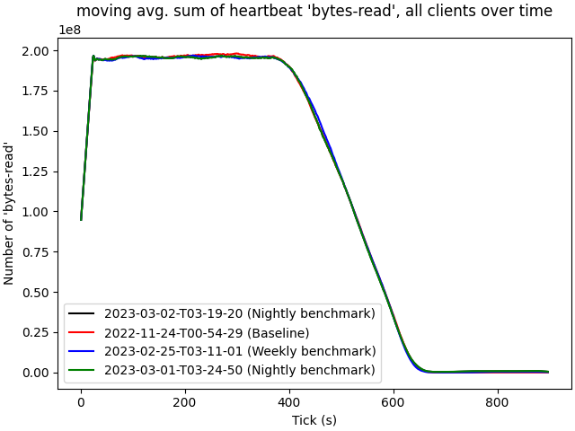

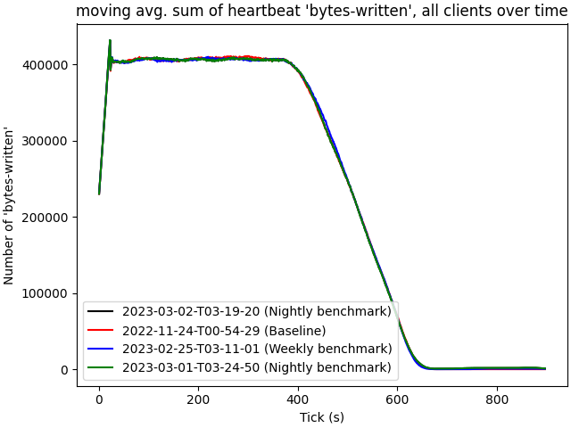

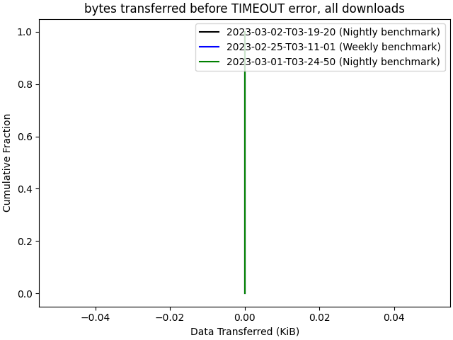

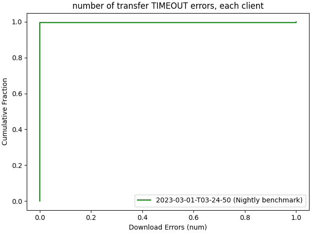

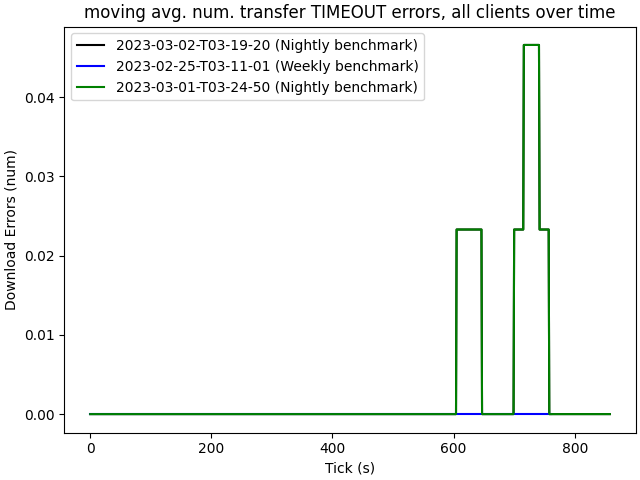

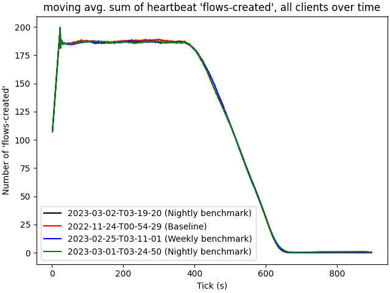

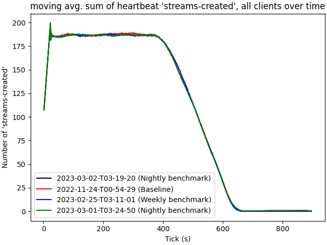

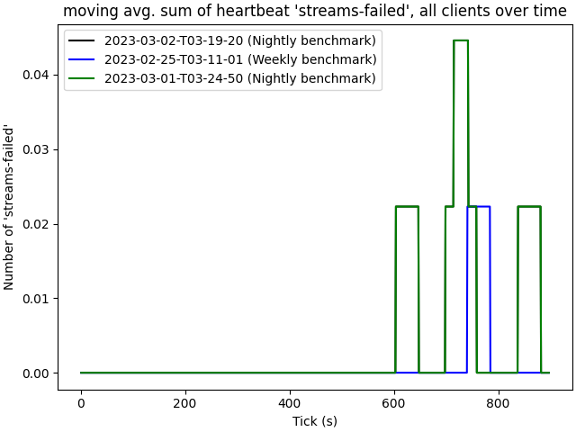

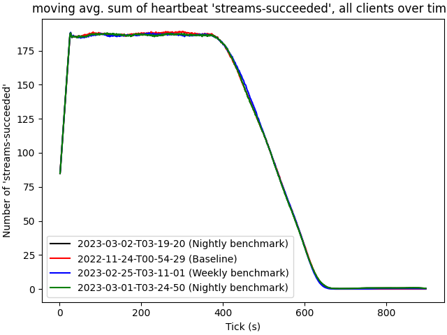

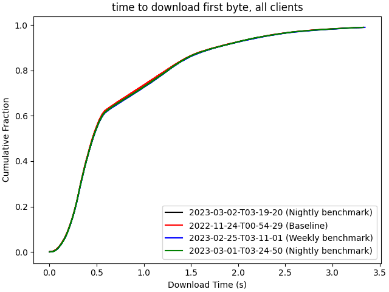

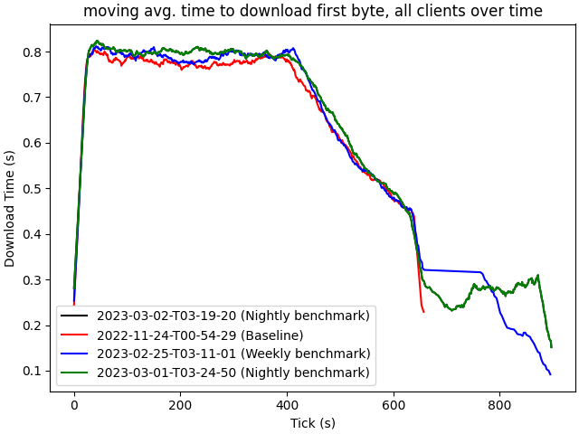

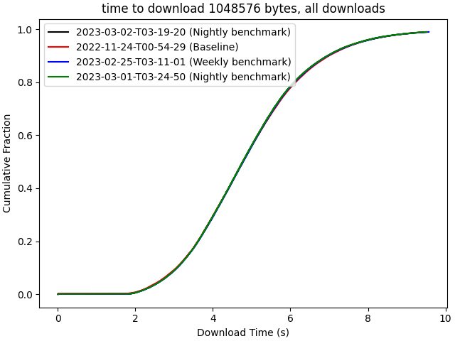

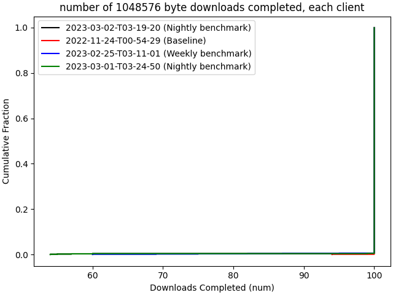

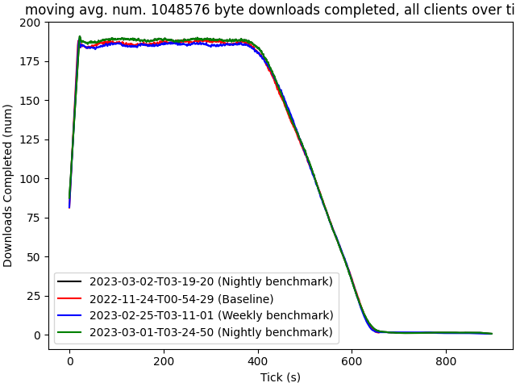

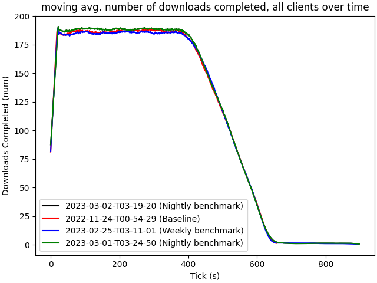

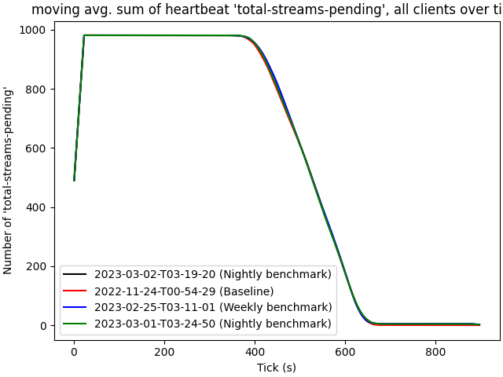
