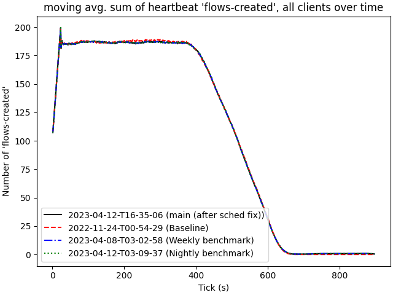
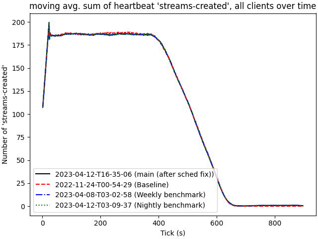
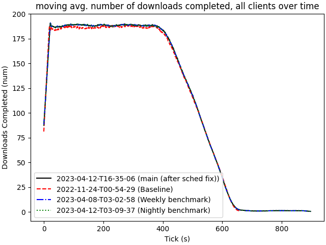

# 2023-04-12-T16-35-06

| Key | Value |
|-----|-------|
| benchmark-sha | b9ea842b299312f8cbf7daf0995f57c3c010bbf6 |
| comment | Confirming that we fixed the scheduler in #2866. |
| compare-to | 2022-11-24-T00-54-29, weekly, nightly |
| compare-to-resolved | 2022-11-24-T00-54-29, 2023-04-08-T03-02-58, 2023-04-12-T03-09-37 |
| container | debian:bullseye-20220527-slim |
| dry-run | false |
| repeat | 1 |
| results-dir | tgen |
| runtime-args | --parallelism 24 |
| rust-version |  |
| shadow-label | main (after sched fix) |
| shadow-ref | main |
| shadow-sha | 5e93e78850e5da2151ebad6225a0ca0328d2e6f3 |
| sim-id | 2023-04-12-T16-35-06 |
| sim-to-run | tgennet-1000 |
| tgen-ref | 3d7788bad362b4487d1145da93ab2fdb73c9b639 |
| timestamp | 1681317306 |
| trigger | workflow_dispatch |
| update-symlink |  |
| workflow-name | Manual TGen Benchmark |

[plots/shadow.results.pdf](plots/shadow.results.pdf)

[plots/tgen.viz.pdf](plots/tgen.viz.pdf)

