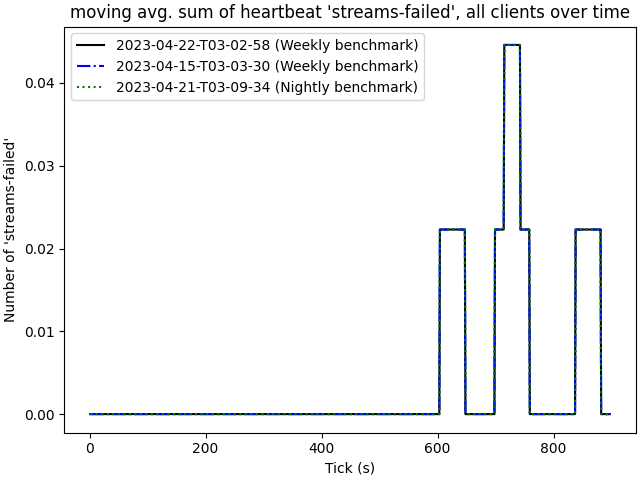

# 2023-04-22-T03-02-58

| Key | Value |
|-----|-------|
| benchmark-sha | 7893f228ef83bd5b815beba60715b21c1079f782 |
| comment | Weekly benchmark of the main branch |
| compare-to | 2022-11-24-T00-54-29, weekly, nightly |
| compare-to-resolved | 2022-11-24-T00-54-29, 2023-04-15-T03-03-30, 2023-04-21-T03-09-34 |
| container | debian:bullseye-20220527-slim |
| dry-run | false |
| repeat | 1 |
| results-dir | tgen |
| runtime-args | --parallelism 24 |
| rust-version |  |
| shadow-label | Weekly benchmark |
| shadow-ref | main |
| shadow-sha | 7372dcaef7489cc987d315755d95965f1d817cac |
| sim-id | 2023-04-22-T03-02-58 |
| sim-to-run | tgennet-1000 |
| tgen-ref | 3d7788bad362b4487d1145da93ab2fdb73c9b639 |
| timestamp | 1682132578 |
| trigger | schedule |
| update-symlink | weekly |
| workflow-name | Weekly TGen Benchmark |

[plots/shadow.results.pdf](plots/shadow.results.pdf)

[plots/tgen.viz.pdf](plots/tgen.viz.pdf)

