# 2023-05-06-T03-03-34

| Key | Value |
|-----|-------|
| benchmark-sha | da1ac114582b059d0400adf50b5f267722cda3bb |
| comment | Weekly benchmark of the main branch |
| compare-to | 2022-11-24-T00-54-29, weekly, nightly |
| compare-to-resolved | 2022-11-24-T00-54-29, 2023-04-29-T04-06-14, 2023-05-05-T03-09-45 |
| container | debian:bullseye-20220527-slim |
| dry-run | false |
| repeat | 1 |
| results-dir | tgen |
| runner-label | rhea |
| runtime-args | --parallelism 24 |
| rust-version |  |
| shadow-label | Weekly benchmark |
| shadow-ref | main |
| shadow-sha | 6cf1b376f7da9a4c6d4257810f164ab03c9980aa |
| sim-id | 2023-05-06-T03-03-34 |
| sim-to-run | tgennet-1000 |
| tgen-ref | 3d7788bad362b4487d1145da93ab2fdb73c9b639 |
| timestamp | 1683342214 |
| trigger | schedule |
| update-symlink | weekly |
| workflow-name | Weekly TGen Benchmark |

[plots/shadow.results.pdf](plots/shadow.results.pdf)

[plots/tgen.viz.pdf](plots/tgen.viz.pdf)

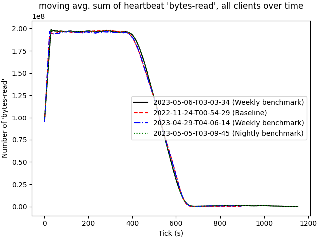

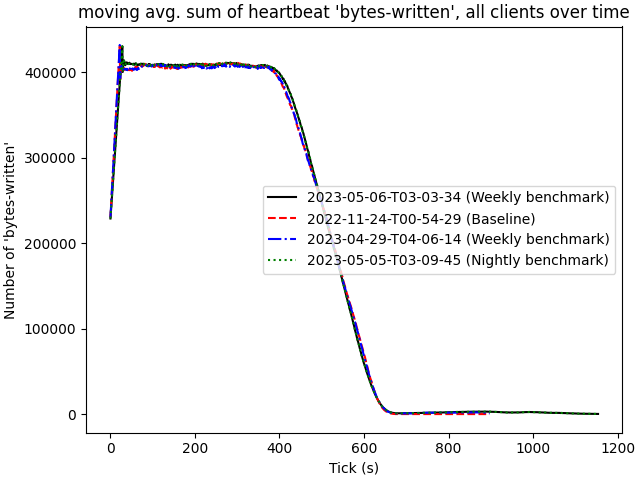

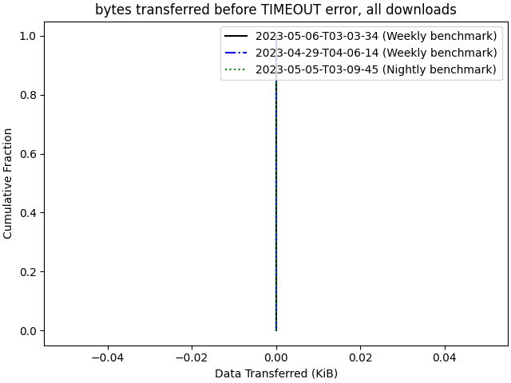

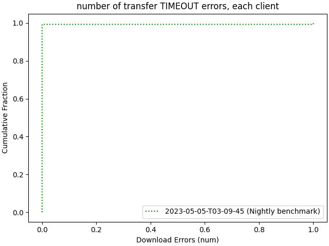

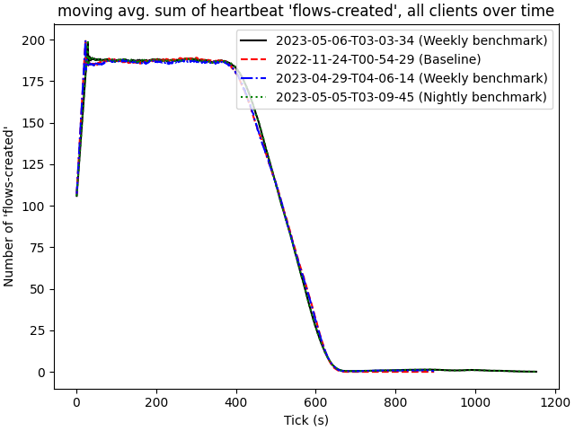

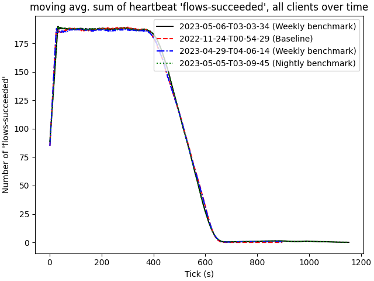

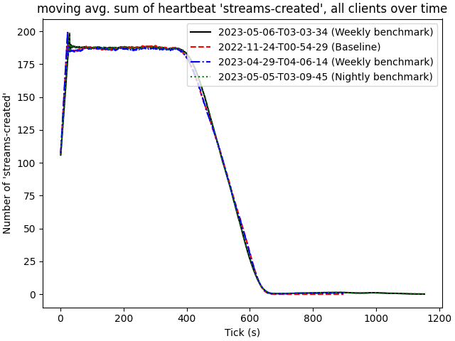

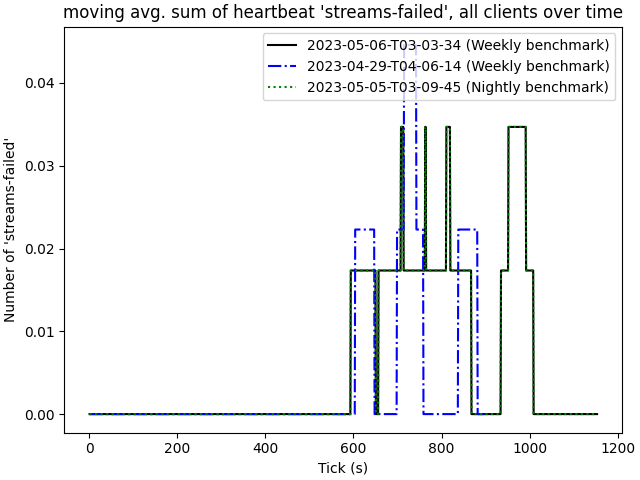

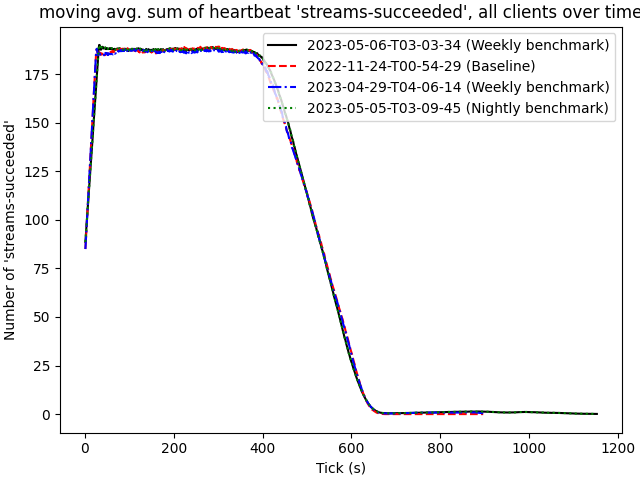

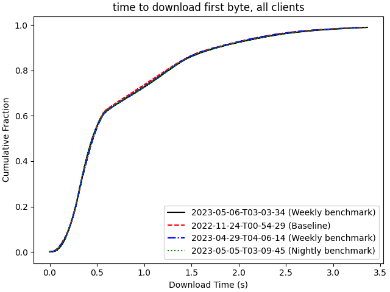

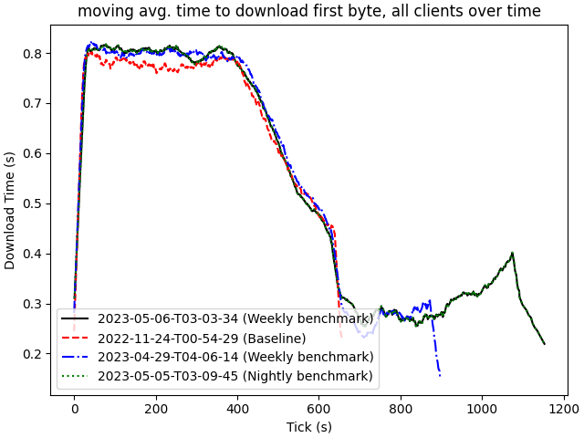

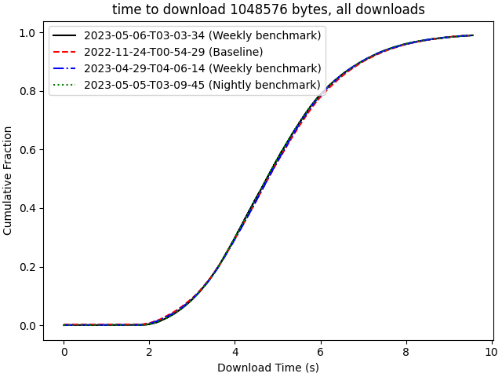

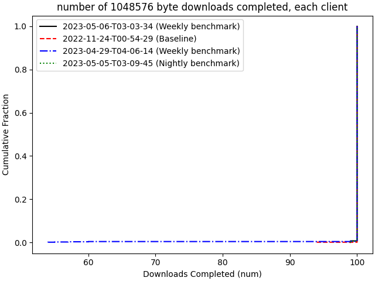

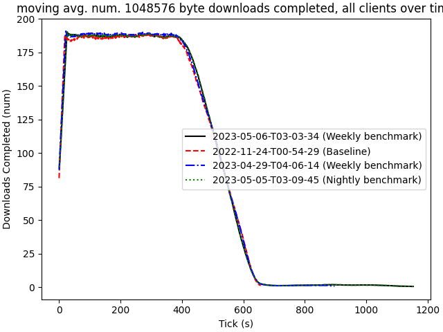

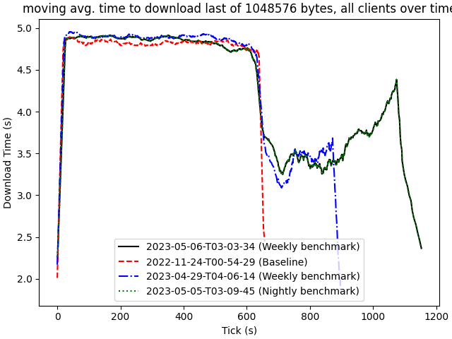

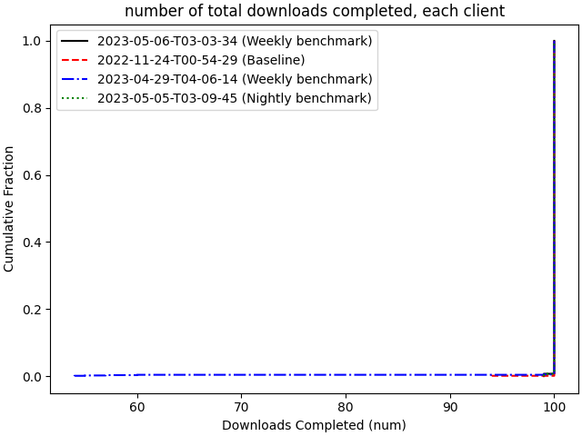

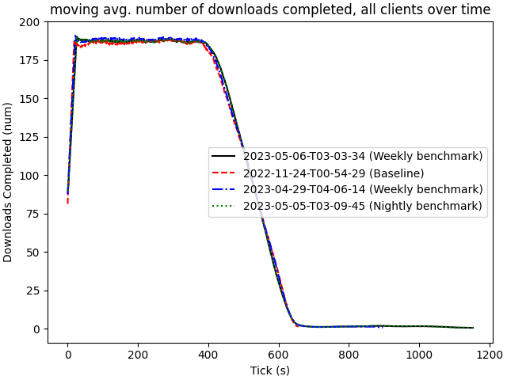

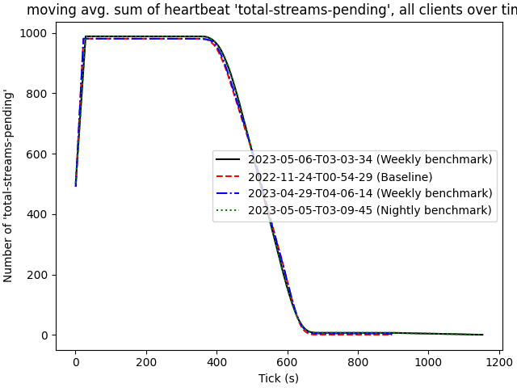
