# 2023-05-10-T03-09-18

| Key | Value |
|-----|-------|
| benchmark-sha | b04fb26204c710584521805dac307701b0c8cd65 |
| comment | Nightly benchmark of the main branch |
| compare-to | 2022-11-24-T00-54-29, weekly, nightly |
| compare-to-resolved | 2022-11-24-T00-54-29, 2023-05-06-T03-03-34, 2023-05-09-T03-10-00 |
| container | debian:bullseye-20230502-slim |
| dry-run | false |
| repeat | 1 |
| results-dir | tgen |
| runner-label | rhea |
| runtime-args | --parallelism 24 |
| rust-version |  |
| shadow-label | Nightly benchmark |
| shadow-ref | main |
| shadow-sha | 36a121222136f6fa0d9a3006c7ad3b3ca42c5aae |
| sim-id | 2023-05-10-T03-09-18 |
| sim-to-run | tgennet-1000 |
| tgen-ref | 30c95bbe723ebe5e4d068adfd975b094e00dbe10 |
| timestamp | 1683688158 |
| trigger | schedule |
| update-symlink | nightly |
| workflow-name | Nightly TGen Benchmark |

[plots/shadow.results.pdf](plots/shadow.results.pdf)

[plots/tgen.viz.pdf](plots/tgen.viz.pdf)

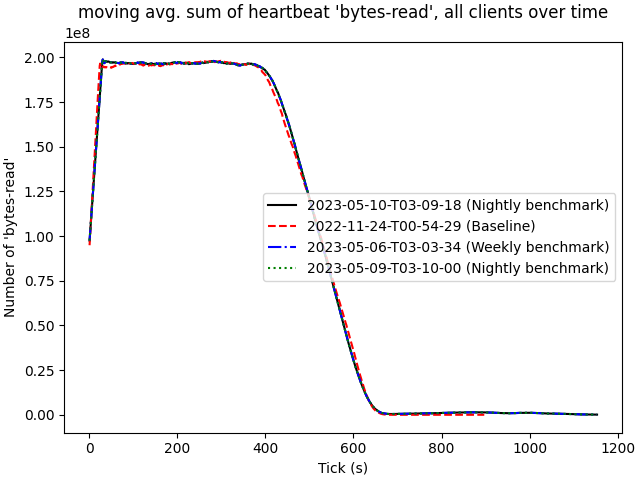

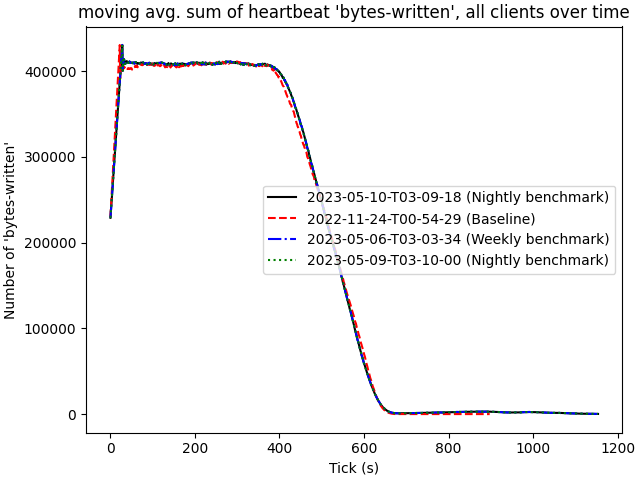

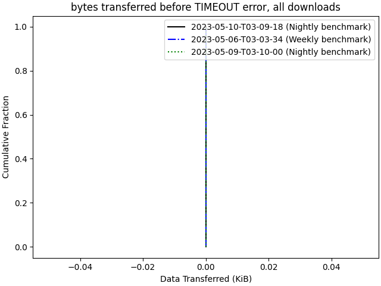

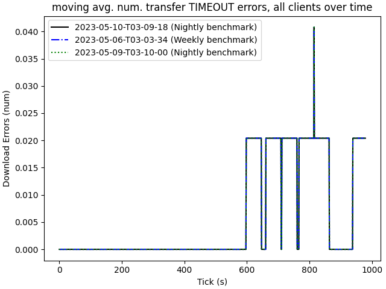

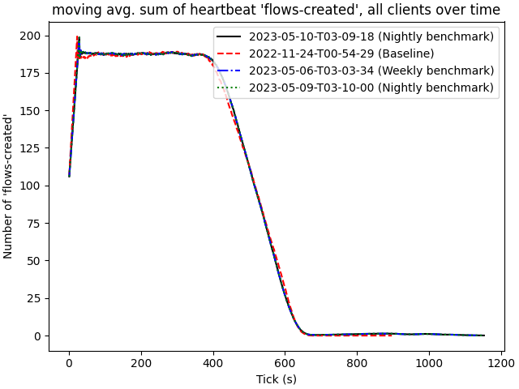

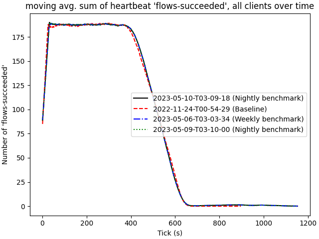

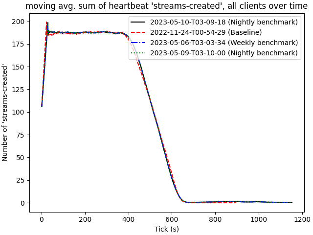

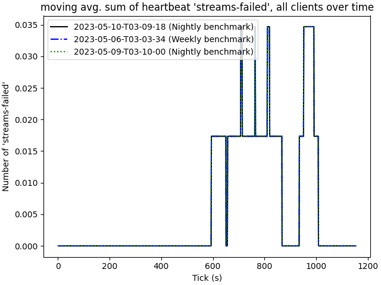

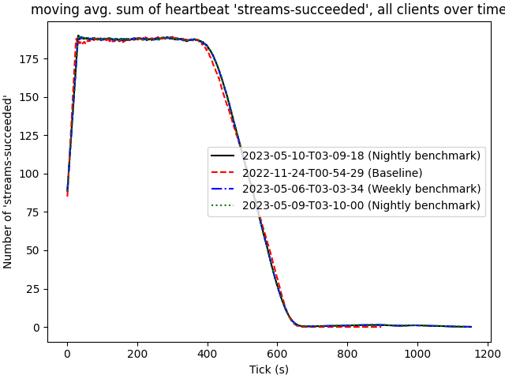

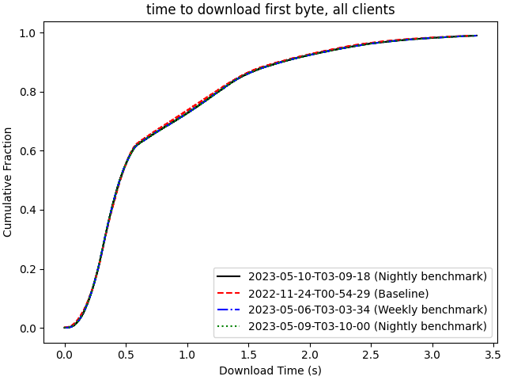

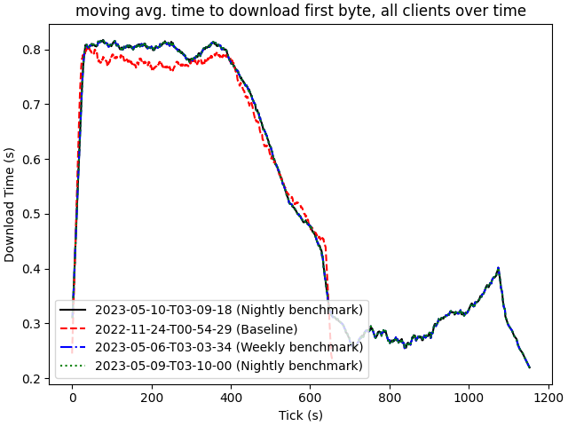

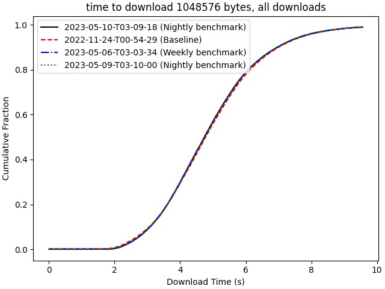

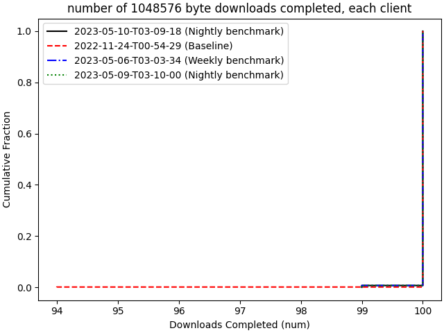

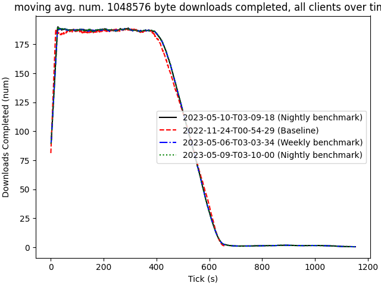

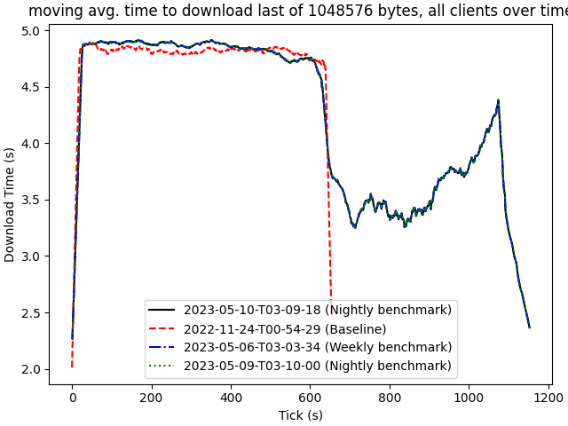

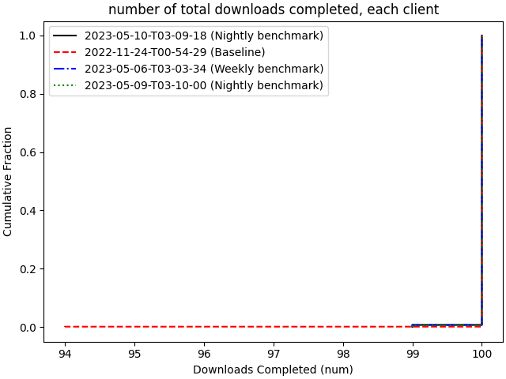

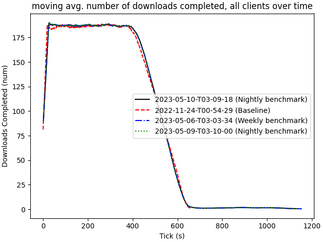

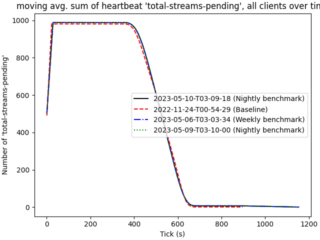
