# 2023-05-12-T03-09-47

| Key | Value |
|-----|-------|
| benchmark-sha | [b80504d202b9fcfba89f7b2fceaefb7b8cf4c40d](https://github.com/shadow/benchmark/commit/b80504d202b9fcfba89f7b2fceaefb7b8cf4c40d) |
| comment | Nightly benchmark of the main branch |
| compare-to | 2022-11-24-T00-54-29, weekly, nightly |
| compare-to-resolved | [2022-11-24-T00-54-29](/tgen/2022-11-24-T00-54-29/README.md), [2023-05-06-T03-03-34](/tgen/2023-05-06-T03-03-34/README.md), [2023-05-11-T03-09-33](/tgen/2023-05-11-T03-09-33/README.md) |
| container | debian:bullseye-20230502-slim |
| dry-run | false |
| repeat | 1 |
| results-dir | tgen |
| runner-label | rhea |
| runtime-args | --parallelism 24 |
| rust-version | rustc 1.69.0 (84c898d65 2023-04-16) |
| shadow-label | Nightly benchmark |
| shadow-ref | main |
| shadow-sha | [a1d9a9f51f0be5737c75a3d21780d5ff32e5a7cb](https://github.com/shadow/shadow/commit/a1d9a9f51f0be5737c75a3d21780d5ff32e5a7cb) |
| sim-id | 2023-05-12-T03-09-47 |
| sim-to-run | tgennet-1000 |
| tgen-ref | 30c95bbe723ebe5e4d068adfd975b094e00dbe10 |
| timestamp | 1683860987 |
| trigger | schedule |
| update-symlink | nightly |
| workflow-name | Nightly TGen Benchmark |

[plots/shadow.results.pdf](plots/shadow.results.pdf)

[plots/tgen.viz.pdf](plots/tgen.viz.pdf)

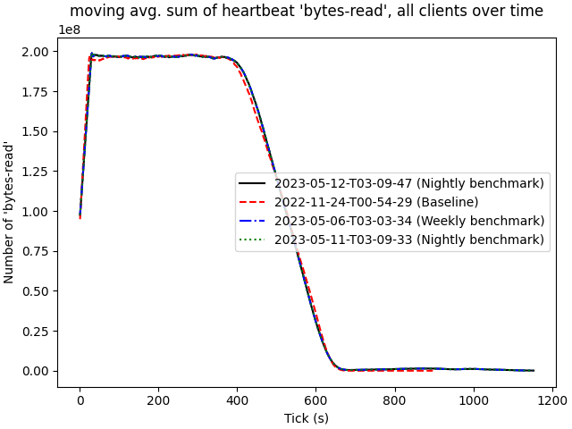

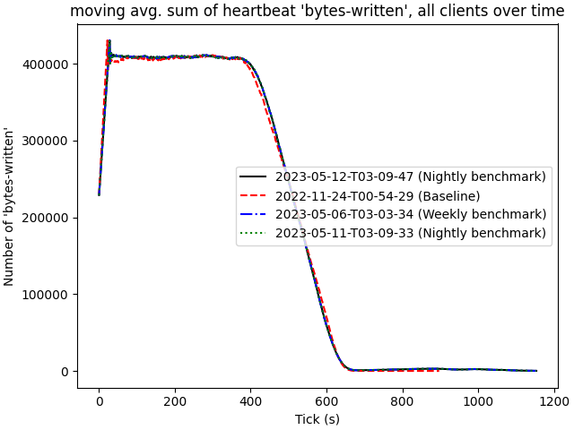

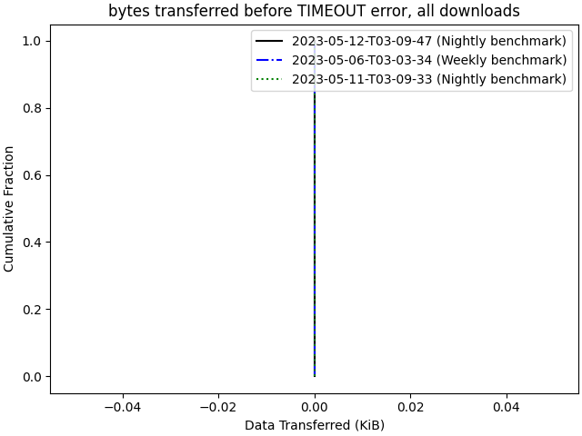

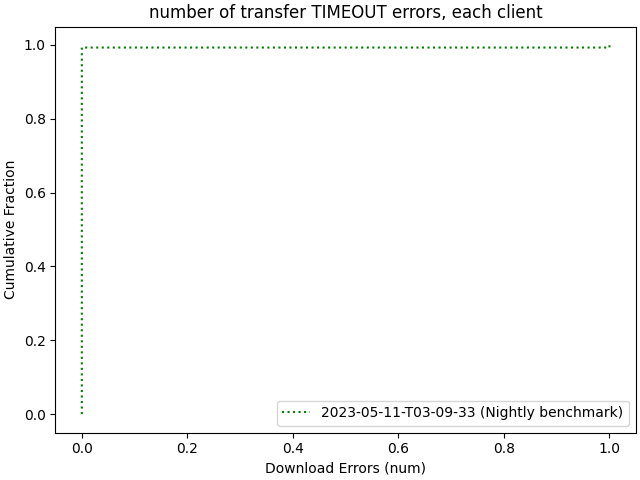

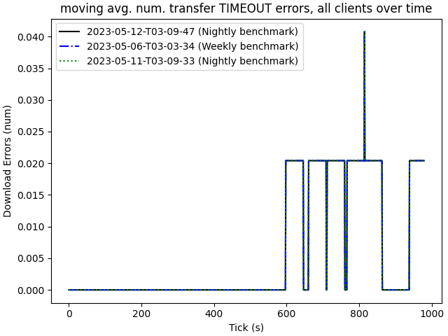

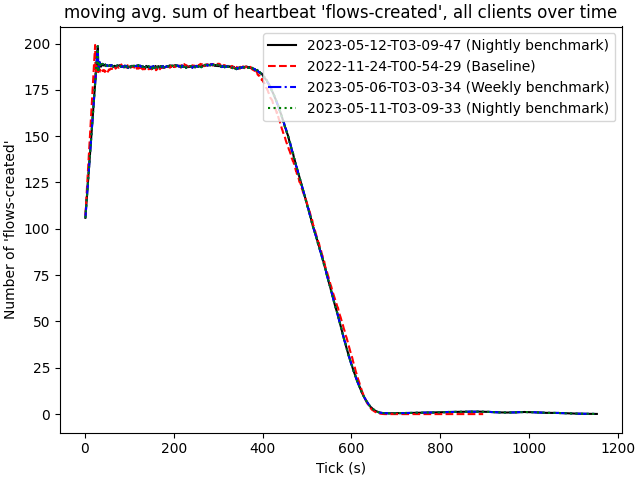

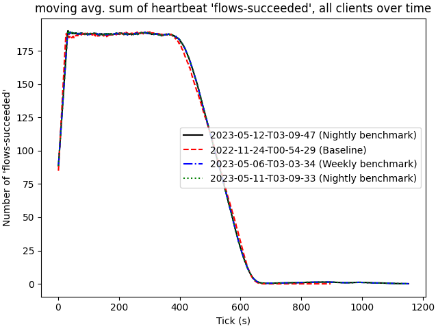

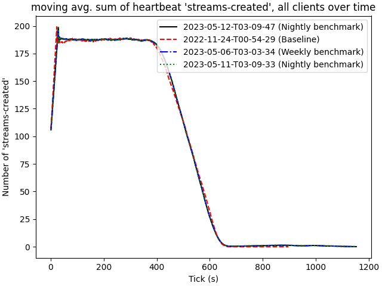

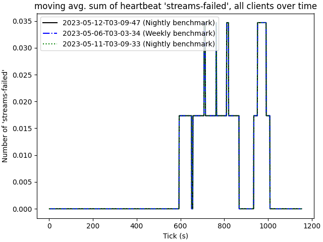

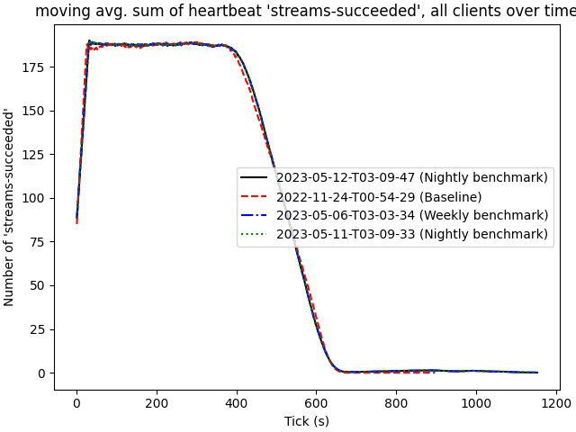

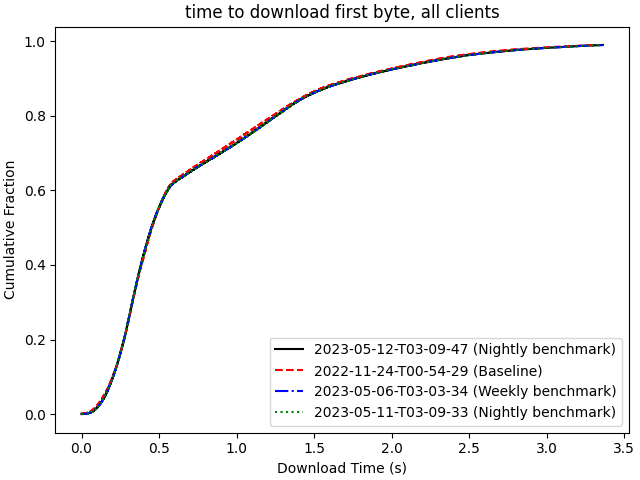

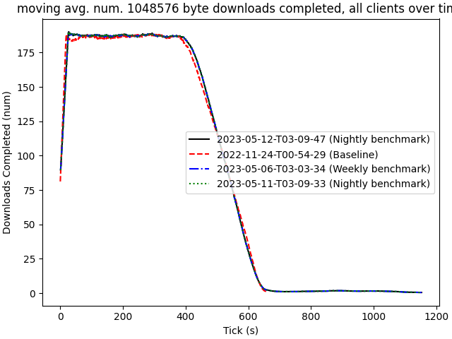

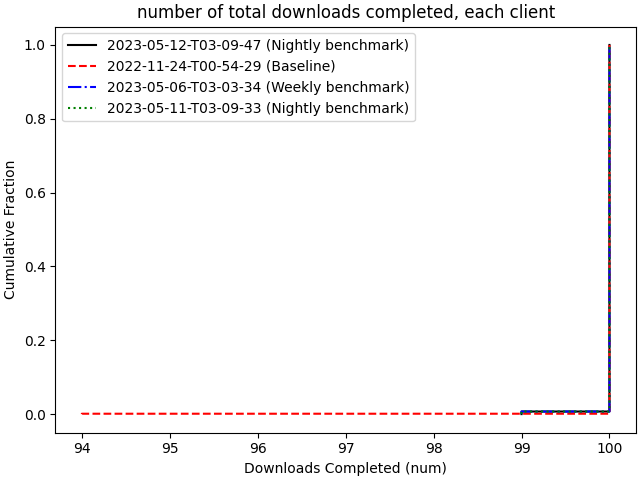

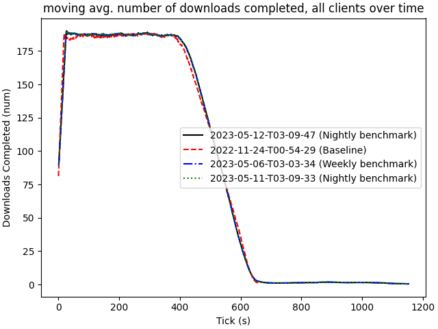

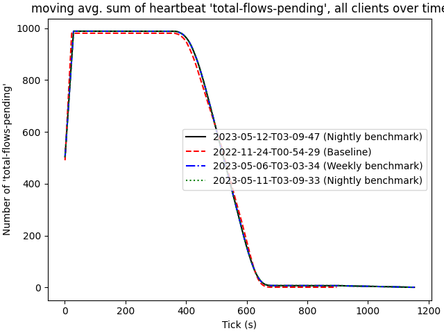

