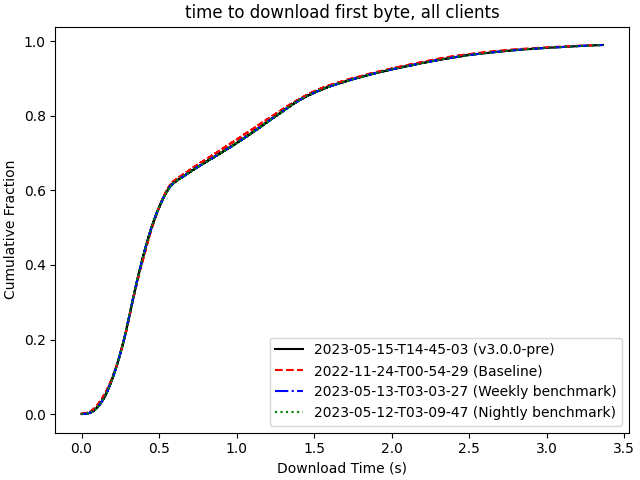

# 2023-05-15-T14-45-03

| Key | Value |
|-----|-------|
| benchmark-sha | [e8c028104807cc176db9e3f1701ca516f89d3247](https://github.com/shadow/benchmark/commit/e8c028104807cc176db9e3f1701ca516f89d3247) |
| comment | Baseline for v3.0.0-pre |
| compare-to | 2022-11-24-T00-54-29, weekly, nightly |
| compare-to-resolved | [2022-11-24-T00-54-29](/tgen/2022-11-24-T00-54-29/README.md), [2023-05-13-T03-03-27](/tgen/2023-05-13-T03-03-27/README.md), [2023-05-12-T03-09-47](/tgen/2023-05-12-T03-09-47/README.md) |
| container | debian:bullseye-20230502-slim |
| dry-run | false |
| repeat | 1 |
| results-dir | tgen |
| runner-label | rhea |
| runtime-args | --parallelism 24 |
| rust-version | rustc 1.69.0 (84c898d65 2023-04-16) |
| shadow-label | v3.0.0-pre |
| shadow-ref | v3.0.0-pre |
| shadow-sha | [6cf1b376f7da9a4c6d4257810f164ab03c9980aa](https://github.com/shadow/shadow/commit/6cf1b376f7da9a4c6d4257810f164ab03c9980aa) |
| sim-id | 2023-05-15-T14-45-03 |
| sim-to-run | tgennet-1000 |
| tgen-ref | 30c95bbe723ebe5e4d068adfd975b094e00dbe10 |
| timestamp | 1684161903 |
| trigger | workflow_dispatch |
| update-symlink |  |
| workflow-name | Manual TGen Benchmark |

[plots/shadow.results.pdf](plots/shadow.results.pdf)

[plots/tgen.viz.pdf](plots/tgen.viz.pdf)

