# 2023-05-19-T03-09-14

| Key | Value |
|-----|-------|
| benchmark-sha | [0c59307e232cf71be9fe6cb7d973b7acea09ae7d](https://github.com/shadow/benchmark/commit/0c59307e232cf71be9fe6cb7d973b7acea09ae7d) |
| comment | Nightly benchmark of the main branch |
| compare-to | nightly, weekly, 2023-05-15-T14-45-03 |
| compare-to-resolved | [2023-05-18-T03-09-31](/tgen/2023-05-18-T03-09-31/README.md), [2023-05-13-T03-03-27](/tgen/2023-05-13-T03-03-27/README.md), [2023-05-15-T14-45-03](/tgen/2023-05-15-T14-45-03/README.md) |
| container | debian:bullseye-20230502-slim |
| dry-run | false |
| repeat | 1 |
| results-dir | tgen |
| runner-label | rhea |
| runtime-args | --parallelism 24 |
| rust-version | rustc 1.69.0 (84c898d65 2023-04-16) |
| shadow-label | Nightly benchmark |
| shadow-ref | main |
| shadow-sha | [2789ee12241170afac607a9d4e741e093e3bad58](https://github.com/shadow/shadow/commit/2789ee12241170afac607a9d4e741e093e3bad58) |
| sim-id | 2023-05-19-T03-09-14 |
| sim-to-run | tgennet-1000 |
| tgen-ref | 30c95bbe723ebe5e4d068adfd975b094e00dbe10 |
| timestamp | 1684465754 |
| trigger | schedule |
| update-symlink | nightly |
| workflow-name | Nightly TGen Benchmark |

[plots/shadow.results.pdf](plots/shadow.results.pdf)

[plots/tgen.viz.pdf](plots/tgen.viz.pdf)

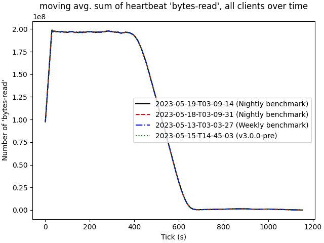

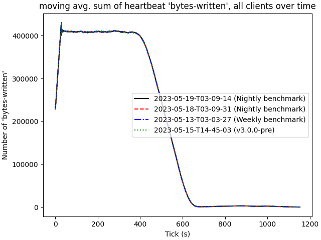

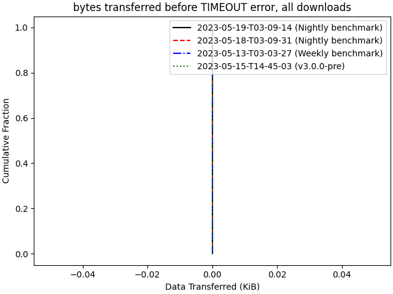

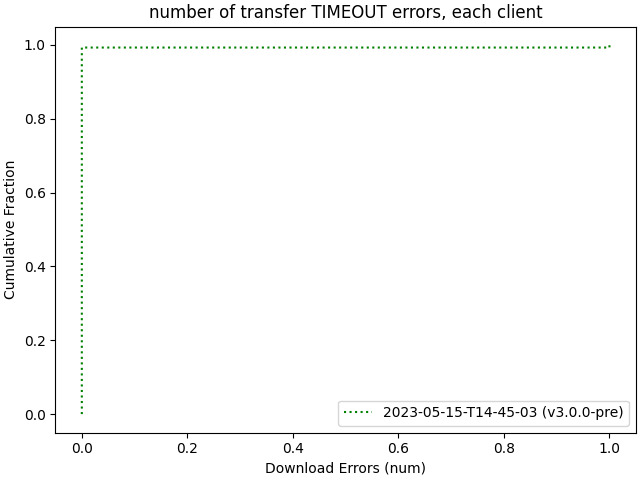

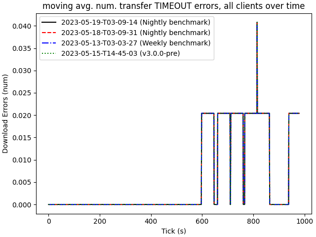

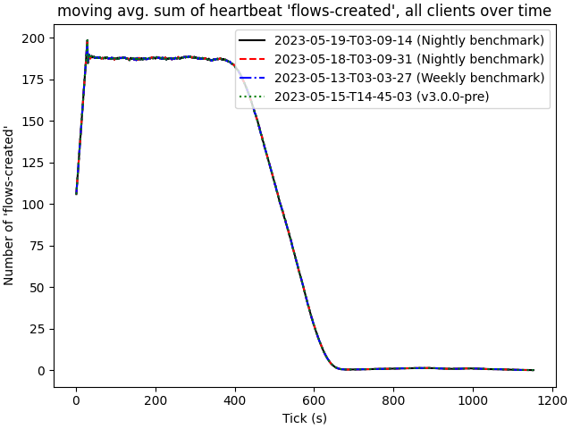

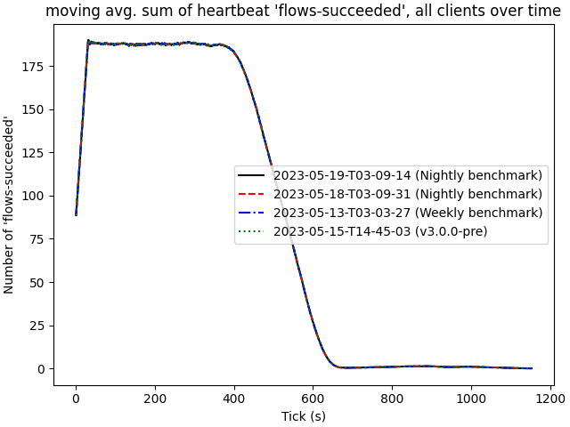

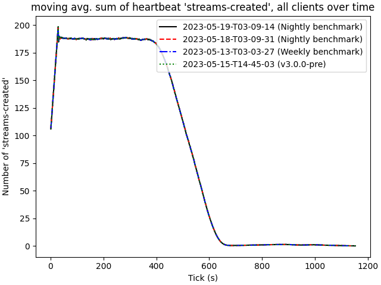

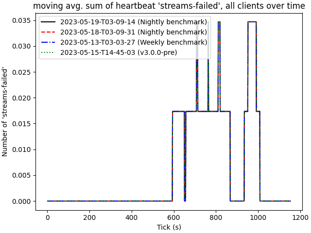

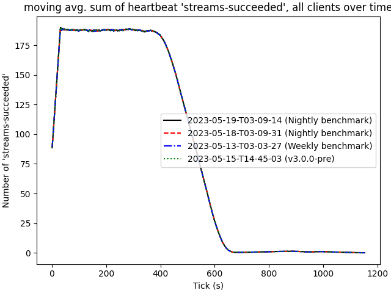

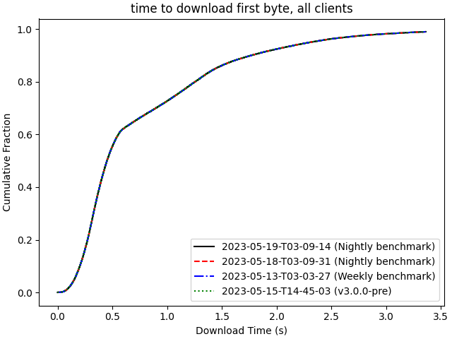

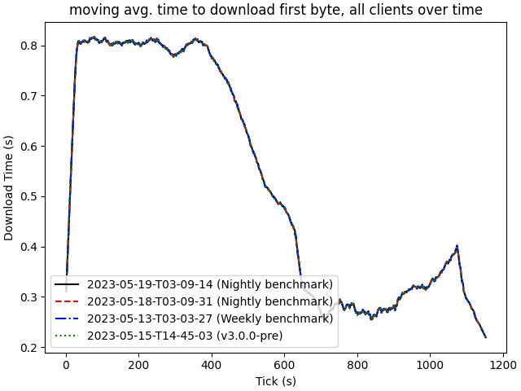

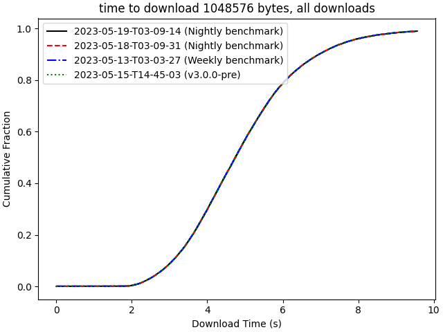

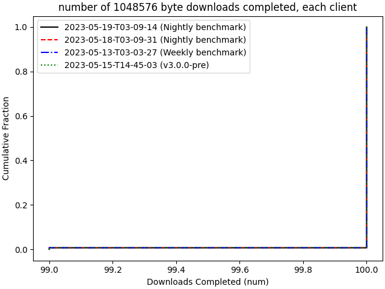

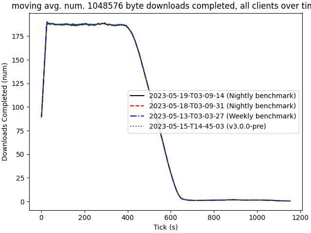

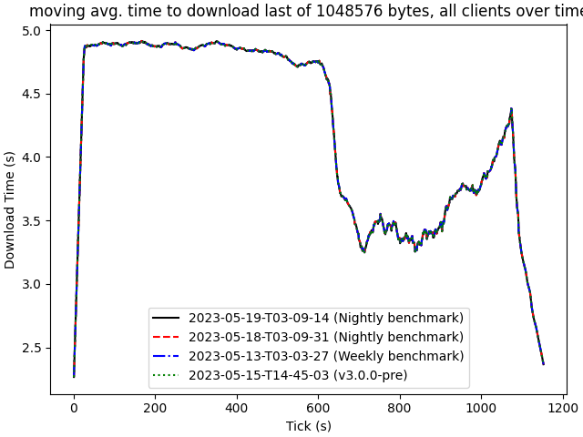

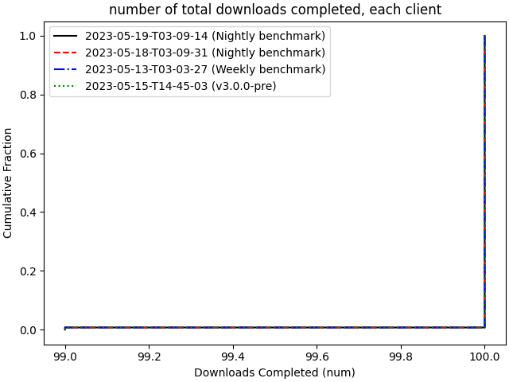

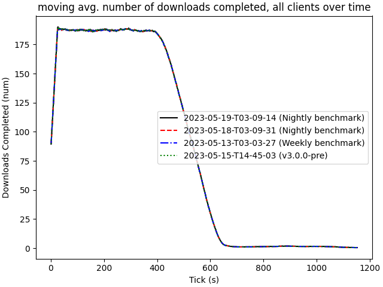

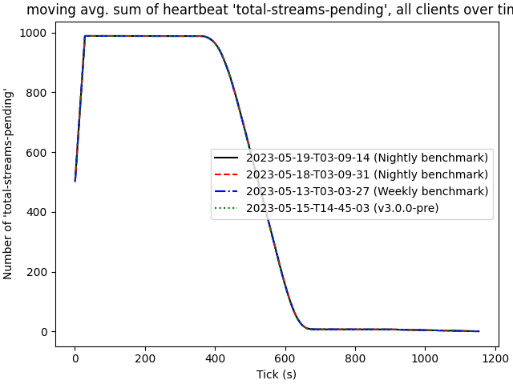
