# 2023-11-25-T03-03-43

| Key | Value |
|-----|-------|
| benchmark-sha | [0affa2fbd5b850d2c4aa1866eb57e35fadd87c77](https://github.com/shadow/benchmark/commit/0affa2fbd5b850d2c4aa1866eb57e35fadd87c77) |
| comment | Weekly benchmark of the main branch |
| compare-to | nightly, weekly, 2023-05-15-T14-45-03 |
| compare-to-resolved | [2023-11-24-T03-09-52](/tgen/2023-11-24-T03-09-52/README.md), [2023-11-18-T03-04-40](/tgen/2023-11-18-T03-04-40/README.md), [2023-05-15-T14-45-03](/tgen/2023-05-15-T14-45-03/README.md) |
| container | debian:bullseye-20230502-slim |
| dry-run | false |
| repeat | 1 |
| results-dir | tgen |
| runner-label | rhea |
| runtime-args | --parallelism 24 |
| rust-version | rustc 1.74.0 (79e9716c9 2023-11-13) |
| shadow-label | Weekly benchmark |
| shadow-ref | main |
| shadow-sha | [5ac8c7a6a813c61e91e4bc69461231d1c5ccc2cb](https://github.com/shadow/shadow/commit/5ac8c7a6a813c61e91e4bc69461231d1c5ccc2cb) |
| sim-id | 2023-11-25-T03-03-43 |
| sim-to-run | tgennet-1000 |
| tgen-ref | 30c95bbe723ebe5e4d068adfd975b094e00dbe10 |
| timestamp | 1700881423 |
| trigger | schedule |
| update-symlink | weekly |
| workflow-name | Weekly TGen Benchmark |

[plots/shadow.results.pdf](plots/shadow.results.pdf)

[plots/tgen.viz.pdf](plots/tgen.viz.pdf)

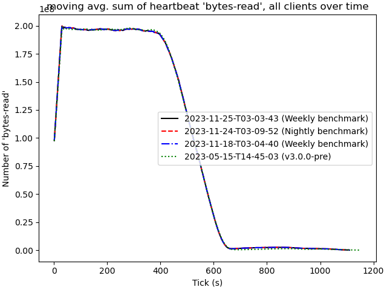

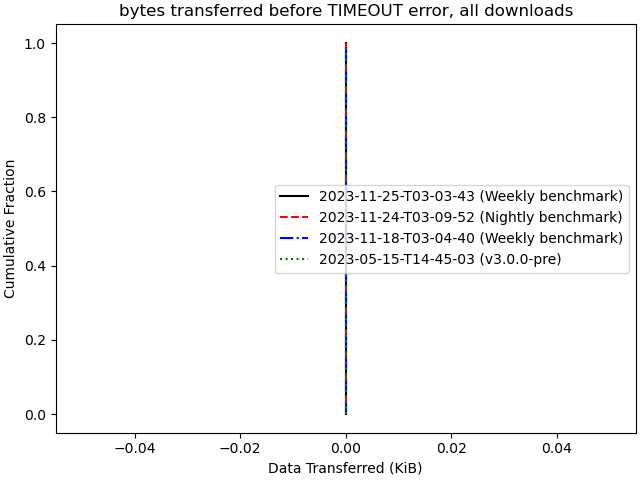

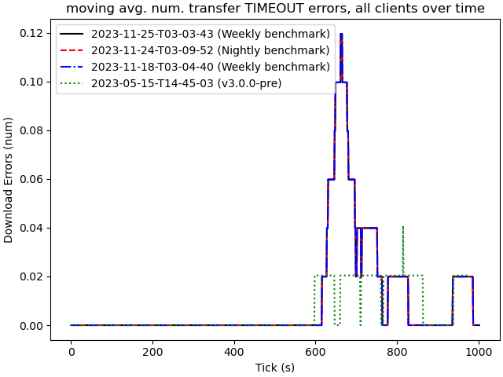

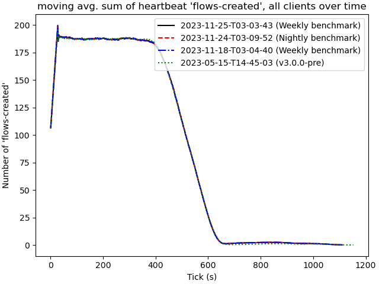

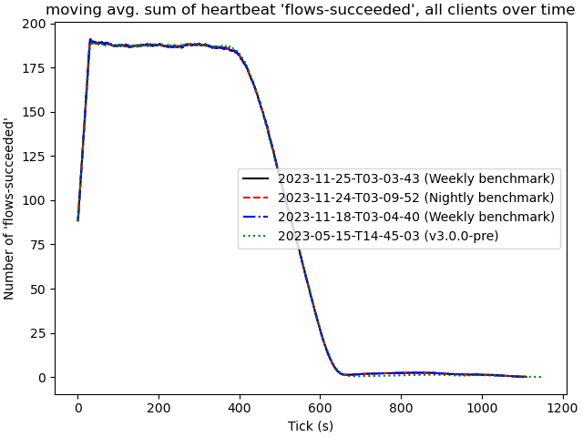

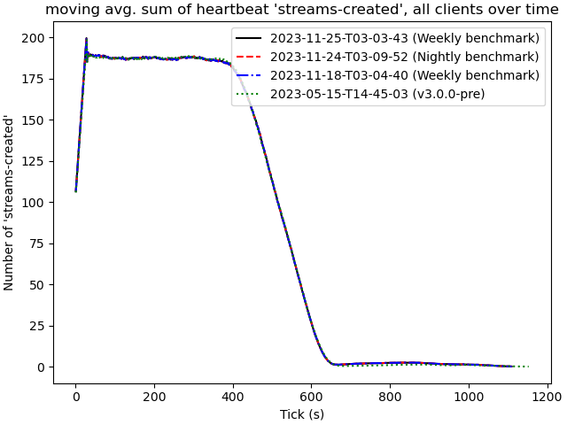

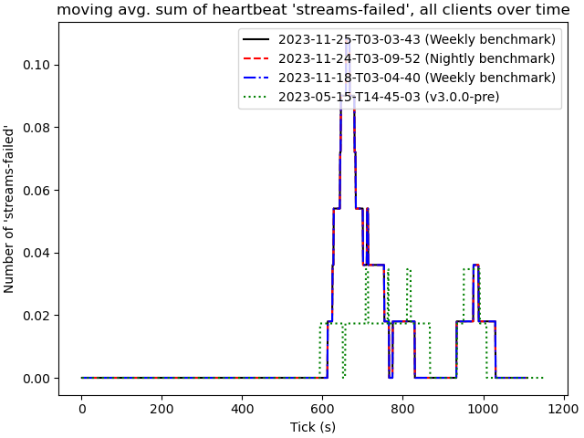

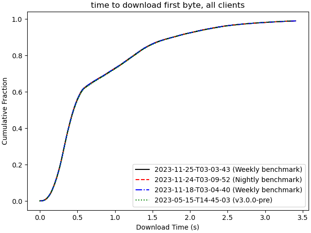

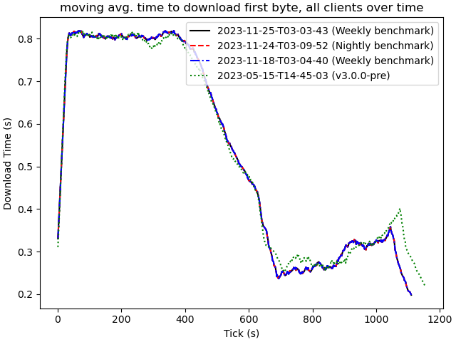

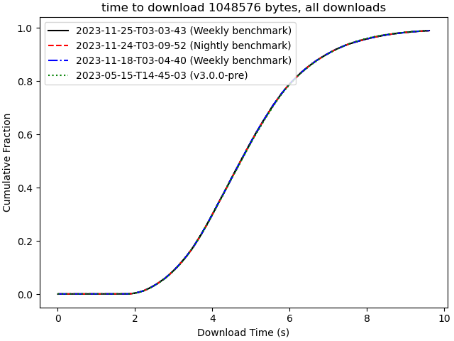

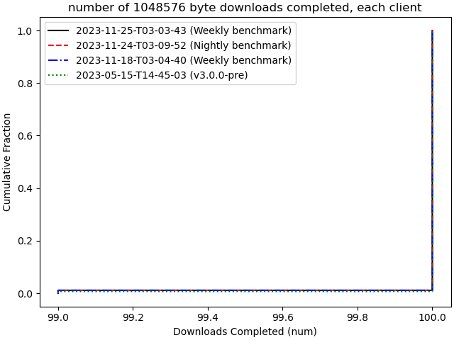

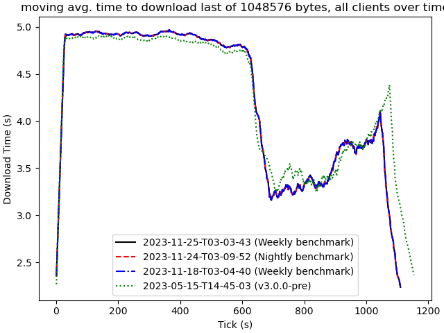

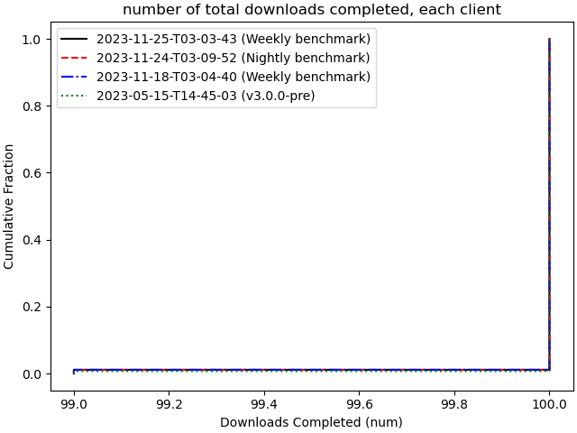

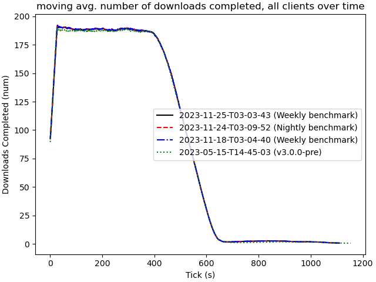

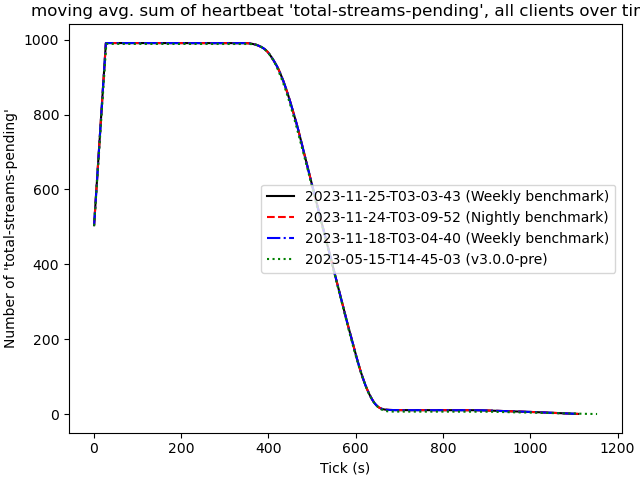
