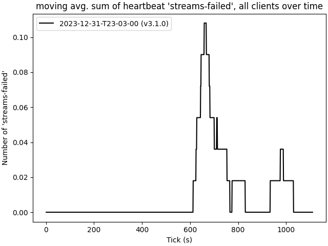

# 2023-12-31-T23-03-00

| Key | Value |
|-----|-------|
| benchmark-sha | [02ecce34c80fe08f625ff102f0cf294de3c964cc](https://github.com/shadow/benchmark/commit/02ecce34c80fe08f625ff102f0cf294de3c964cc) |
| comment | New baseline for v3.1.0 |
| compare-to | , |
| compare-to-resolved |  |
| container | debian:bookworm-20231218-slim |
| dry-run | false |
| repeat | 1 |
| results-dir | tgen |
| runner-label | cora |
| runtime-args | --parallelism 32 |
| rust-version | rustc 1.75.0 (82e1608df 2023-12-21) |
| shadow-label | v3.1.0 |
| shadow-ref | v3.1.0 |
| shadow-sha | [172f88c7bd123e186ce085845b2cc2cb91e96380](https://github.com/shadow/shadow/commit/172f88c7bd123e186ce085845b2cc2cb91e96380) |
| sim-id | 2023-12-31-T23-03-00 |
| sim-to-run | tgennet-1000 |
| tgen-ref | 816d68cd3d0ff7d0ec71e8bbbae24ecd6a636117 |
| timestamp | 1704063780 |
| trigger | workflow_dispatch |
| update-symlink |  |
| workflow-name | Manual TGen Benchmark |

[plots/shadow.results.pdf](plots/shadow.results.pdf)

[plots/tgen.viz.pdf](plots/tgen.viz.pdf)

