# 2024-06-07-T03-12-07

| Key | Value |
|-----|-------|
| benchmark-sha | [3a3356ca73a0c9ea040fc9a8cebe69f44b93181c](https://github.com/shadow/benchmark/commit/3a3356ca73a0c9ea040fc9a8cebe69f44b93181c) |
| comment | Nightly benchmark of the main branch |
| compare-to | nightly, weekly, 2023-12-31-T23-03-00 |
| compare-to-resolved | [2024-06-06-T03-12-01](/tgen/2024-06-06-T03-12-01/README.md), [2024-06-01-T03-08-07](/tgen/2024-06-01-T03-08-07/README.md), [2023-12-31-T23-03-00](/tgen/2023-12-31-T23-03-00/README.md) |
| container | debian:bookworm-20231218-slim |
| dry-run | false |
| repeat | 1 |
| results-dir | tgen |
| runner-label | cora |
| runtime-args | --parallelism 32 |
| rust-version | rustc 1.78.0 (9b00956e5 2024-04-29) |
| shadow-label | Nightly benchmark |
| shadow-ref | main |
| shadow-sha | [ecb3edd101452b0069e095f1204f5bfc9758c42b](https://github.com/shadow/shadow/commit/ecb3edd101452b0069e095f1204f5bfc9758c42b) |
| sim-id | 2024-06-07-T03-12-07 |
| sim-to-run | tgennet-1000 |
| tgen-ref | 816d68cd3d0ff7d0ec71e8bbbae24ecd6a636117 |
| timestamp | 1717729927 |
| trigger | schedule |
| update-symlink | nightly |
| workflow-name | Nightly TGen Benchmark |

[plots/shadow.results.pdf](plots/shadow.results.pdf)

[plots/tgen.viz.pdf](plots/tgen.viz.pdf)

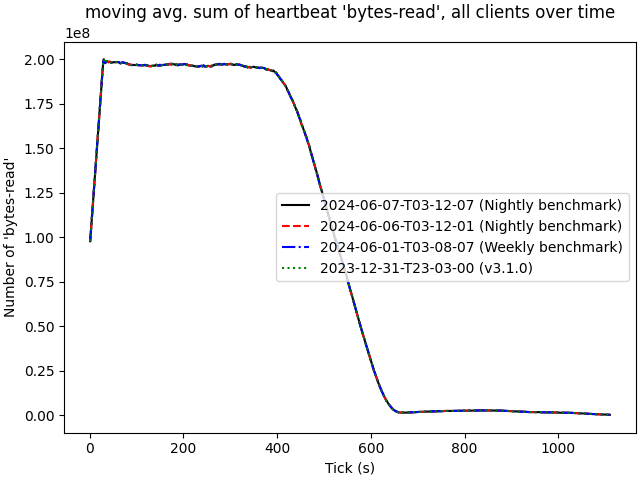

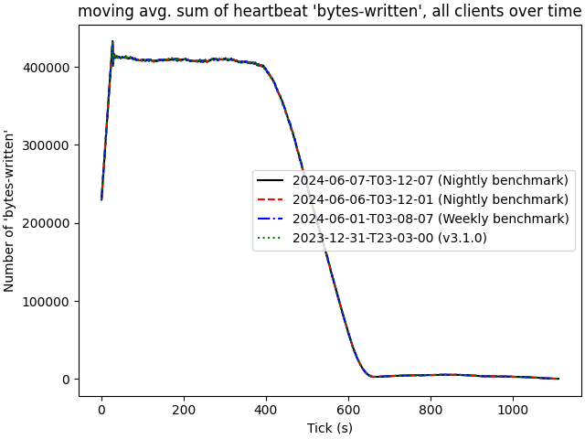

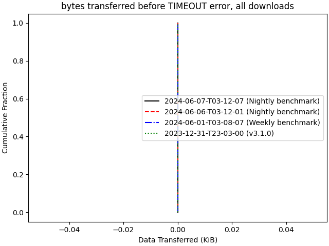

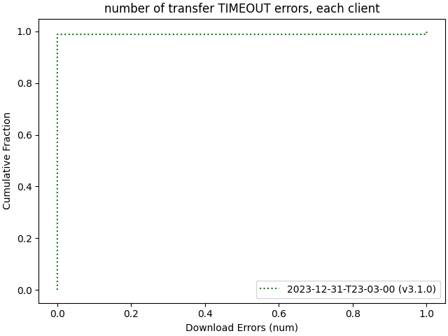

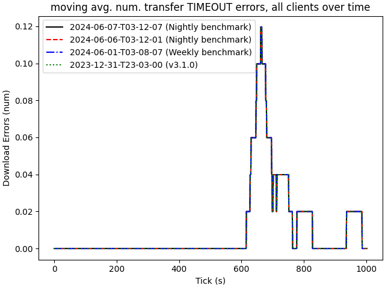

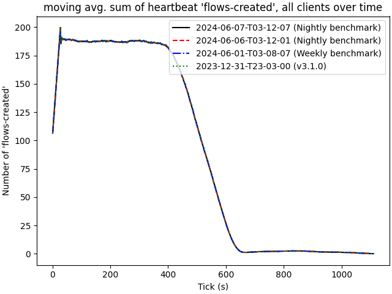

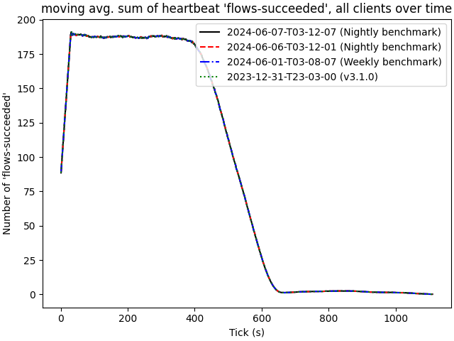

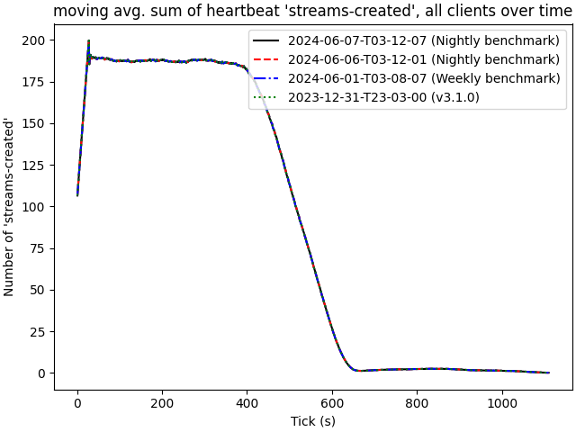

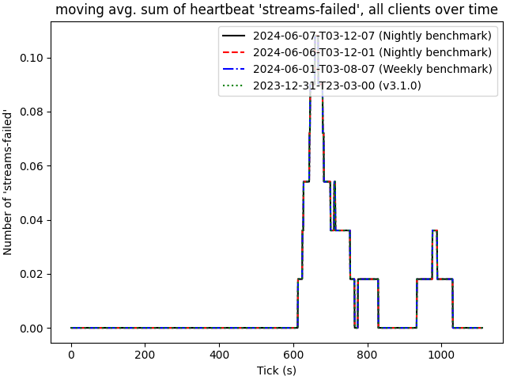

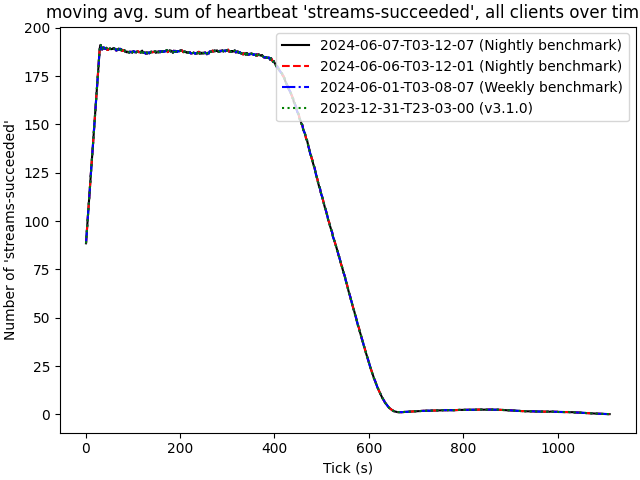

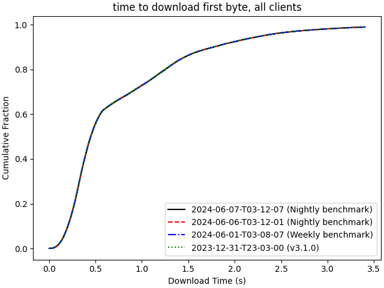

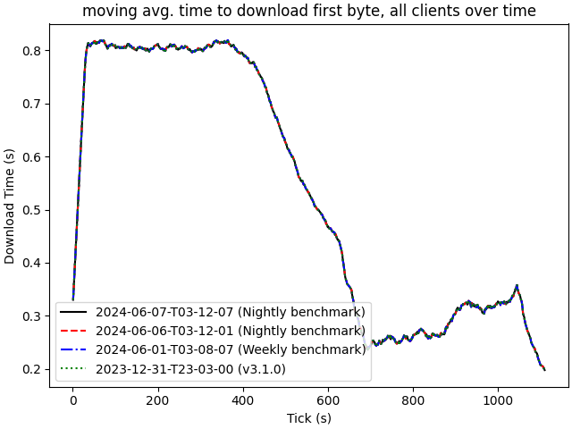

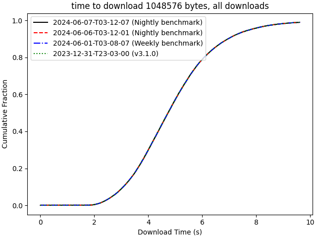

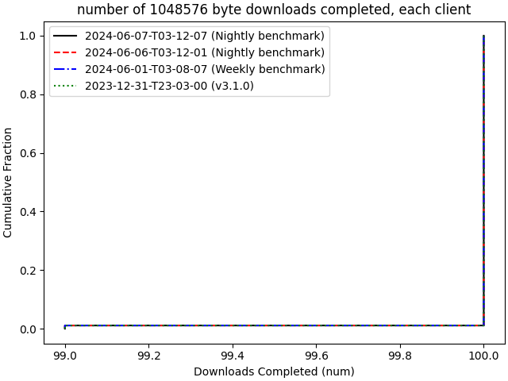

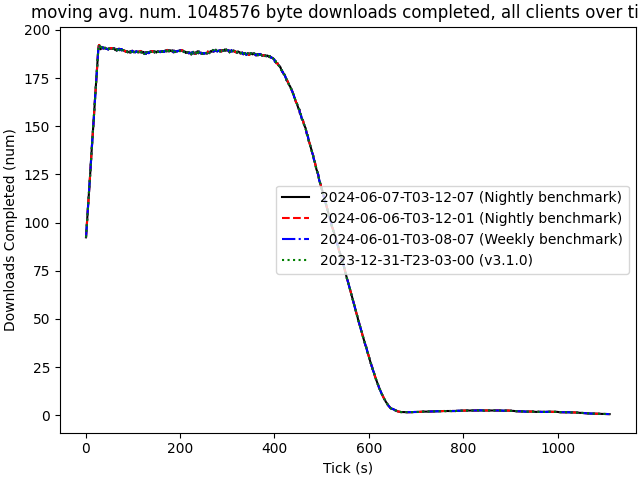

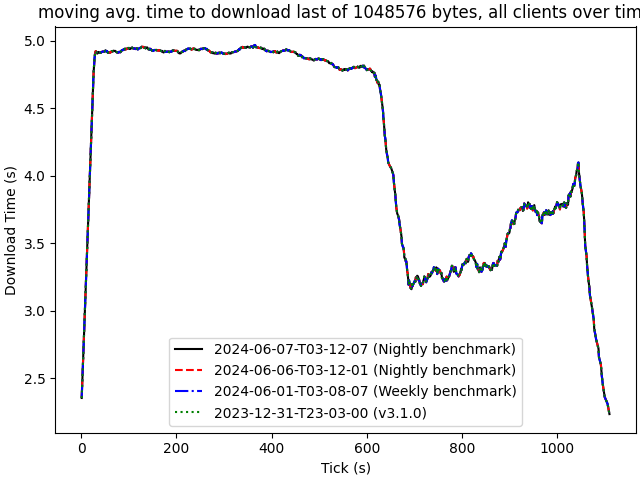

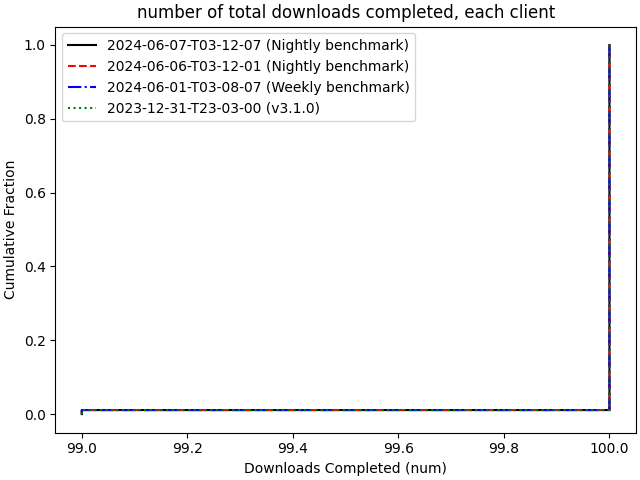

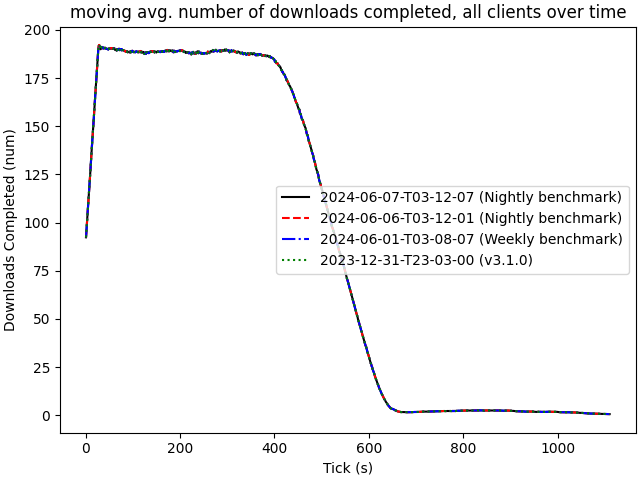

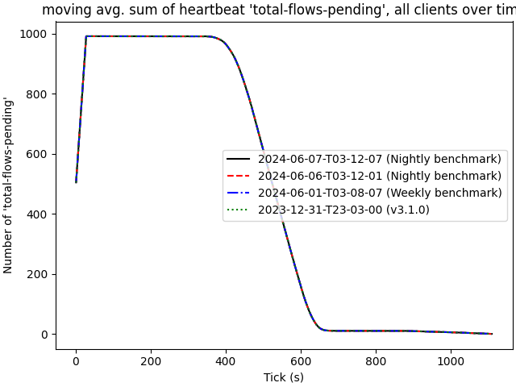

