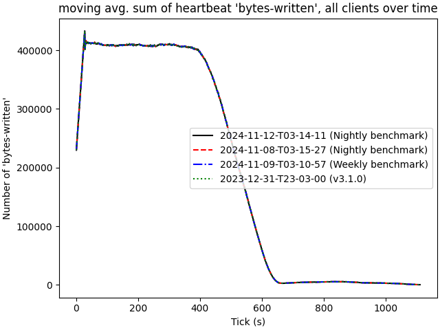
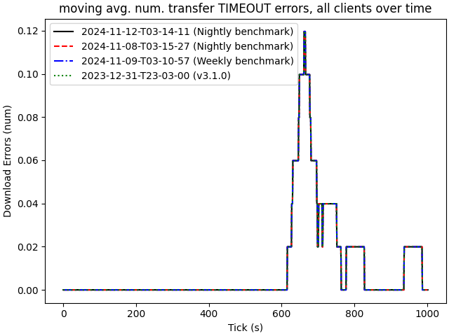

# 2024-11-12-T03-14-11

| Key | Value |
|-----|-------|
| benchmark-sha | [5b632bed0c9236b4c1857fa43fcca25664143ab1](https://github.com/shadow/benchmark/commit/5b632bed0c9236b4c1857fa43fcca25664143ab1) |
| comment | Nightly benchmark of the main branch |
| compare-to | nightly, weekly, 2023-12-31-T23-03-00 |
| compare-to-resolved | [2024-11-08-T03-15-27](/tgen/2024-11-08-T03-15-27/README.md), [2024-11-09-T03-10-57](/tgen/2024-11-09-T03-10-57/README.md), [2023-12-31-T23-03-00](/tgen/2023-12-31-T23-03-00/README.md) |
| container | debian:bookworm-20231218-slim |
| dry-run | false |
| repeat | 1 |
| results-dir | tgen |
| runner-label | cora |
| runtime-args | --parallelism 32 |
| rust-version | rustc 1.81.0 (eeb90cda1 2024-09-04) |
| shadow-label | Nightly benchmark |
| shadow-ref | main |
| shadow-sha | [773f4e24a5124eda1d41a32b4177442bba6a7eaa](https://github.com/shadow/shadow/commit/773f4e24a5124eda1d41a32b4177442bba6a7eaa) |
| sim-id | 2024-11-12-T03-14-11 |
| sim-to-run | tgennet-1000 |
| tgen-ref | 816d68cd3d0ff7d0ec71e8bbbae24ecd6a636117 |
| timestamp | 1731381251 |
| trigger | schedule |
| update-symlink | nightly |
| workflow-name | Nightly TGen Benchmark |

[plots/shadow.results.pdf](plots/shadow.results.pdf)

[plots/tgen.viz.pdf](plots/tgen.viz.pdf)

