# 2024-12-06-T03-29-37

| Key | Value |
|-----|-------|
| benchmark-sha | [cb46d0a4abd2615ea58facbc47a481512f09697d](https://github.com/shadow/benchmark/commit/cb46d0a4abd2615ea58facbc47a481512f09697d) |
| comment | Nightly benchmark of the main branch |
| compare-to | nightly, weekly, 2023-12-31-T23-03-00 |
| compare-to-resolved | [2024-12-05-T03-30-42](/tgen/2024-12-05-T03-30-42/README.md), [2024-11-30-T03-19-43](/tgen/2024-11-30-T03-19-43/README.md), [2023-12-31-T23-03-00](/tgen/2023-12-31-T23-03-00/README.md) |
| container | debian:bookworm-20231218-slim |
| dry-run | false |
| repeat | 1 |
| results-dir | tgen |
| runner-label | cora |
| runtime-args | --parallelism 32 |
| rust-version | rustc 1.82.0 (f6e511eec 2024-10-15) |
| shadow-label | Nightly benchmark |
| shadow-ref | main |
| shadow-sha | [7541367944284c4bf7ee3f9d1c843941d46660ce](https://github.com/shadow/shadow/commit/7541367944284c4bf7ee3f9d1c843941d46660ce) |
| sim-id | 2024-12-06-T03-29-37 |
| sim-to-run | tgennet-1000 |
| tgen-ref | 816d68cd3d0ff7d0ec71e8bbbae24ecd6a636117 |
| timestamp | 1733455777 |
| trigger | schedule |
| update-symlink | nightly |
| workflow-name | Nightly TGen Benchmark |

[plots/tgen.viz.pdf](plots/tgen.viz.pdf)

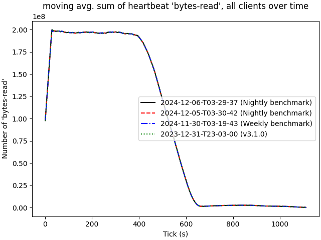

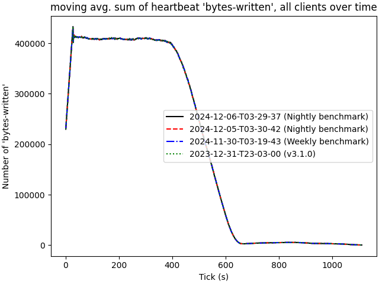

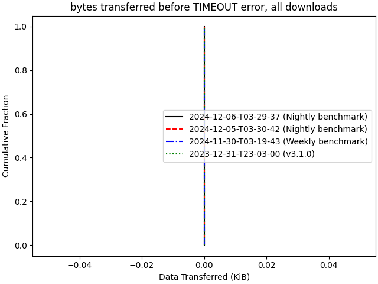

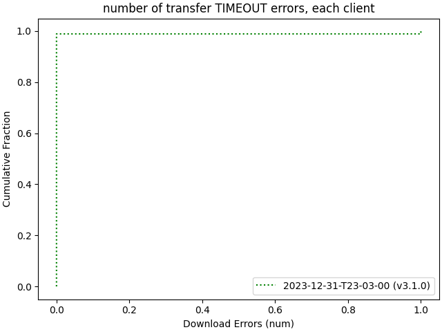

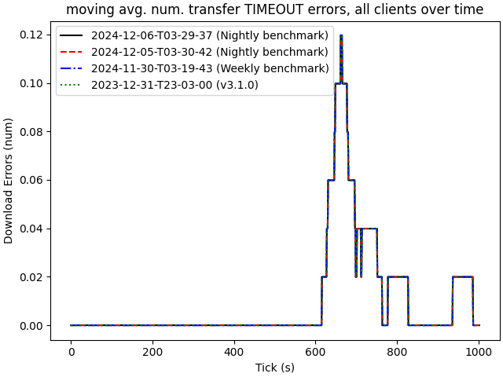

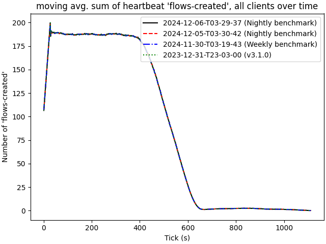

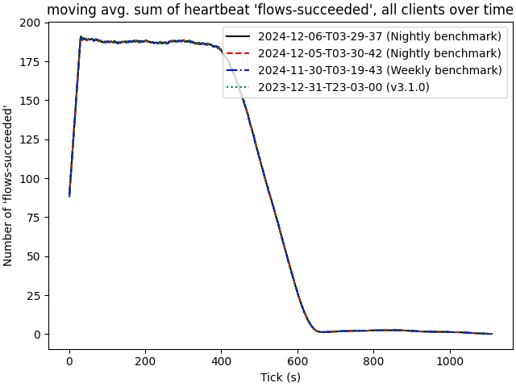

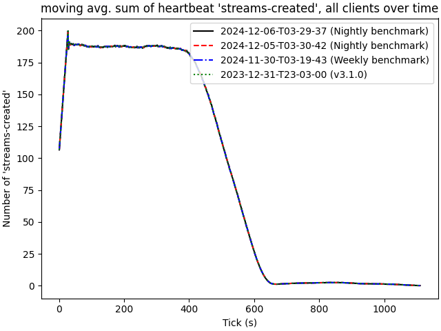

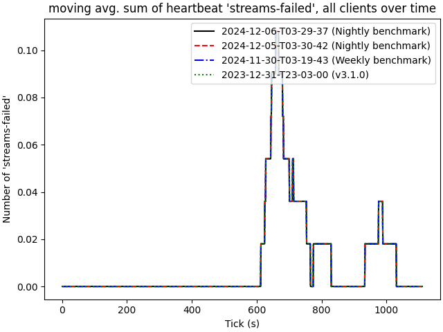

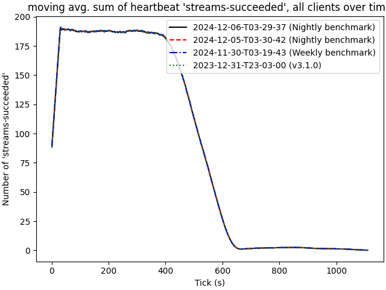

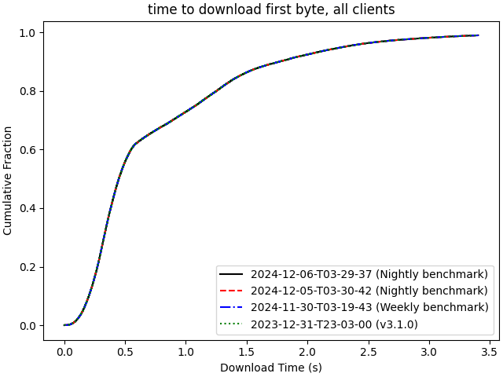

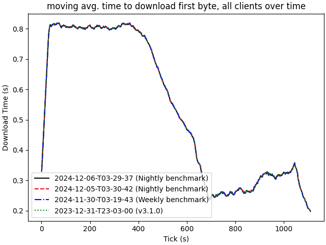

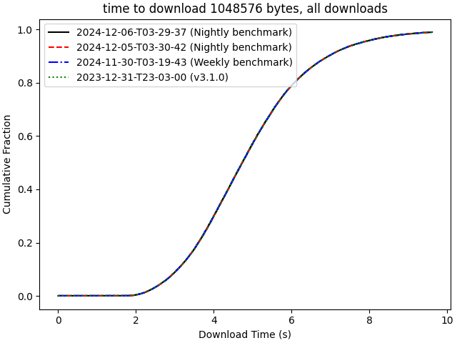

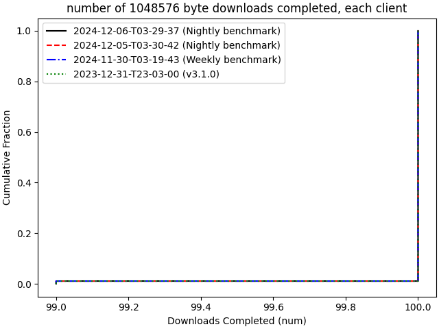

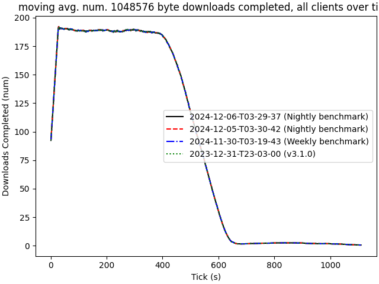

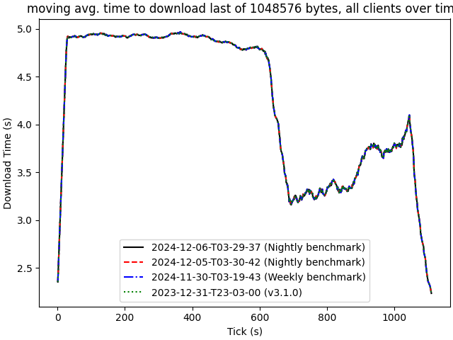

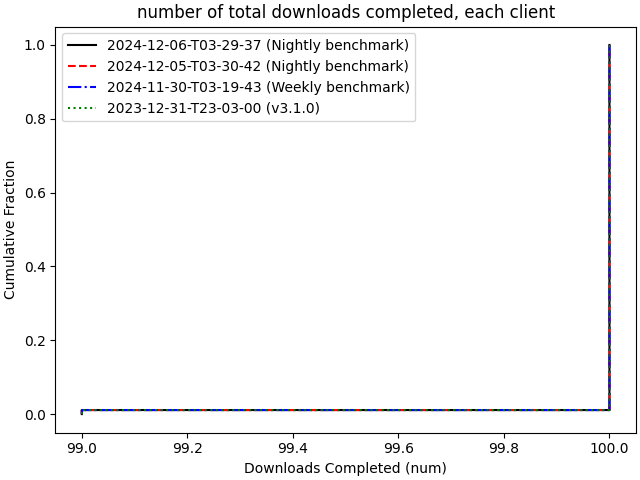

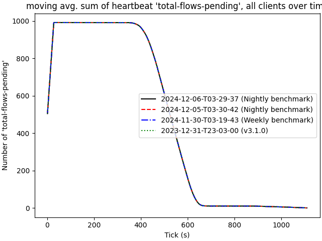

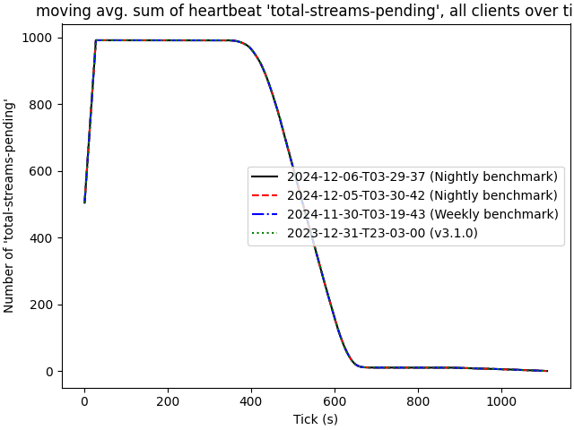
