# 2025-01-10-T23-41-49

| Key | Value |
|-----|-------|
| benchmark-sha | [cb46d0a4abd2615ea58facbc47a481512f09697d](https://github.com/shadow/benchmark/commit/cb46d0a4abd2615ea58facbc47a481512f09697d) |
| comment | C fifo qdisc still using dynamically updated priorities |
| compare-to | nightly, 2025-01-09-T16-56-24 |
| compare-to-resolved | [2025-01-10-T03-19-06](/tgen/2025-01-10-T03-19-06/README.md), [2025-01-09-T16-56-24](/tgen/2025-01-09-T16-56-24/README.md) |
| container | debian:bookworm-20231218-slim |
| dry-run | false |
| repeat | 1 |
| results-dir | tgen |
| runner-label | cora |
| runtime-args | --parallelism 32 |
| rust-version | rustc 1.83.0 (90b35a623 2024-11-26) |
| shadow-label | PR #3489 dynamic |
| shadow-ref | 3d73420a0693bfb464aa303aeec8686dbb61fe5d |
| shadow-sha | [3d73420a0693bfb464aa303aeec8686dbb61fe5d](https://github.com/shadow/shadow/commit/3d73420a0693bfb464aa303aeec8686dbb61fe5d) |
| sim-id | 2025-01-10-T23-41-49 |
| sim-to-run | tgennet-1000 |
| tgen-ref | 816d68cd3d0ff7d0ec71e8bbbae24ecd6a636117 |
| timestamp | 1736552509 |
| trigger | workflow_dispatch |
| update-symlink |  |
| workflow-name | Manual TGen Benchmark |

[plots/tgen.viz.pdf](plots/tgen.viz.pdf)

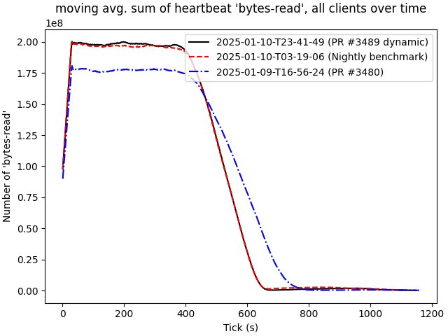

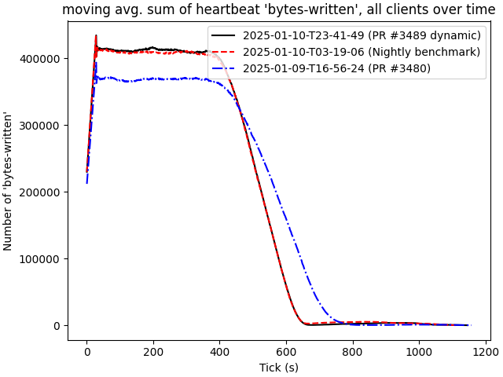

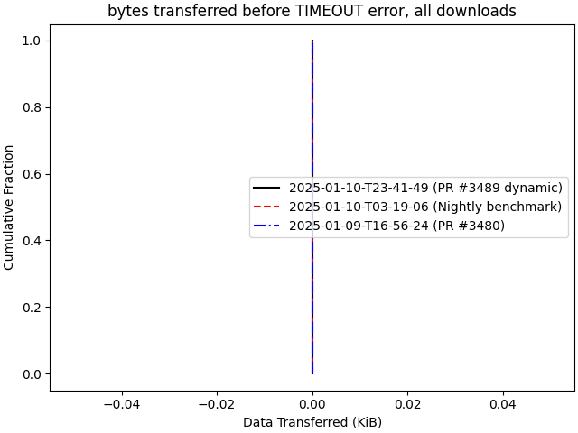

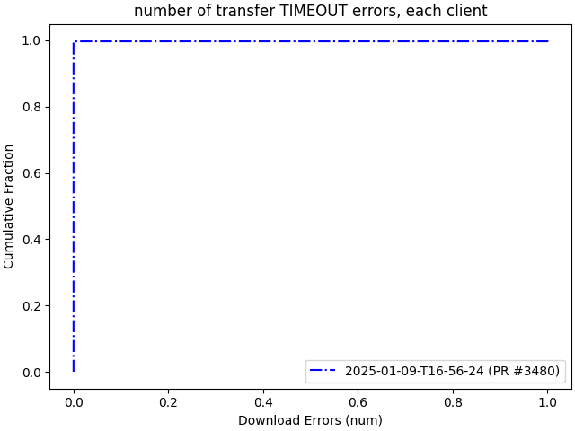

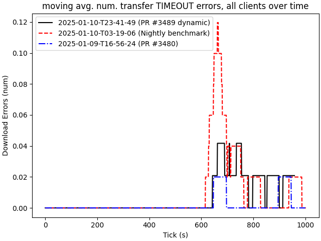

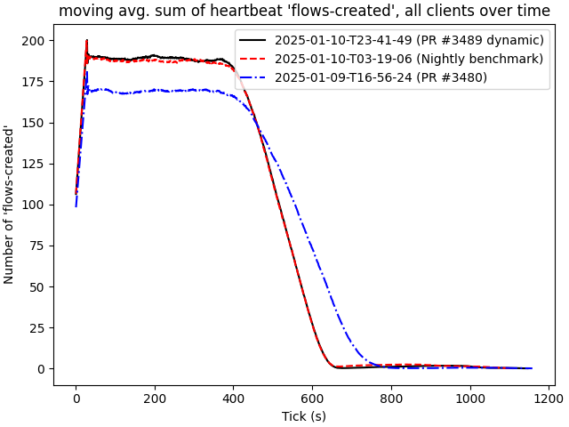

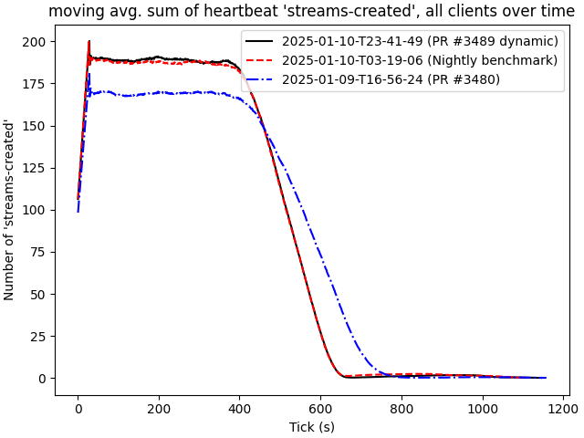

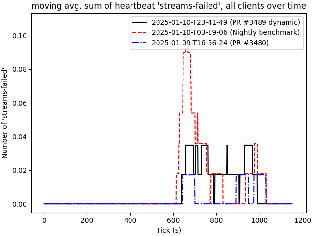

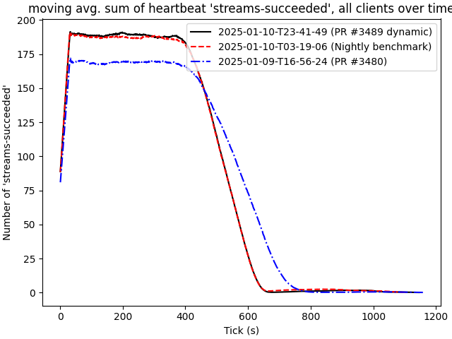

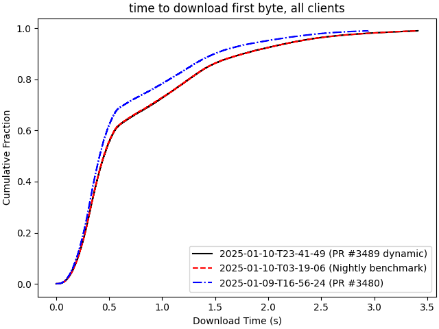

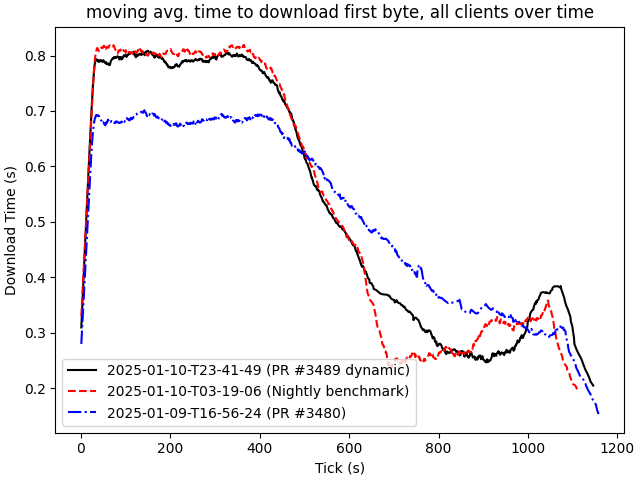

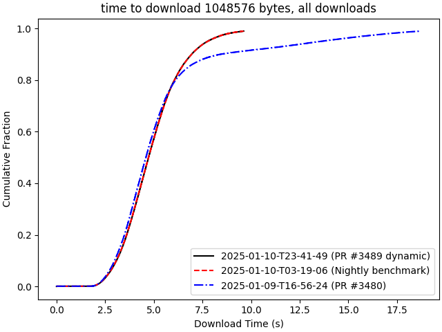

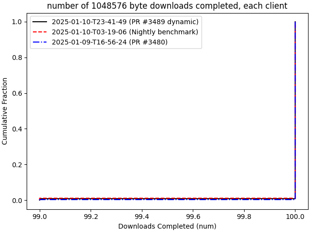

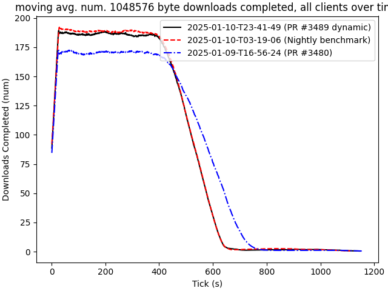

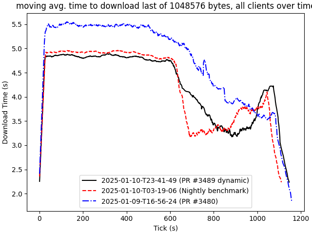

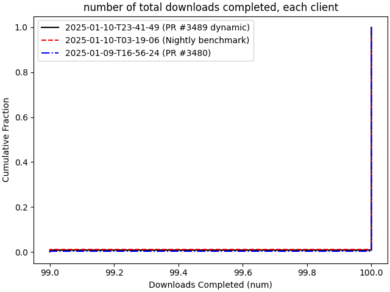

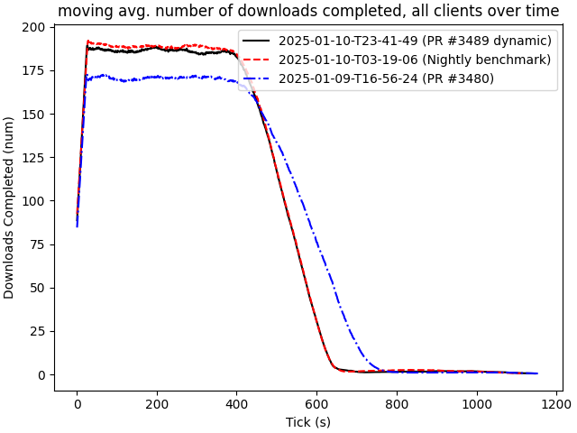

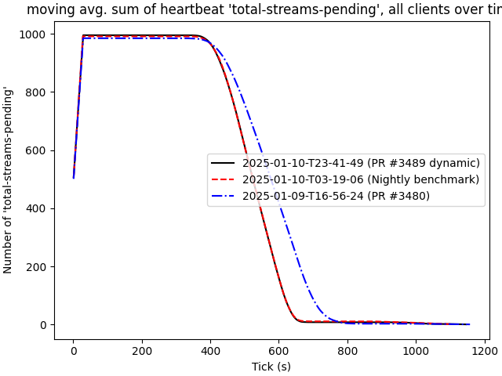
