# 2025-04-01-T03-38-51

| Key | Value |
|-----|-------|
| benchmark-sha | [cb46d0a4abd2615ea58facbc47a481512f09697d](https://github.com/shadow/benchmark/commit/cb46d0a4abd2615ea58facbc47a481512f09697d) |
| comment | Nightly benchmark of the main branch |
| compare-to | nightly, weekly, 2023-12-31-T23-03-00 |
| compare-to-resolved | [2025-03-28-T03-28-15](/tgen/2025-03-28-T03-28-15/README.md), [2025-03-29-T03-21-04](/tgen/2025-03-29-T03-21-04/README.md), [2023-12-31-T23-03-00](/tgen/2023-12-31-T23-03-00/README.md) |
| container | debian:bookworm-20231218-slim |
| dry-run | false |
| repeat | 1 |
| results-dir | tgen |
| runner-label | cora |
| runtime-args | --parallelism 32 |
| rust-version | rustc 1.85.1 (4eb161250 2025-03-15) |
| shadow-label | Nightly benchmark |
| shadow-ref | main |
| shadow-sha | [c7976835f8cb183de76ede64155d0a3b4009eb68](https://github.com/shadow/shadow/commit/c7976835f8cb183de76ede64155d0a3b4009eb68) |
| sim-id | 2025-04-01-T03-38-51 |
| sim-to-run | tgennet-1000 |
| tgen-ref | 816d68cd3d0ff7d0ec71e8bbbae24ecd6a636117 |
| timestamp | 1743478731 |
| trigger | schedule |
| update-symlink | nightly |
| workflow-name | Nightly TGen Benchmark |

[plots/tgen.viz.pdf](plots/tgen.viz.pdf)

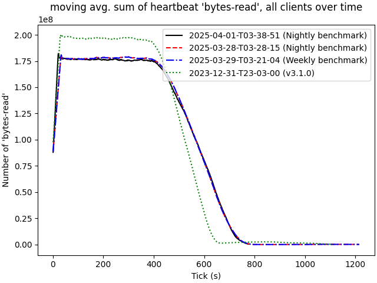

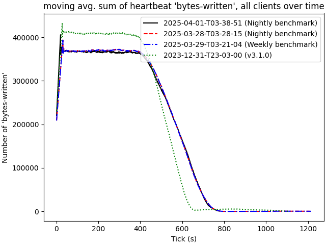

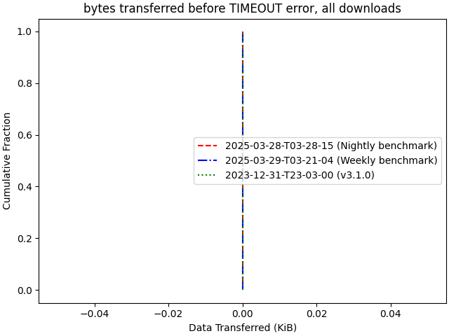

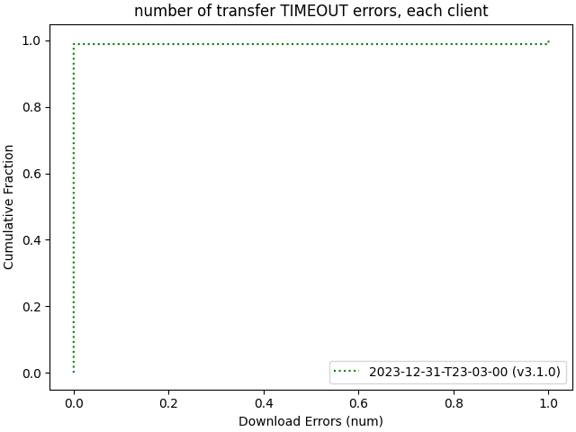

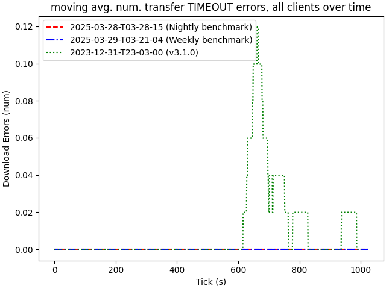

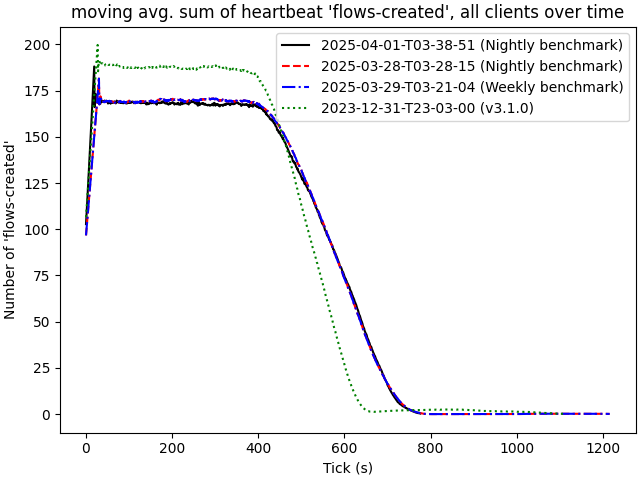

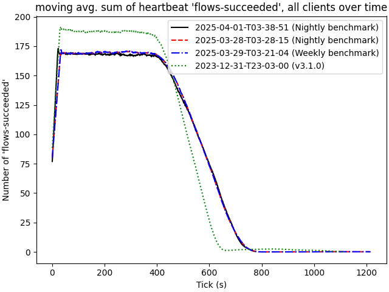

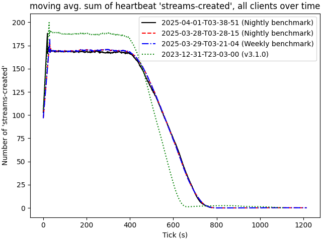

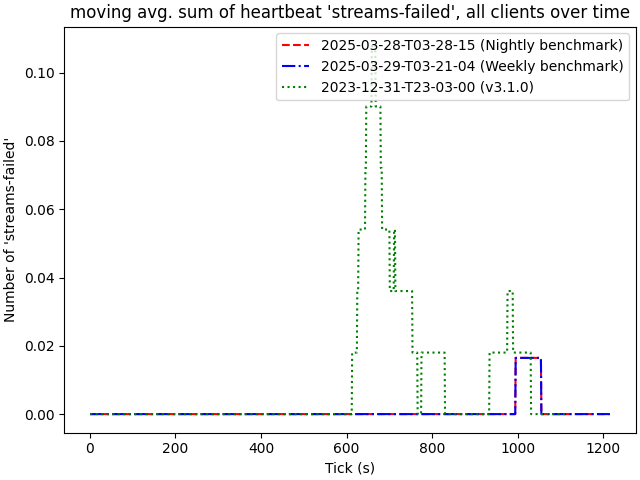

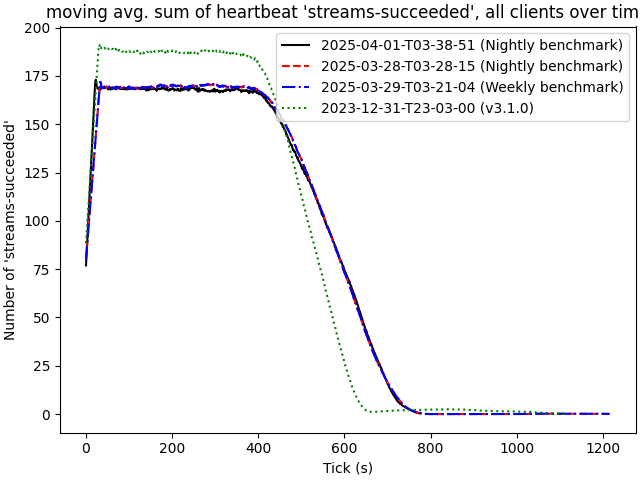

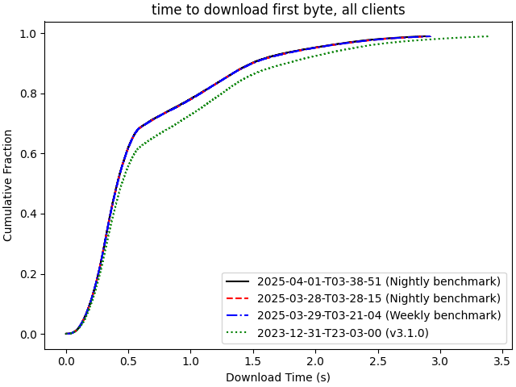

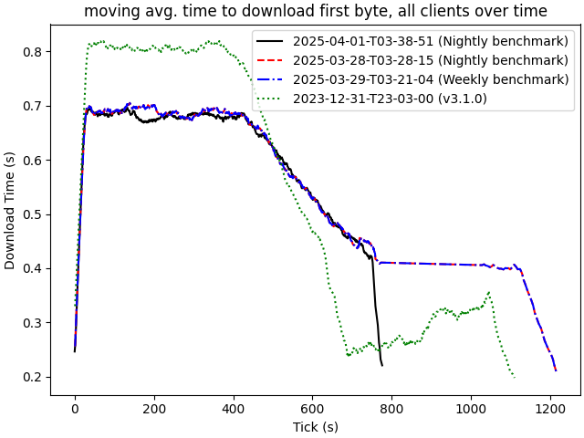

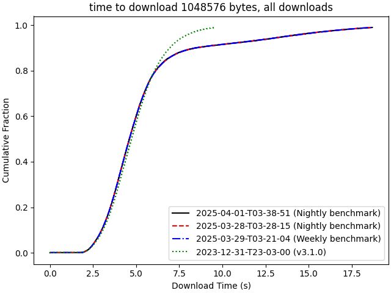

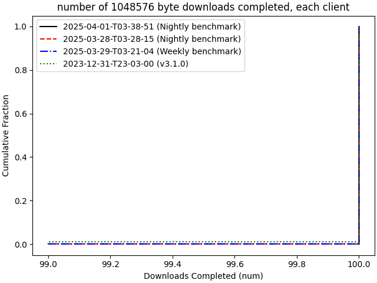

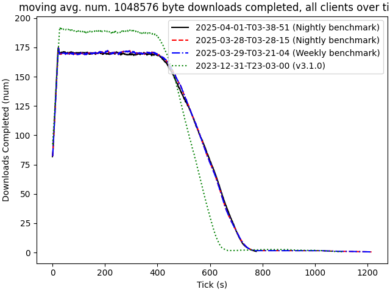

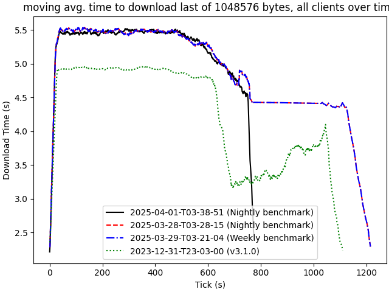

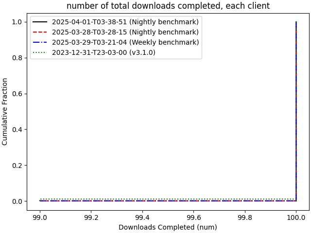

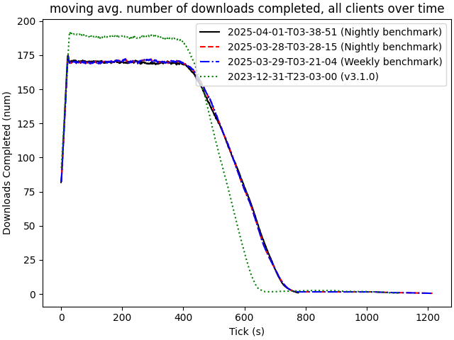

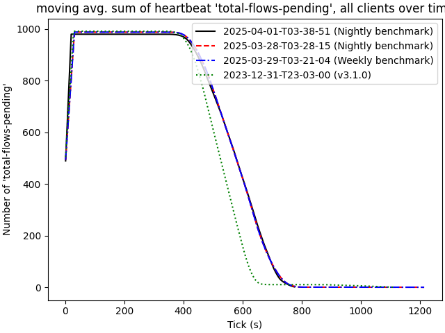

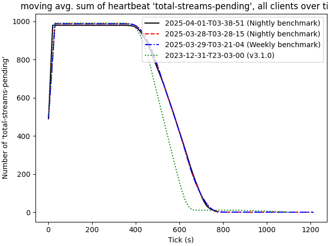
