# 2025-05-16-T03-39-04

| Key | Value |
|-----|-------|
| benchmark-sha | [14e2a50406ee33c70f514dc4fe0e89ea88ad18bd](https://github.com/shadow/benchmark/commit/14e2a50406ee33c70f514dc4fe0e89ea88ad18bd) |
| comment | Nightly benchmark of the main branch |
| compare-to | nightly, weekly, 2023-12-31-T23-03-00 |
| compare-to-resolved | [2025-05-15-T03-37-57](/tgen/2025-05-15-T03-37-57/README.md), [2025-05-10-T03-29-21](/tgen/2025-05-10-T03-29-21/README.md), [2023-12-31-T23-03-00](/tgen/2023-12-31-T23-03-00/README.md) |
| container | debian:bookworm-20231218-slim |
| dry-run | false |
| repeat | 1 |
| results-dir | tgen |
| runner-label | cora |
| runtime-args | --parallelism 32 |
| rust-version | rustc 1.86.0 (05f9846f8 2025-03-31) |
| shadow-label | Nightly benchmark |
| shadow-ref | main |
| shadow-sha | [27733f4796f06f1666682bdfb886cbce477155c6](https://github.com/shadow/shadow/commit/27733f4796f06f1666682bdfb886cbce477155c6) |
| sim-id | 2025-05-16-T03-39-04 |
| sim-to-run | tgennet-1000 |
| tgen-ref | 816d68cd3d0ff7d0ec71e8bbbae24ecd6a636117 |
| timestamp | 1747366744 |
| trigger | schedule |
| update-symlink | nightly |
| workflow-name | Nightly TGen Benchmark |

[plots/tgen.viz.pdf](plots/tgen.viz.pdf)

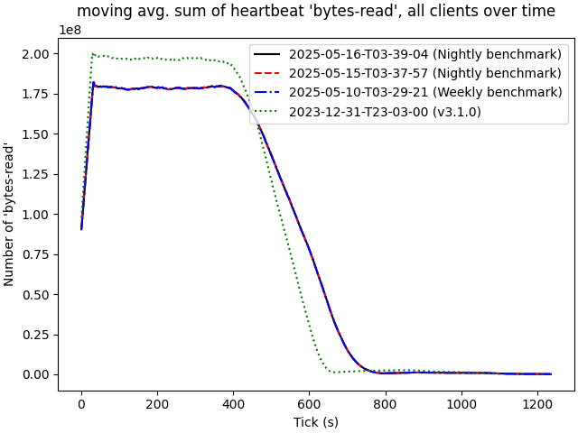

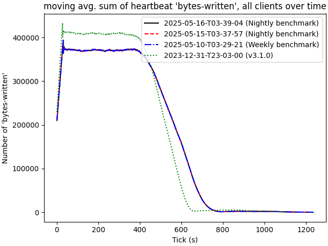

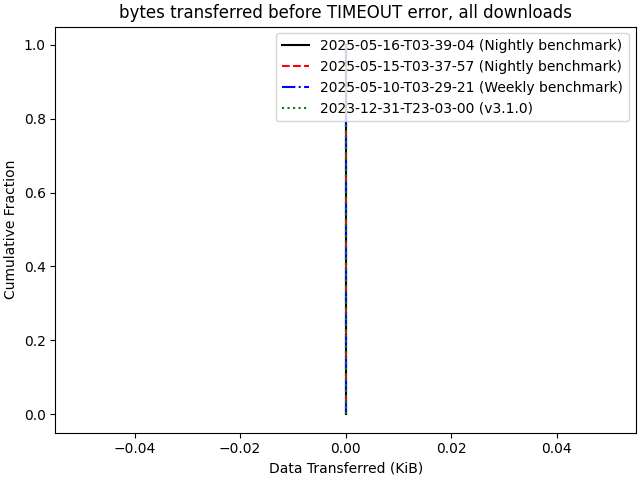

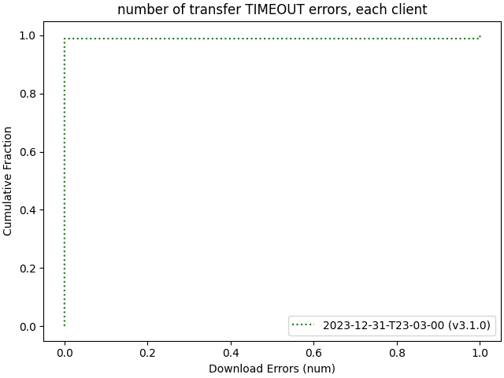

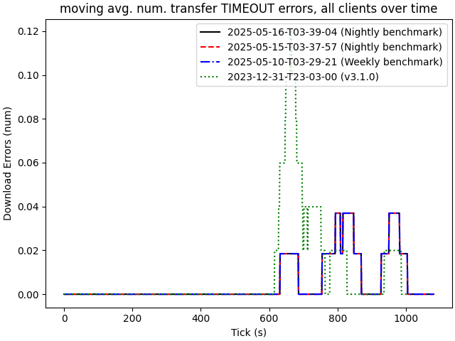

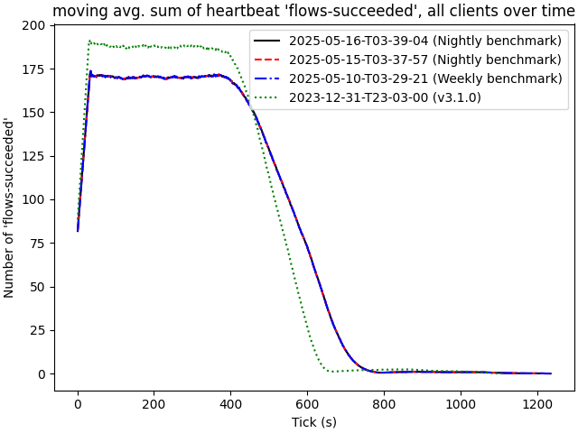

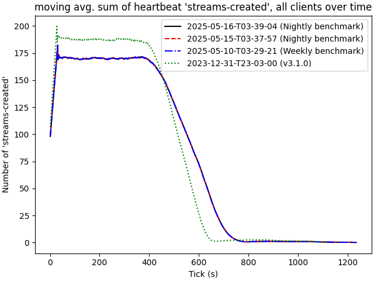

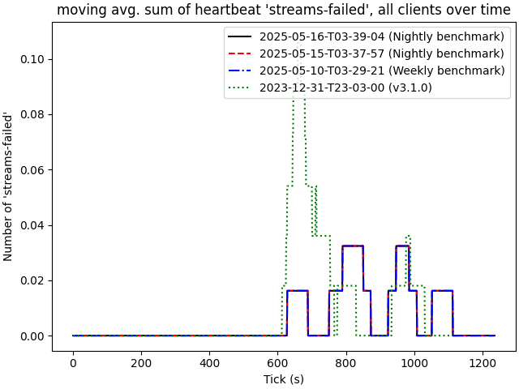

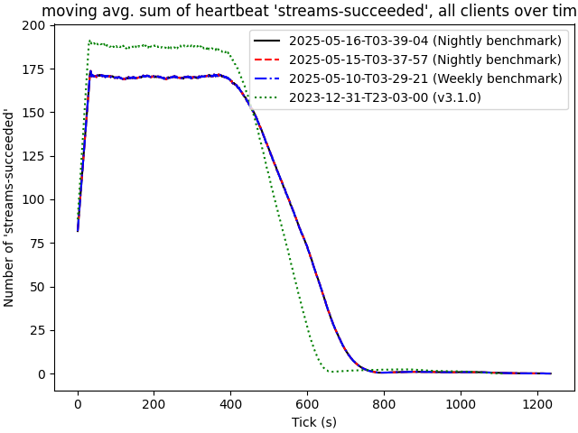

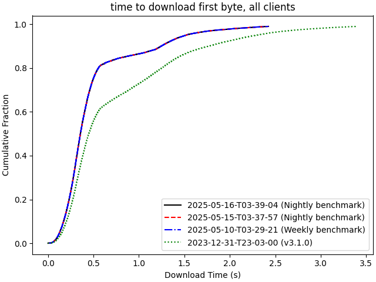

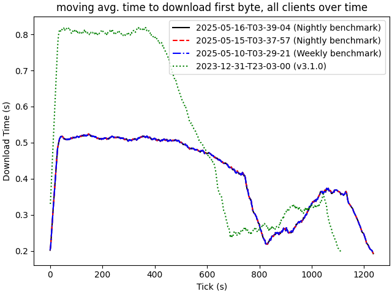

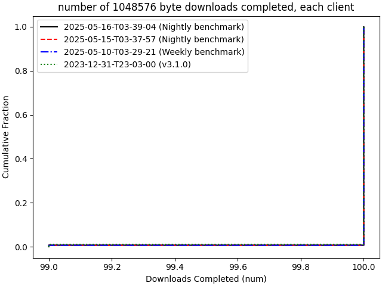

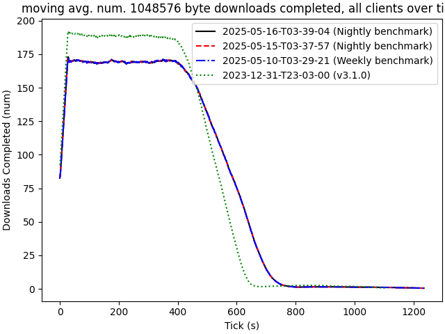

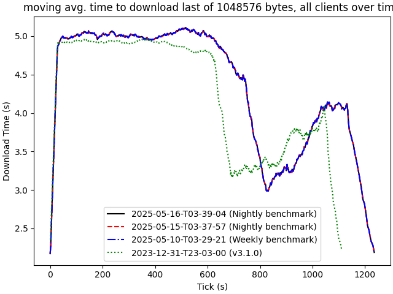

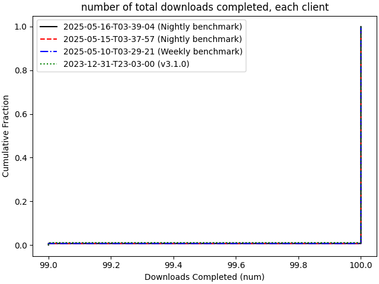

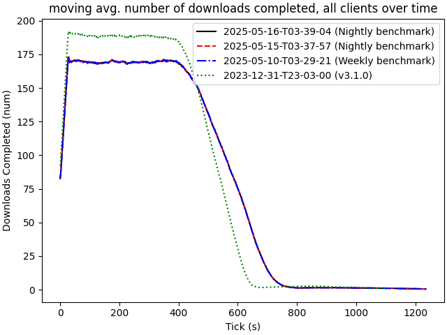

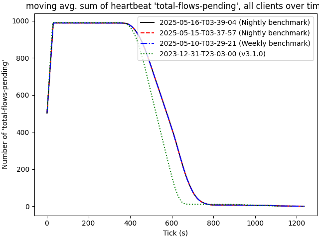

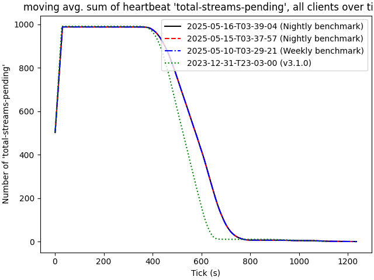
