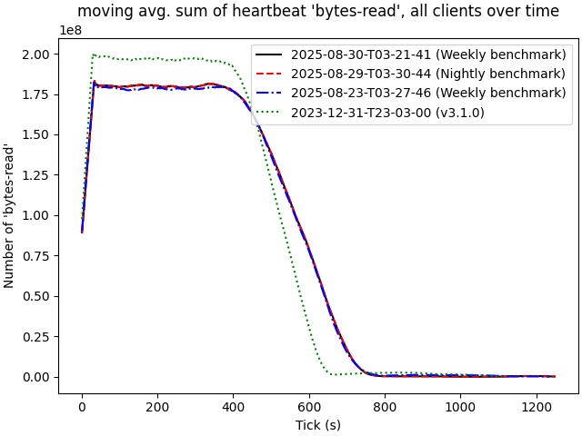
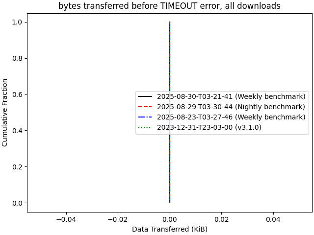
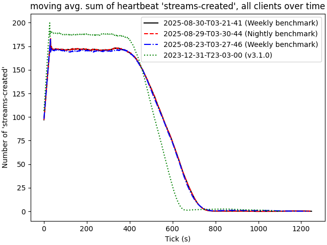

# 2025-08-30-T03-21-41

| Key | Value |
|-----|-------|
| benchmark-sha | [14e2a50406ee33c70f514dc4fe0e89ea88ad18bd](https://github.com/shadow/benchmark/commit/14e2a50406ee33c70f514dc4fe0e89ea88ad18bd) |
| comment | Weekly benchmark of the main branch |
| compare-to | nightly, weekly, 2023-12-31-T23-03-00 |
| compare-to-resolved | [2025-08-29-T03-30-44](/tgen/2025-08-29-T03-30-44/README.md), [2025-08-23-T03-27-46](/tgen/2025-08-23-T03-27-46/README.md), [2023-12-31-T23-03-00](/tgen/2023-12-31-T23-03-00/README.md) |
| container | debian:bookworm-20231218-slim |
| dry-run | false |
| repeat | 1 |
| results-dir | tgen |
| runner-label | cora |
| runtime-args | --parallelism 32 |
| rust-version | rustc 1.88.0 (6b00bc388 2025-06-23) |
| shadow-label | Weekly benchmark |
| shadow-ref | main |
| shadow-sha | [9fea47c3f51d4c33e3ae95c6f6f8ff70eeb50c94](https://github.com/shadow/shadow/commit/9fea47c3f51d4c33e3ae95c6f6f8ff70eeb50c94) |
| sim-id | 2025-08-30-T03-21-41 |
| sim-to-run | tgennet-1000 |
| tgen-ref | 816d68cd3d0ff7d0ec71e8bbbae24ecd6a636117 |
| timestamp | 1756524101 |
| trigger | schedule |
| update-symlink | weekly |
| workflow-name | Weekly TGen Benchmark |

[plots/tgen.viz.pdf](plots/tgen.viz.pdf)

