# 2026-05-29-T06-48-00

| Key | Value |
|-----|-------|
| benchmark-sha | [53186ae295c35ca05a7e222e5baee82ae1f8eb7a](https://github.com/shadow/benchmark/commit/53186ae295c35ca05a7e222e5baee82ae1f8eb7a) |
| comment | Nightly benchmark of the main branch |
| compare-to | nightly, weekly, 2023-12-31-T23-03-00 |
| compare-to-resolved | [2026-05-28-T06-47-58](/tgen/2026-05-28-T06-47-58/README.md), [2026-05-23-T05-55-50](/tgen/2026-05-23-T05-55-50/README.md), [2023-12-31-T23-03-00](/tgen/2023-12-31-T23-03-00/README.md) |
| container | debian:bookworm-20231218-slim |
| dry-run | false |
| repeat | 1 |
| results-dir | tgen |
| runner-label | cora |
| runtime-args | --parallelism 32 |
| rust-version | rustc 1.95.0 (59807616e 2026-04-14) |
| shadow-label | Nightly benchmark |
| shadow-ref | main |
| shadow-sha | [cf02a65ad71bdcb7dd57d9897eaebab6740cbec2](https://github.com/shadow/shadow/commit/cf02a65ad71bdcb7dd57d9897eaebab6740cbec2) |
| sim-id | 2026-05-29-T06-48-00 |
| sim-to-run | tgennet-1000 |
| tgen-ref | 816d68cd3d0ff7d0ec71e8bbbae24ecd6a636117 |
| timestamp | 1780037280 |
| trigger | schedule |
| update-symlink | nightly |
| workflow-name | Nightly TGen Benchmark |

[plots/tgen.viz.pdf](plots/tgen.viz.pdf)

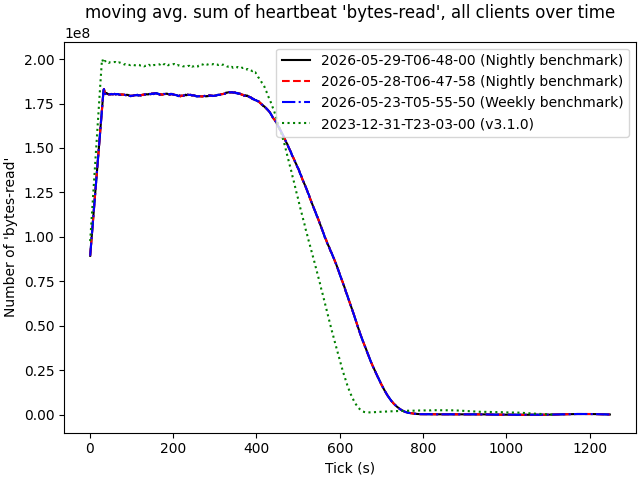

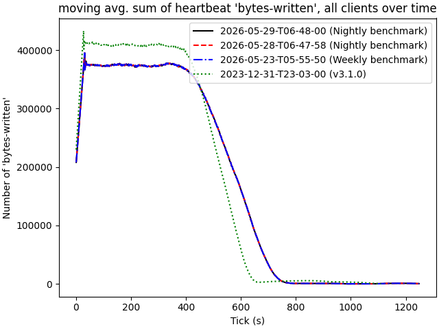

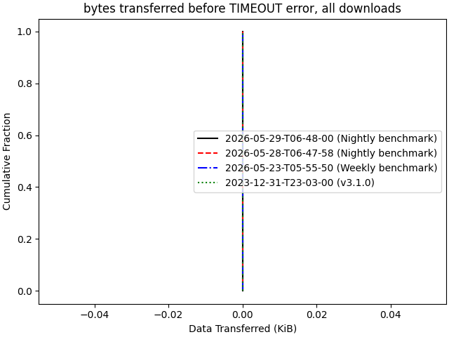

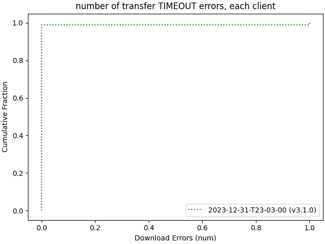

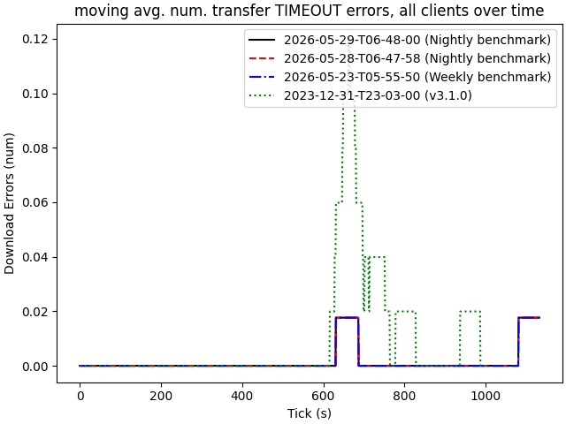

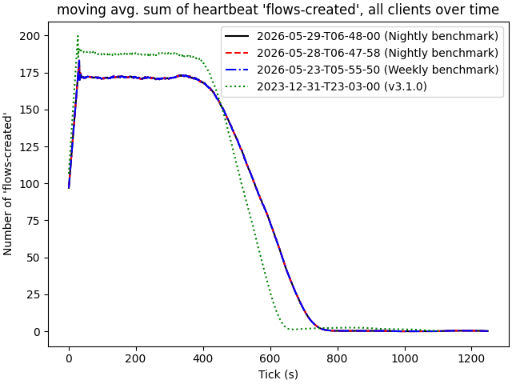

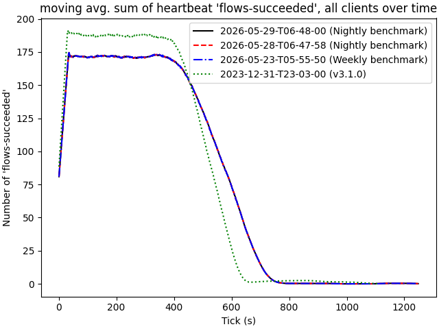

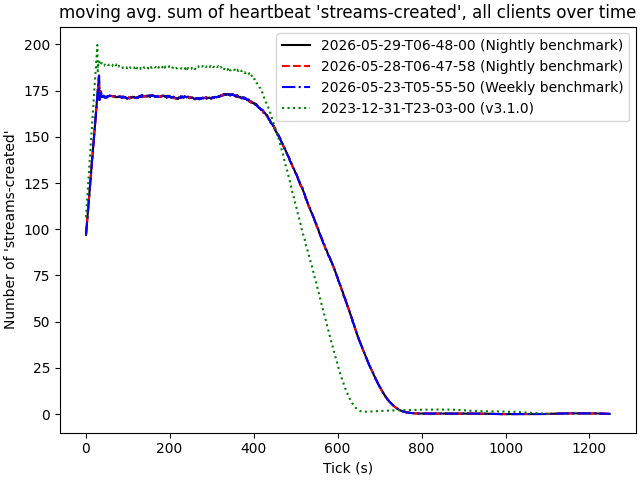

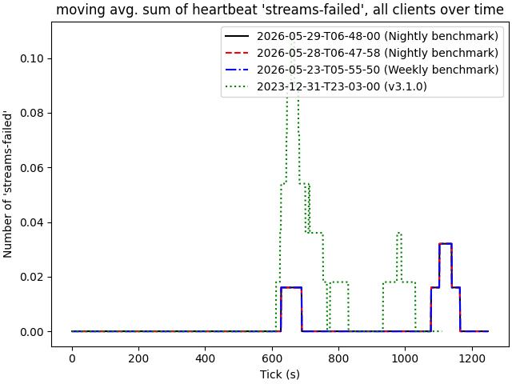

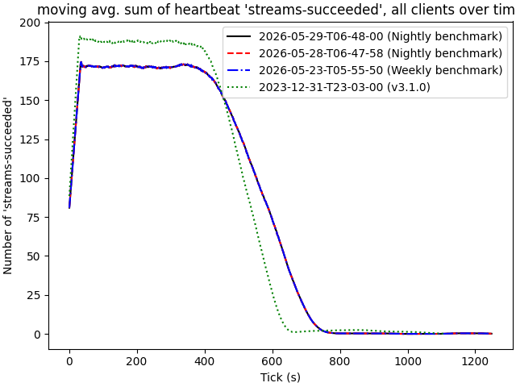

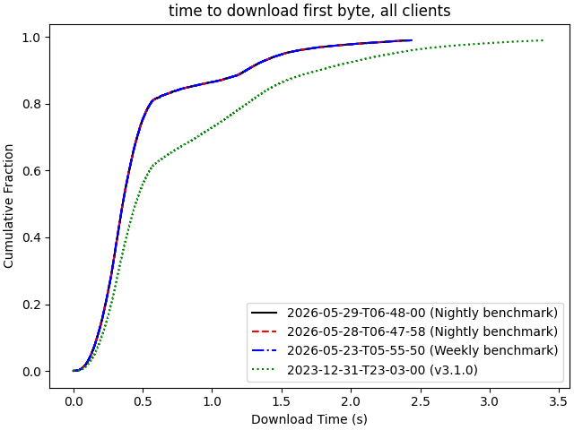

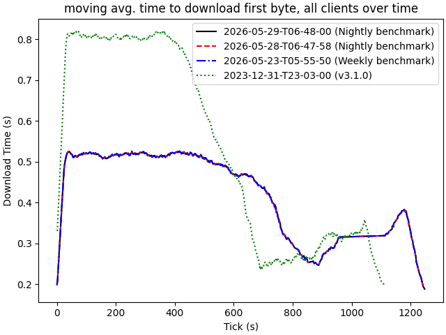

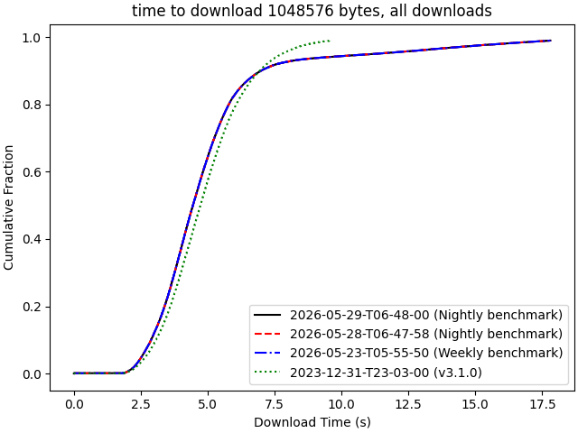

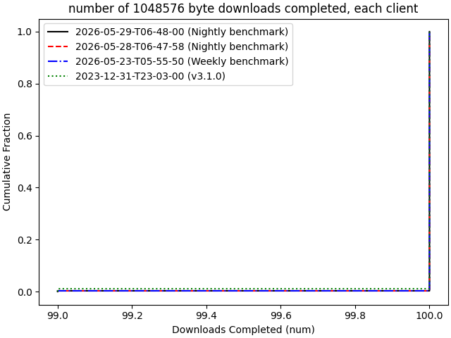

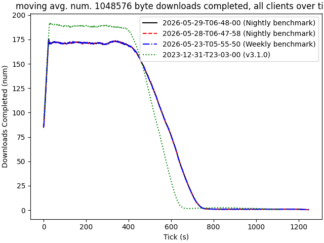

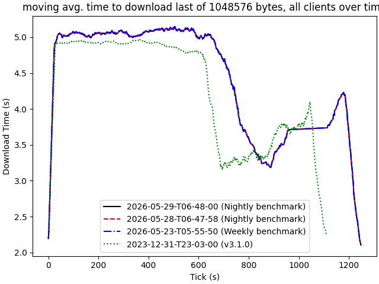

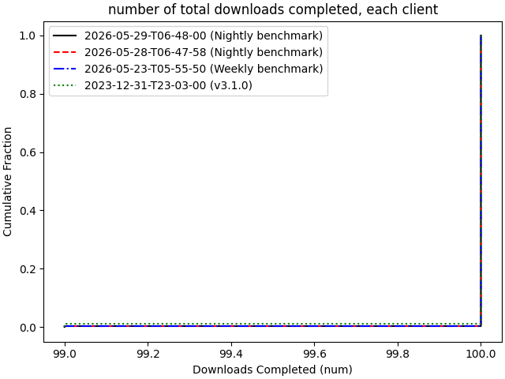

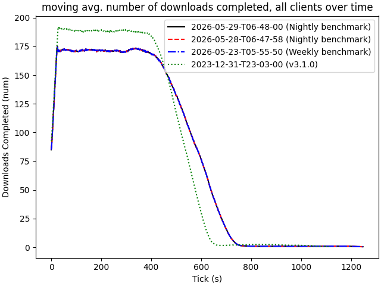

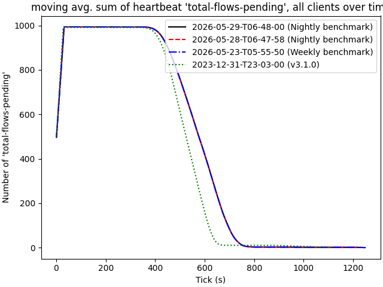

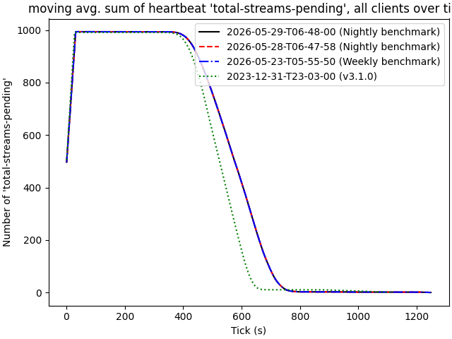
