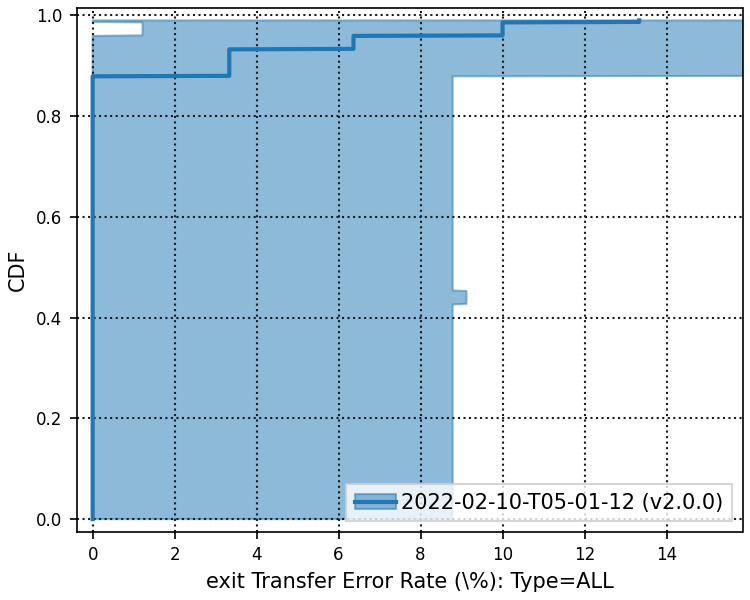

# 2022-02-10-T05-01-12

| Key | Value |
|-----|-------|
| benchmark-sha | d03abca7e1e4225a5d5ae67399ef12c185b48306 |
| comment | Shadow v2.0.0 |
| compare-to | nightly, weekly |
| compare-to-resolved | ,  |
| container | debian:11-slim |
| dry-run | false |
| oniontrace-ref | f271ead90526b29b3dd7218ce6e56813e3b4dce3 |
| repeat | 3 |
| results-dir | tor |
| runtime-args | --parallelism 24 --progress true |
| rust-version | rustc 1.58.1 (db9d1b20b 2022-01-20) |
| shadow-label | v2.0.0 |
| shadow-ref | v2.0.0 |
| shadow-sha | d4211125bcf401f2617de2abff392f279c564251 |
| sim-id | 2022-02-10-T05-01-12 |
| sim-to-run | tornet-0.05 |
| tgen-ref | f28daefc20857c20e964aca6e970f69e2dce0edb |
| timestamp | 1644469272 |
| tor-ref | tor-0.4.6.10 |
| tornettools-ref | fa36f57ebc4db81559132c5cd8cd7bfc2f92406f |
| trigger | workflow_dispatch |
| update-symlink |  |
| workflow-name | Manual Tor Benchmark |

