# 2022-02-12-T21-03-46

| Key | Value |
|-----|-------|
| benchmark-sha | c4e699a2ba22abc46a2a9dd069190fb1f771afe4 |
| comment | Weekly benchmark of the main branch |
| compare-to | nightly, weekly, 2022-02-10-T05-01-12 |
| compare-to-resolved | 2022-02-11-T05-50-06, , 2022-02-10-T05-01-12 |
| container | debian:11-slim |
| dry-run | false |
| oniontrace-ref | f271ead90526b29b3dd7218ce6e56813e3b4dce3 |
| repeat | 3 |
| results-dir | tor |
| runtime-args | --parallelism 24 --progress true --use-preload-openssl-crypto true |
| rust-version | rustc 1.58.1 (db9d1b20b 2022-01-20) |
| shadow-label | Weekly benchmark |
| shadow-ref | main |
| shadow-sha | 280ba088c3ef4eddbbfa81c80beb5fb9385a1bcf |
| sim-id | 2022-02-12-T21-03-46 |
| sim-to-run | tornet-0.05 |
| tgen-ref | f28daefc20857c20e964aca6e970f69e2dce0edb |
| timestamp | 1644699826 |
| tor-ref | tor-0.4.6.10 |
| tornettools-ref | fa36f57ebc4db81559132c5cd8cd7bfc2f92406f |
| trigger | workflow_dispatch |
| update-symlink | weekly |
| workflow-name | Weekly Tor Benchmark |

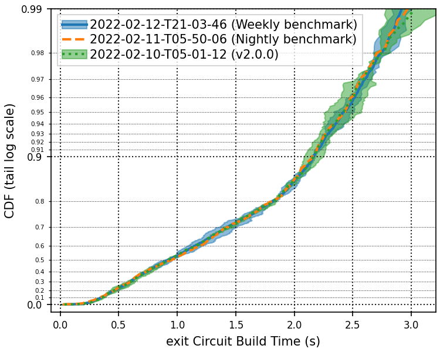

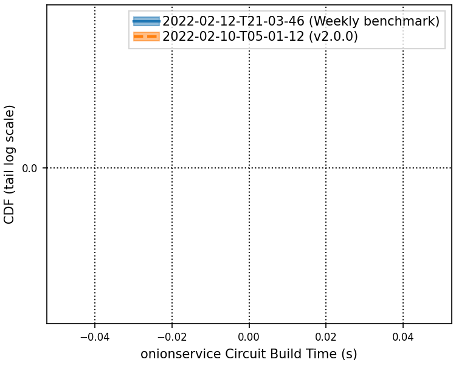

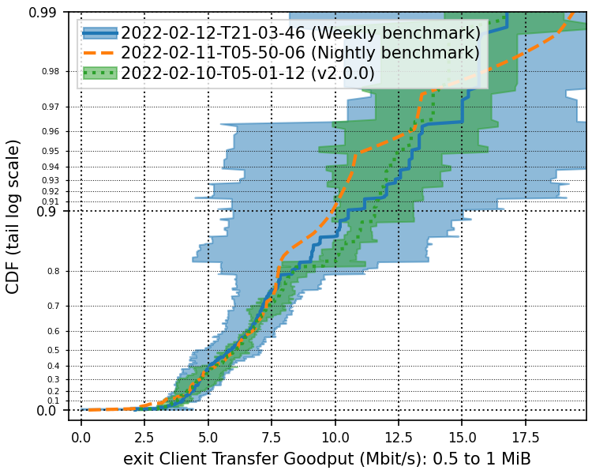

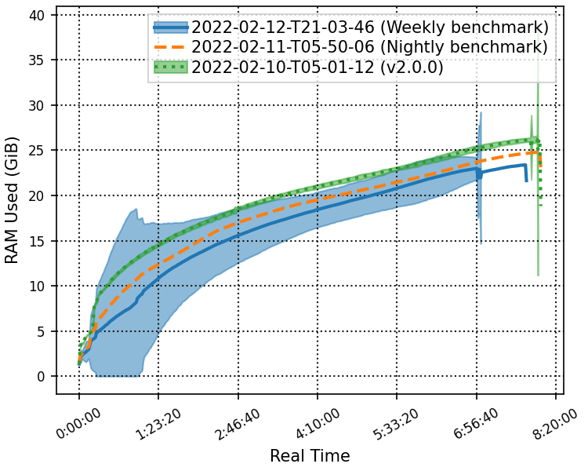

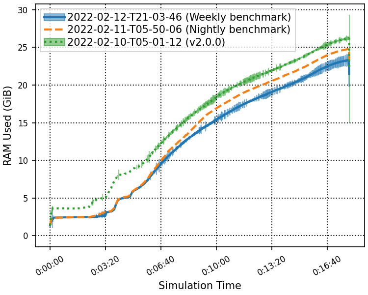

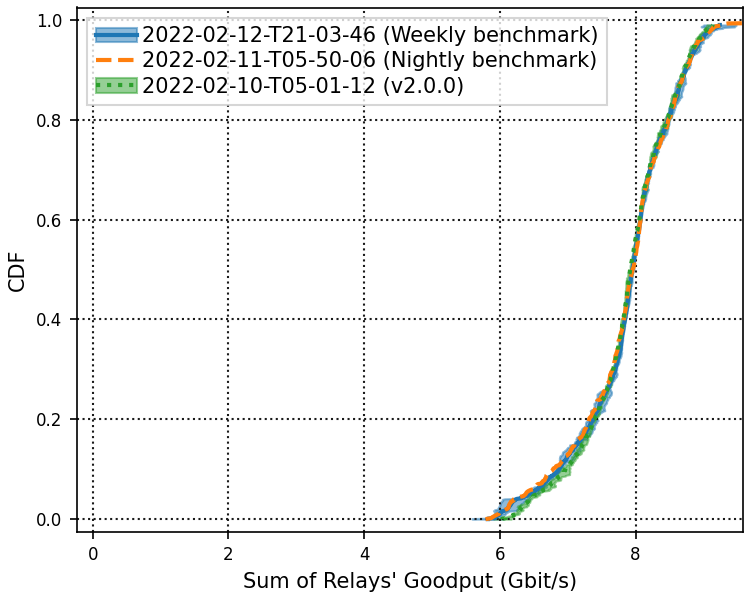

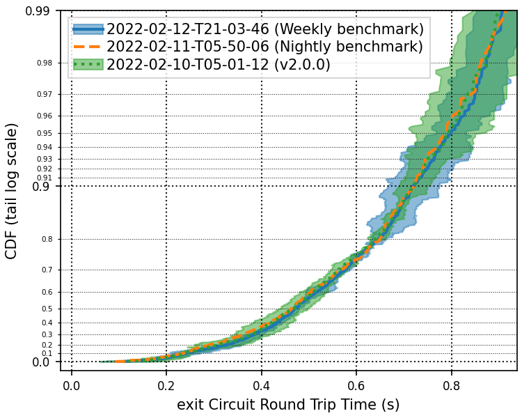

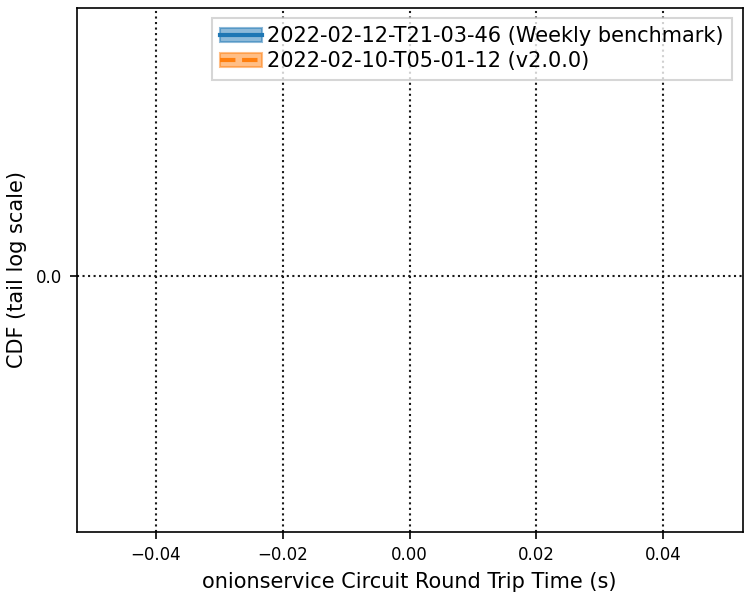

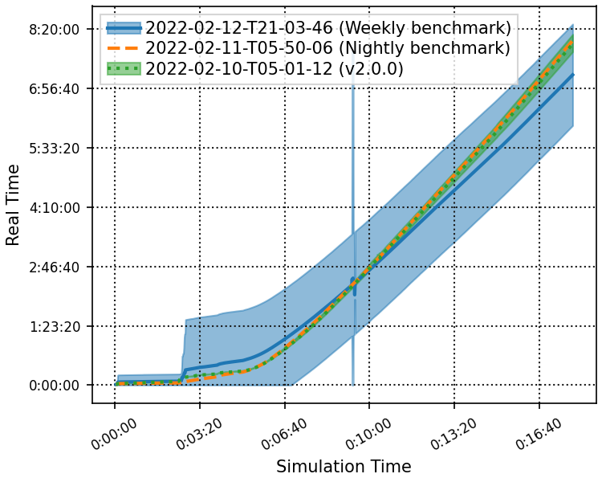

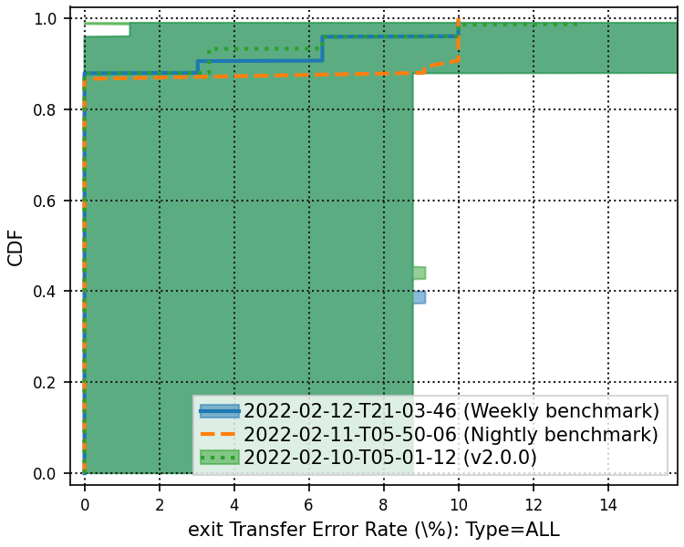

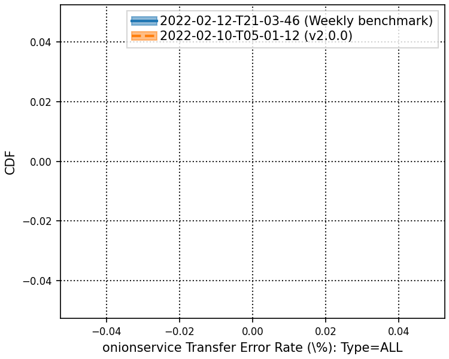

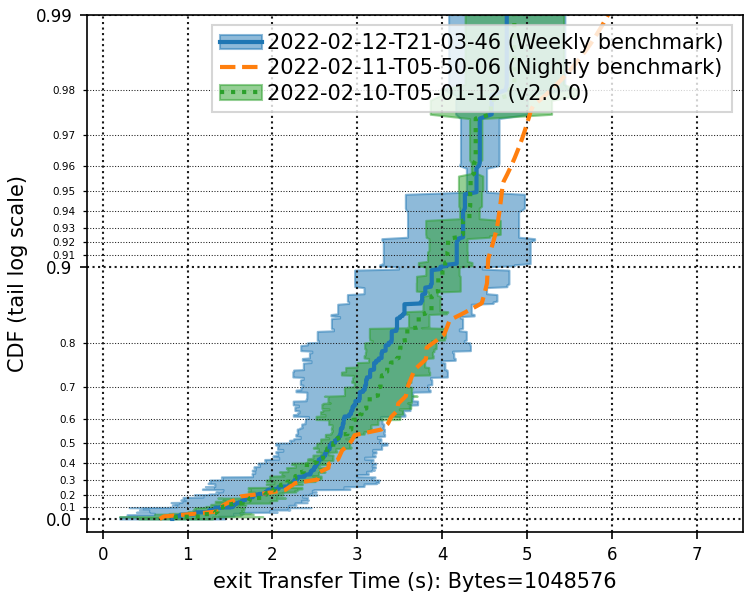

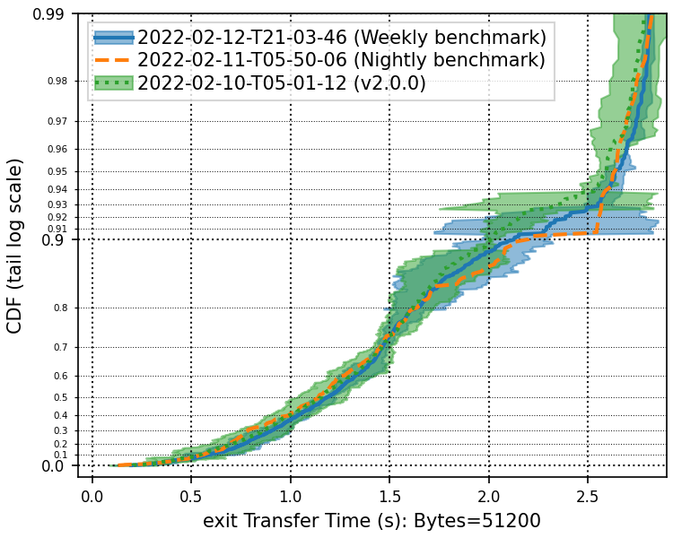

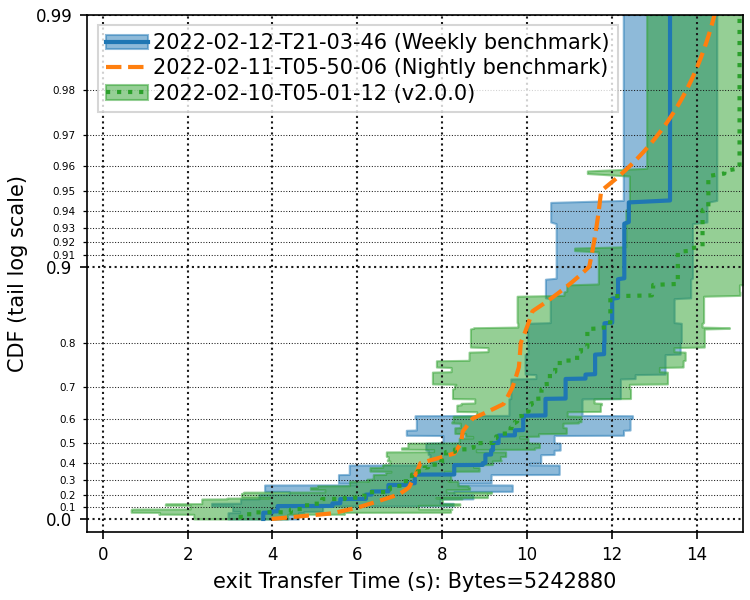

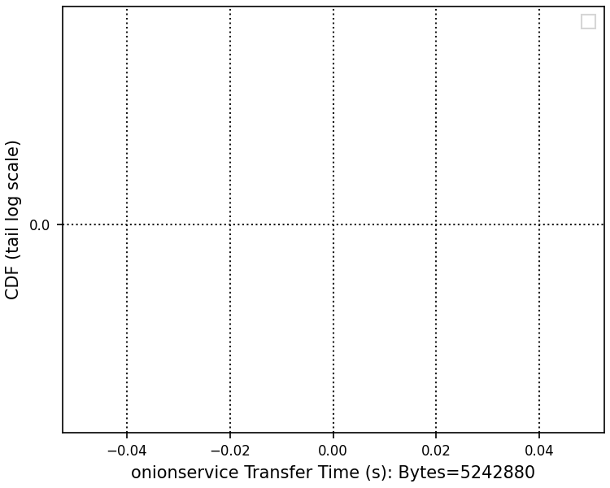
