# 2022-04-12-T18-47-32

| Key | Value |
|-----|-------|
| benchmark-sha | 0961997610450c2c523669ca45514d9c3e988d86 |
| comment |  |
| compare-to | nightly, weekly, 2022-02-10-T05-01-12 |
| compare-to-resolved | 2022-04-12-T03-34-04, 2022-04-09-T18-16-54, 2022-02-10-T05-01-12 |
| container | debian:bullseye-20220228-slim |
| dry-run | false |
| oniontrace-ref | f271ead90526b29b3dd7218ce6e56813e3b4dce3 |
| repeat | 1 |
| results-dir | tor |
| runtime-args | --parallelism 24 --progress true --use-preload-openssl-crypto true |
| rust-version | rustc 1.60.0 (7737e0b5c 2022-04-04) |
| shadow-label | enable shadow time jumps |
| shadow-ref | pull/2004/head |
| shadow-sha | 6e96b6973a80b0161ce313624ee1e8b54fe2520e |
| sim-id | 2022-04-12-T18-47-32 |
| sim-to-run | tornet-0.05 |
| tgen-ref | f28daefc20857c20e964aca6e970f69e2dce0edb |
| timestamp | 1649789252 |
| tor-ref | tor-0.4.6.10 |
| tornettools-ref | fa36f57ebc4db81559132c5cd8cd7bfc2f92406f |
| trigger | workflow_dispatch |
| update-symlink |  |
| workflow-name | Manual Tor Benchmark |

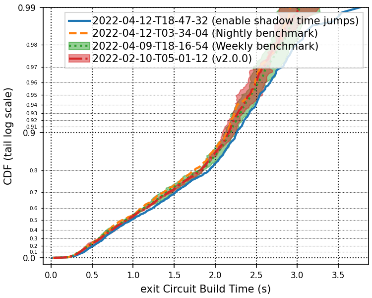

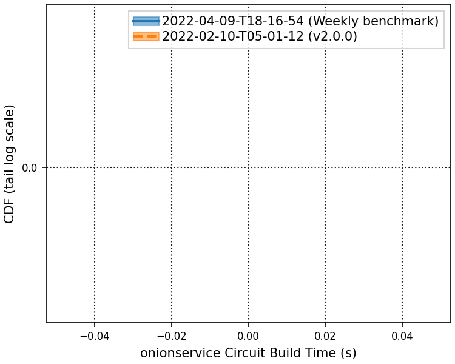

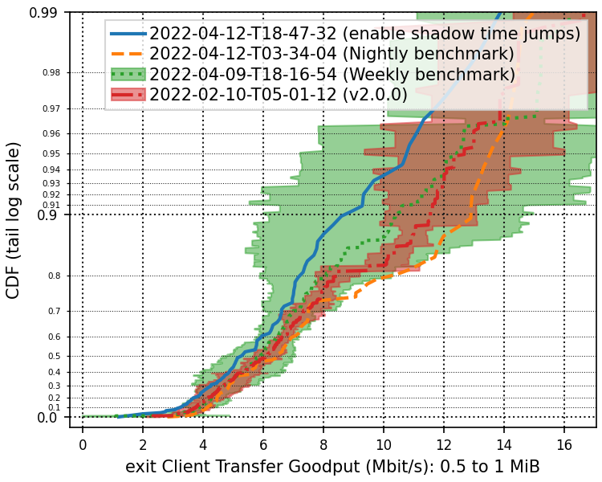

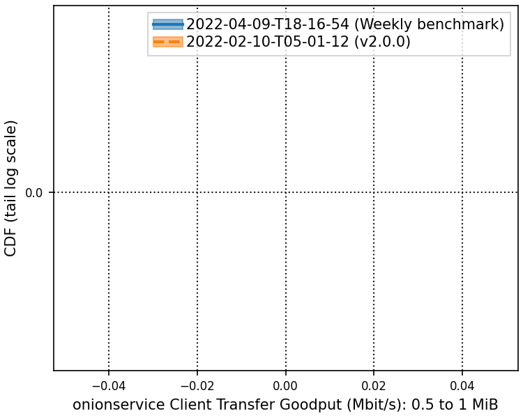

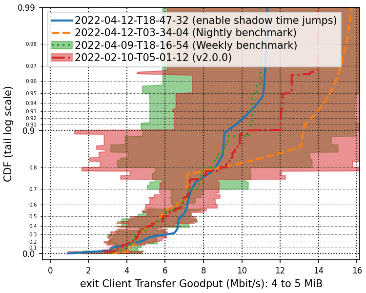

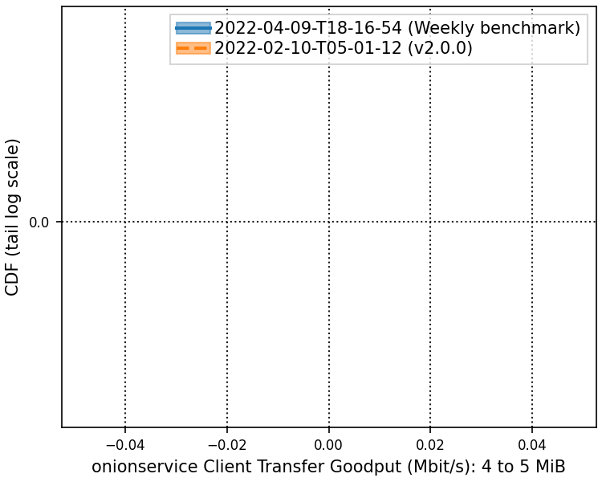

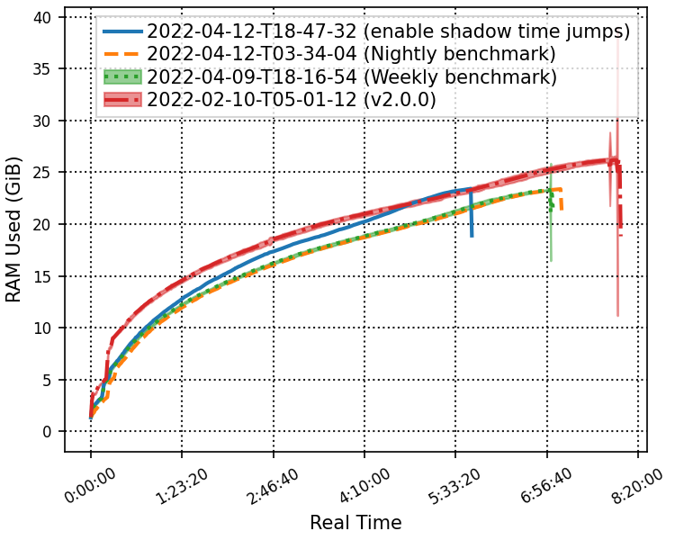

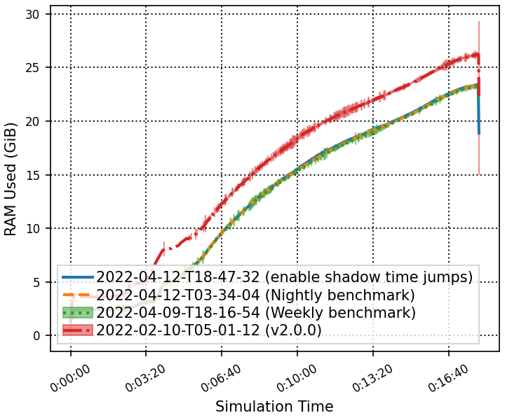

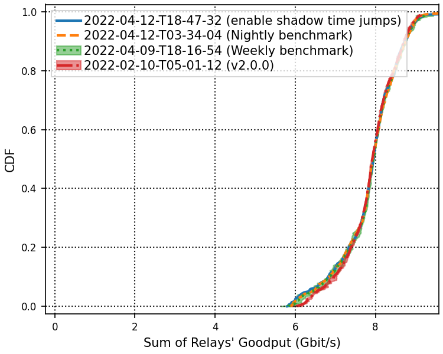

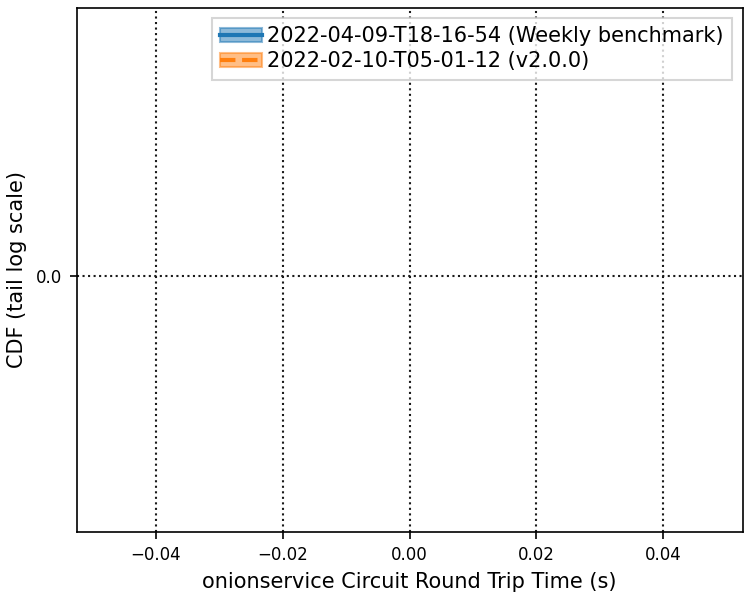

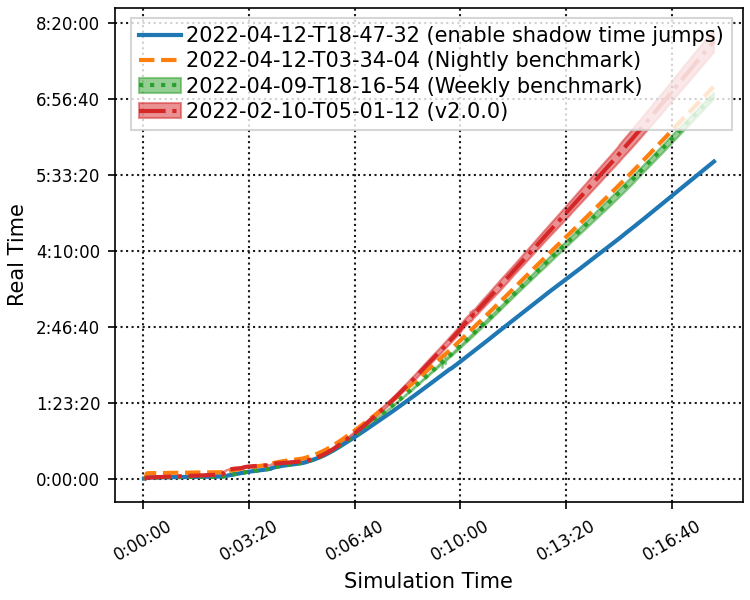

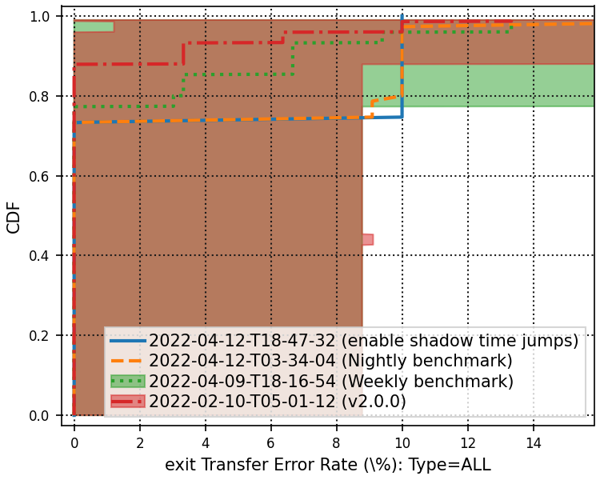

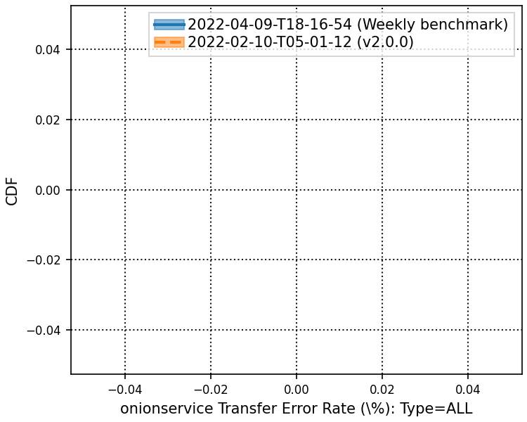

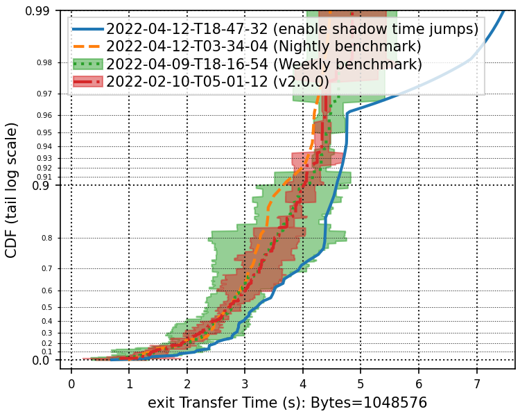

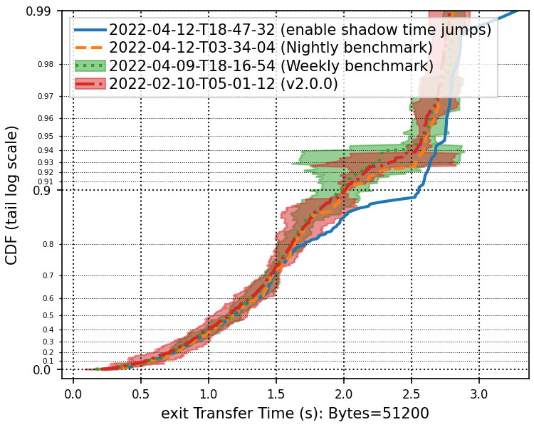

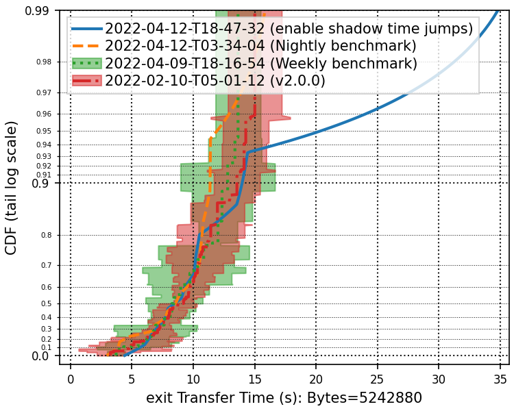

