# 2022-05-11-T03-51-38

| Key | Value |
|-----|-------|
| benchmark-sha | 840f12d2ba7eb344ca698bb6160e219469b22aef |
| comment | Nightly benchmark of the main branch |
| compare-to | nightly, weekly, 2022-02-10-T05-01-12 |
| compare-to-resolved | 2022-05-06-T03-40-25, 2022-05-09-T15-11-02, 2022-02-10-T05-01-12 |
| container | debian:bullseye-20220228-slim |
| dry-run | false |
| oniontrace-ref | f271ead90526b29b3dd7218ce6e56813e3b4dce3 |
| repeat | 1 |
| results-dir | tor |
| runtime-args | --parallelism 24 --progress true --use-preload-openssl-crypto true |
| rust-version | rustc 1.60.0 (7737e0b5c 2022-04-04) |
| shadow-label | Nightly benchmark |
| shadow-ref | main |
| shadow-sha | 72a5e82fa9ed29f36fa555f8c7b1d66fcf4fa85e |
| sim-id | 2022-05-11-T03-51-38 |
| sim-to-run | tornet-0.05 |
| tgen-ref | f28daefc20857c20e964aca6e970f69e2dce0edb |
| timestamp | 1652241098 |
| tor-ref | tor-0.4.6.10 |
| tornettools-ref | fa36f57ebc4db81559132c5cd8cd7bfc2f92406f |
| trigger | schedule |
| update-symlink | nightly |
| workflow-name | Nightly Tor Benchmark |

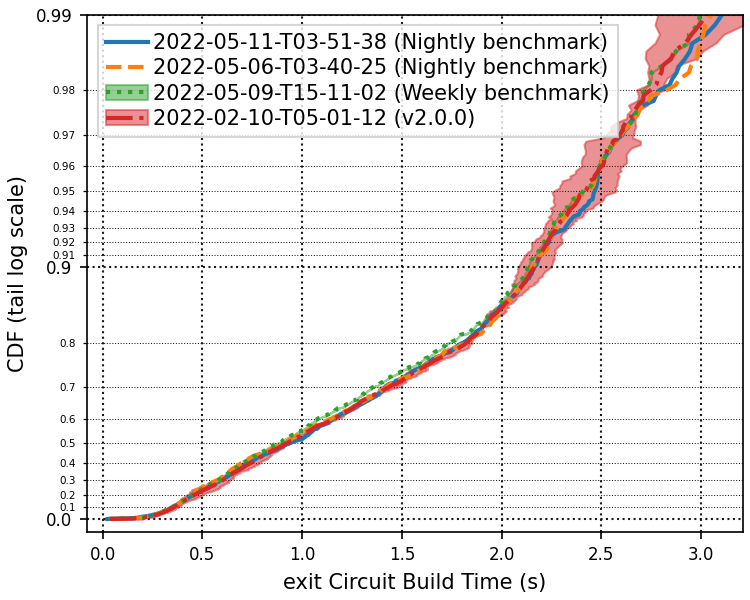

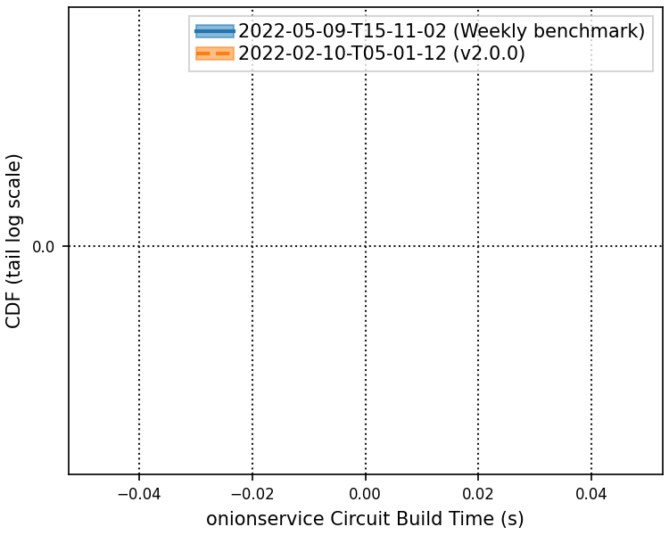

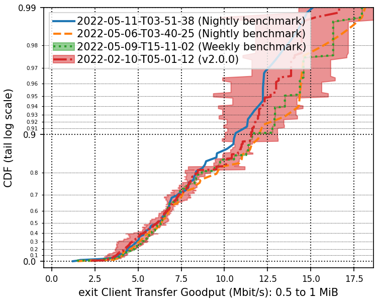

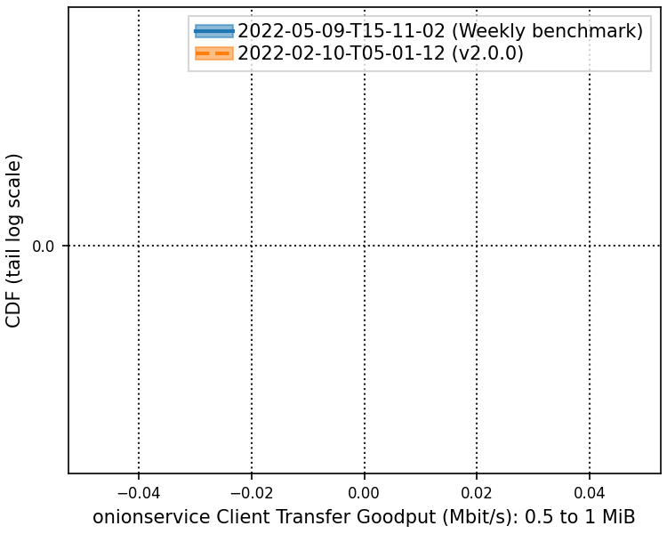

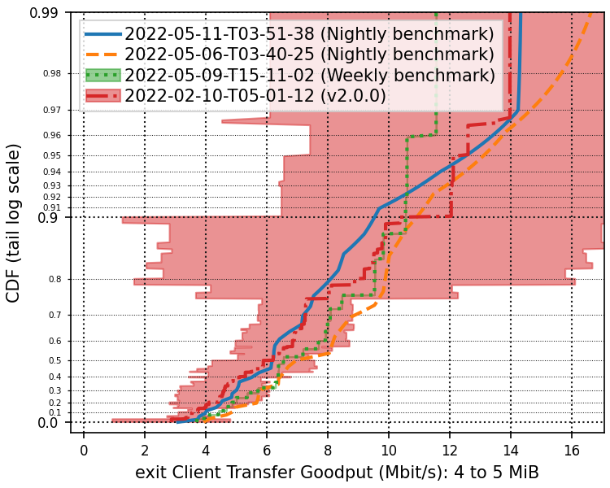

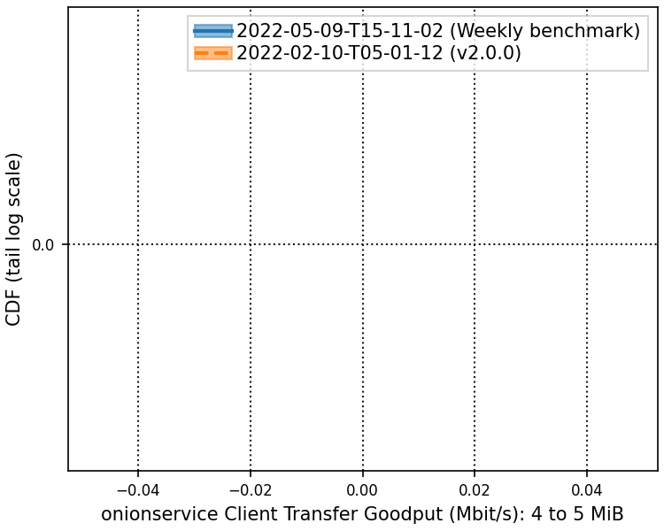

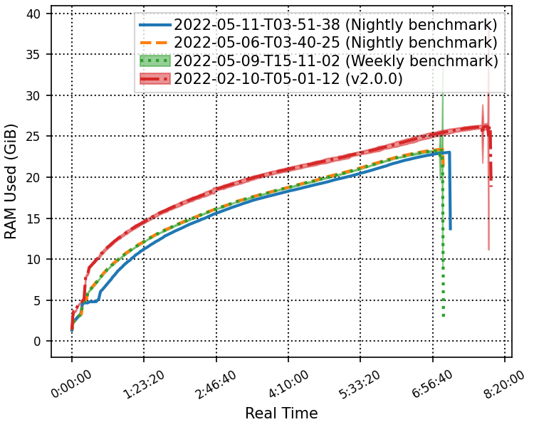

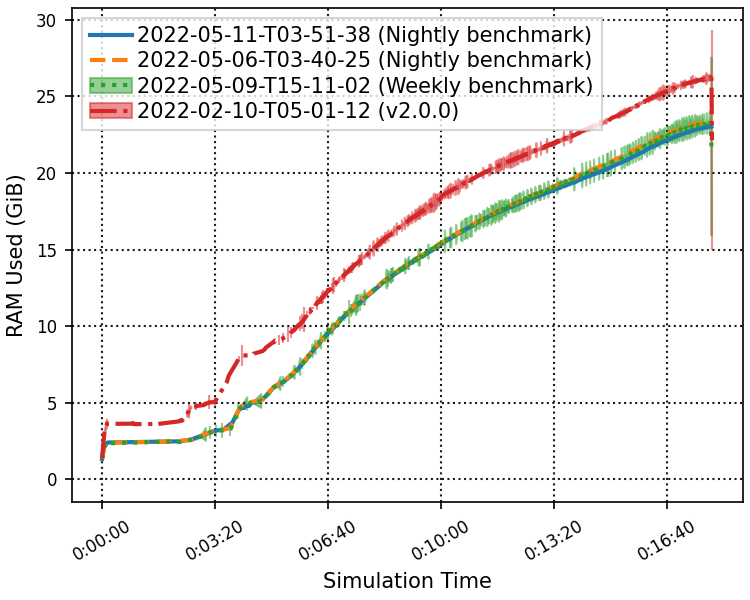

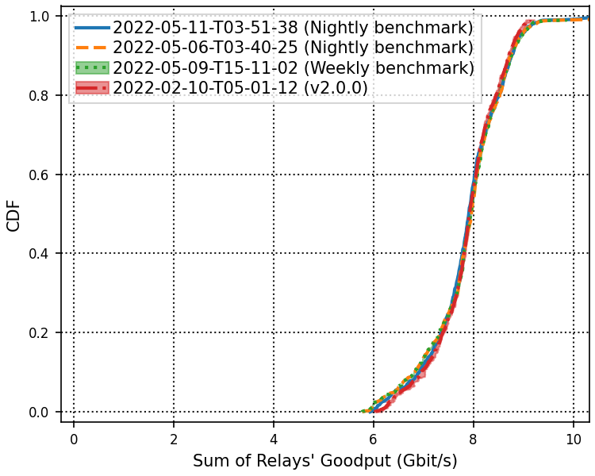

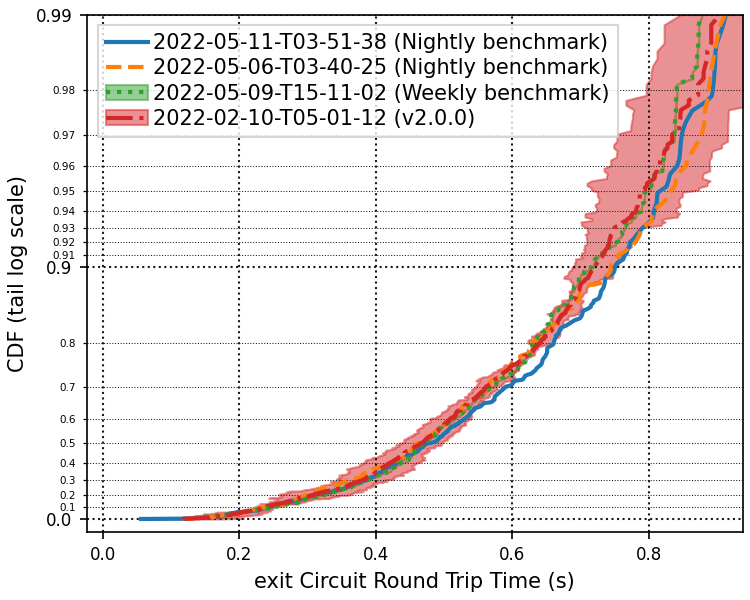

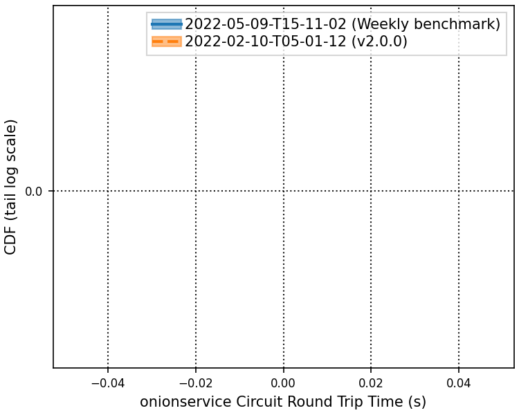

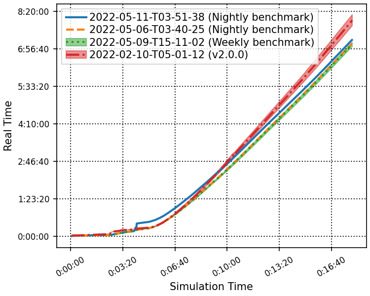

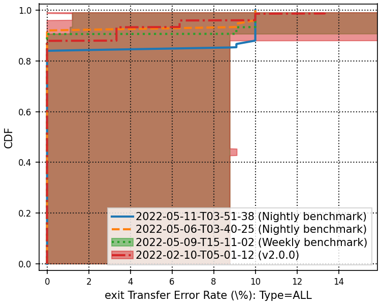

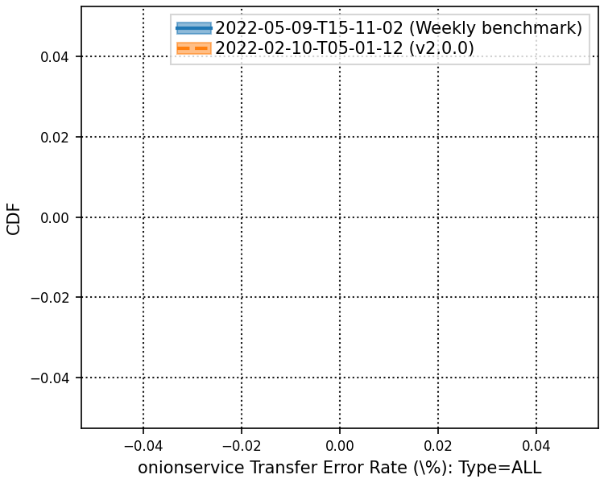

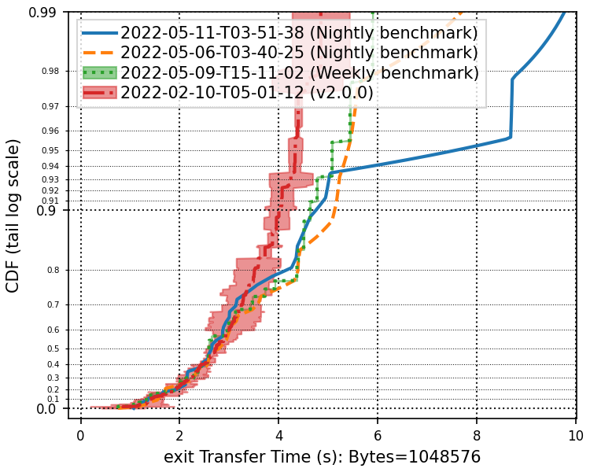

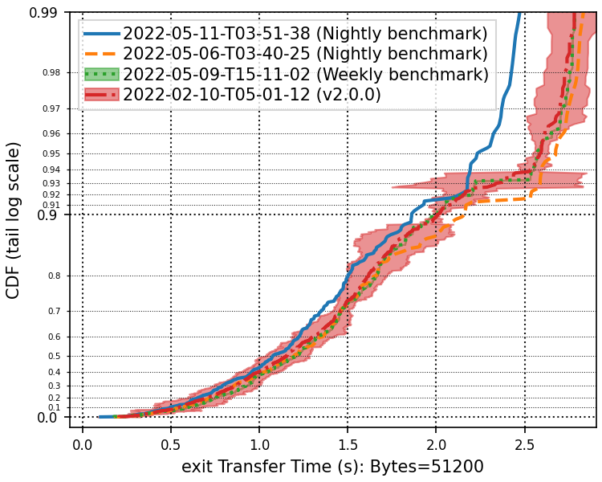

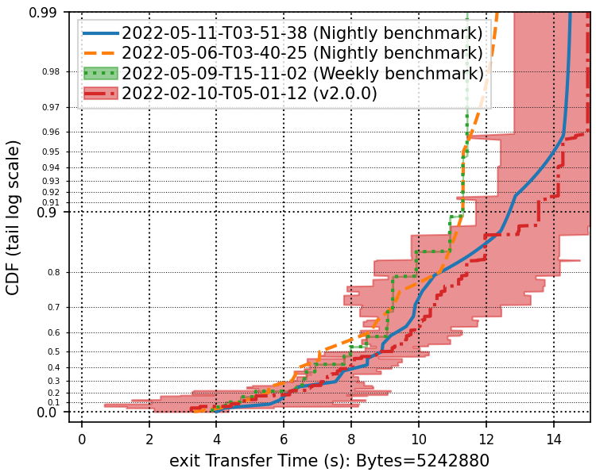

