# 2022-05-31-T03-46-05

| Key | Value |
|-----|-------|
| benchmark-sha | 7b663dadd812cf06da3abb4a813f88aacd541e88 |
| comment | Nightly benchmark of the main branch |
| compare-to | nightly, weekly, 2022-02-10-T05-01-12 |
| compare-to-resolved | 2022-05-27-T03-52-02, 2022-05-28-T03-40-34, 2022-02-10-T05-01-12 |
| container | debian:bullseye-20220228-slim |
| dry-run | false |
| oniontrace-ref | f271ead90526b29b3dd7218ce6e56813e3b4dce3 |
| repeat | 1 |
| results-dir | tor |
| runtime-args | --parallelism 24 --progress true --use-preload-openssl-crypto true |
| rust-version | rustc 1.61.0 (fe5b13d68 2022-05-18) |
| shadow-label | Nightly benchmark |
| shadow-ref | main |
| shadow-sha | 095b7c3497214a39b0ee3da0848c92f3d3803a11 |
| sim-id | 2022-05-31-T03-46-05 |
| sim-to-run | tornet-0.05 |
| tgen-ref | f28daefc20857c20e964aca6e970f69e2dce0edb |
| timestamp | 1653968765 |
| tor-ref | tor-0.4.6.10 |
| tornettools-ref | fa36f57ebc4db81559132c5cd8cd7bfc2f92406f |
| trigger | schedule |
| update-symlink | nightly |
| workflow-name | Nightly Tor Benchmark |

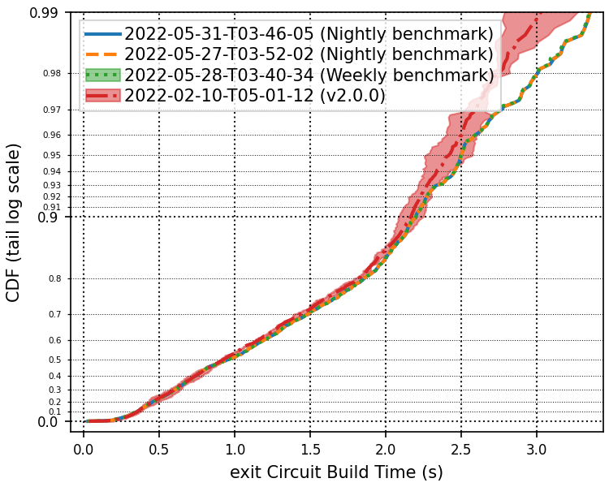

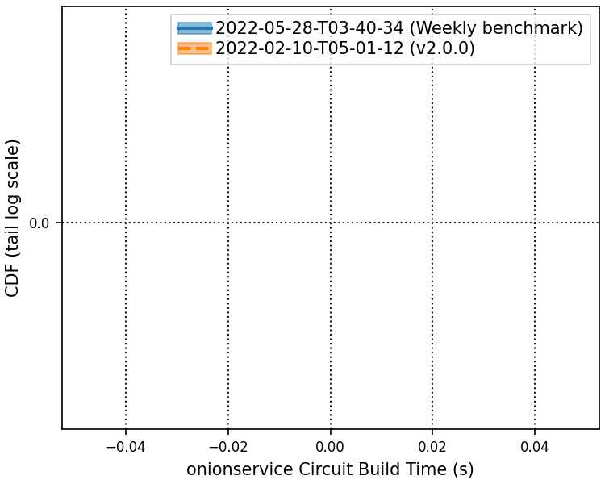

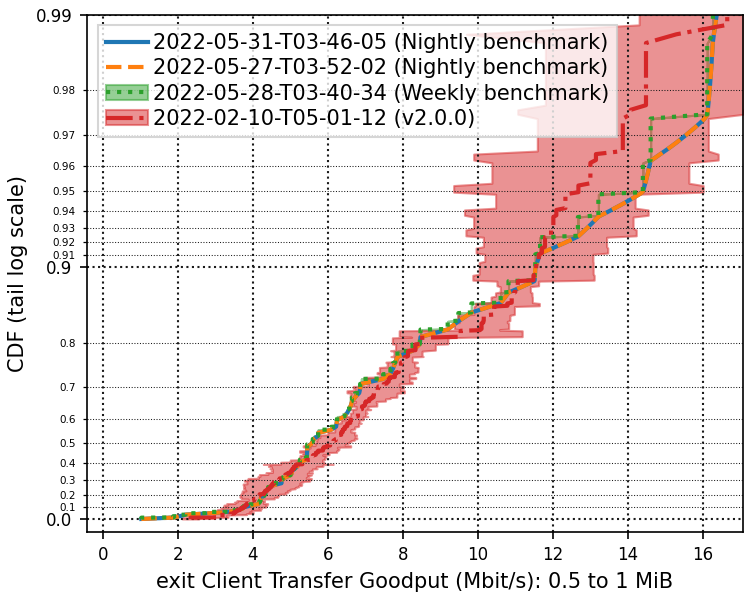

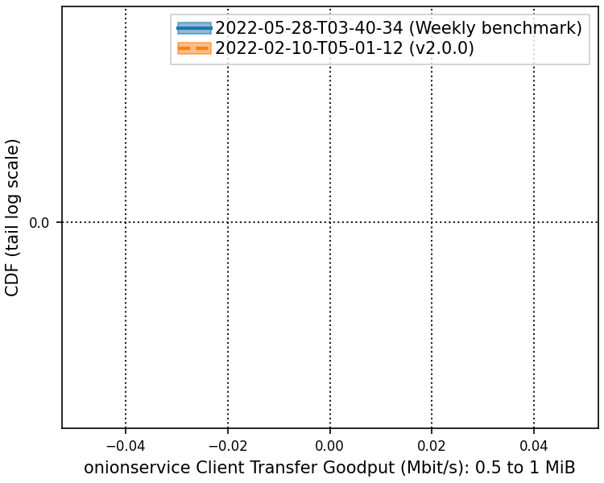

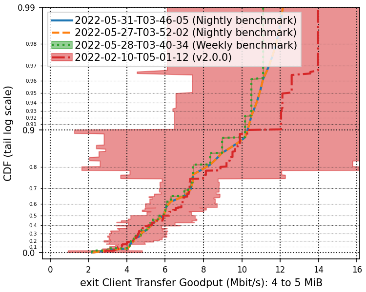

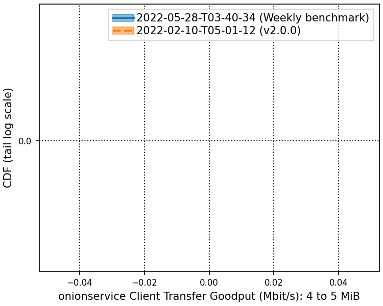

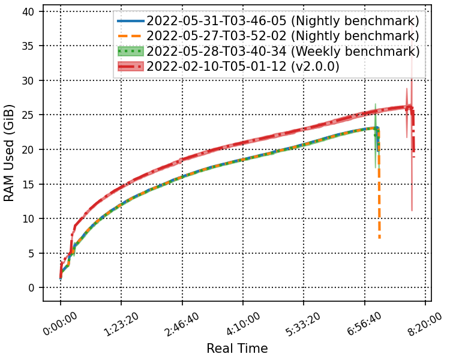

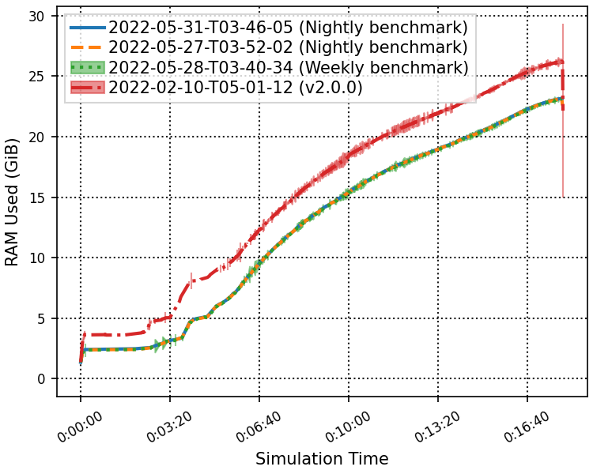

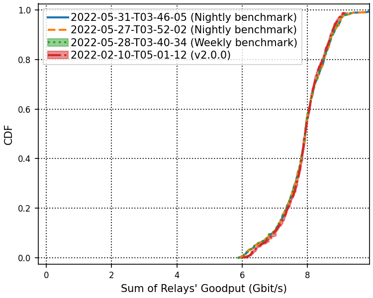

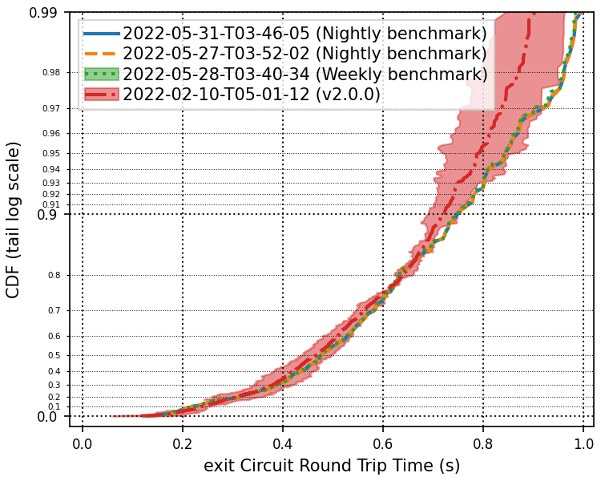

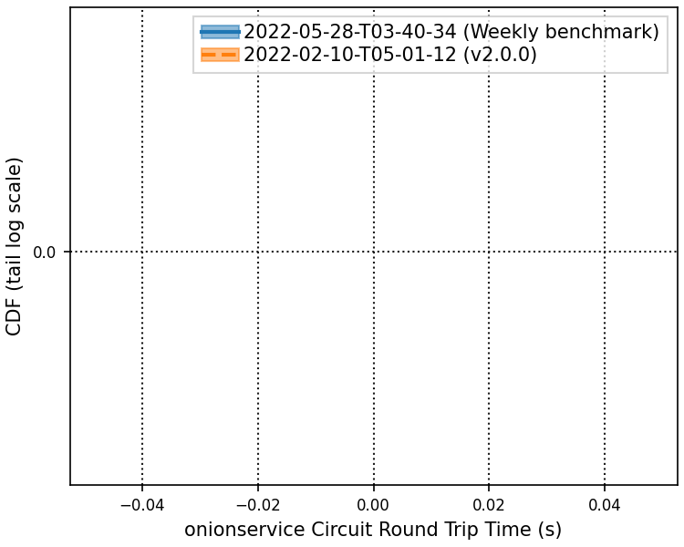

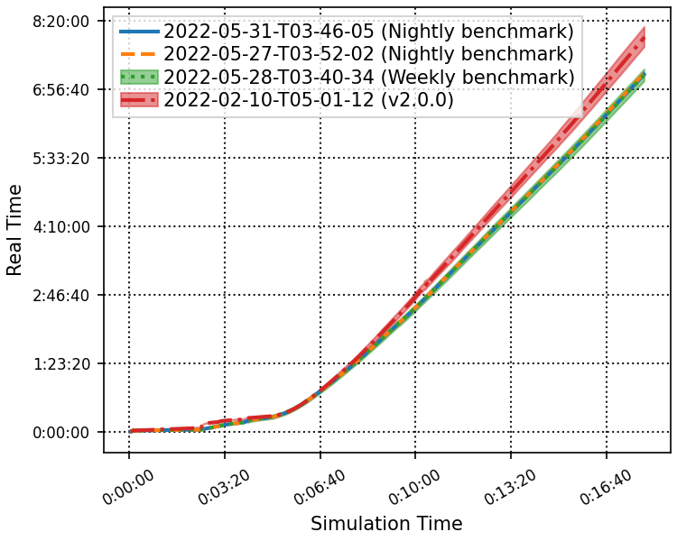

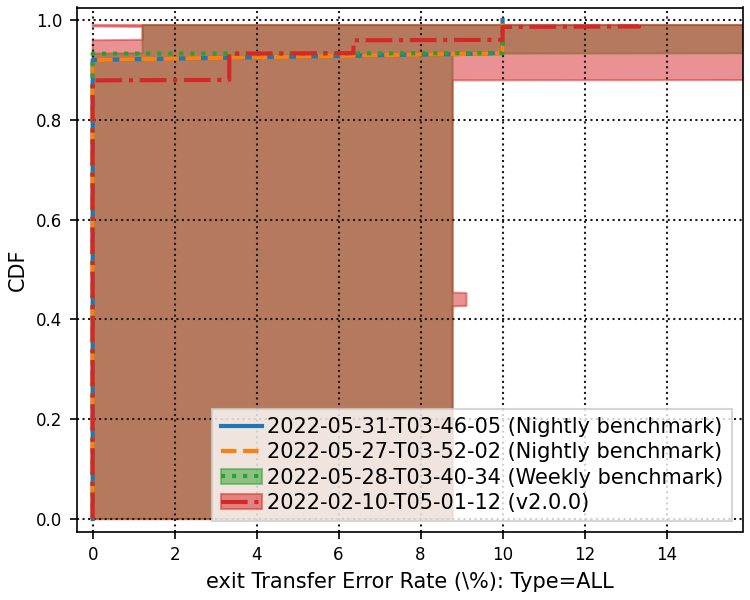

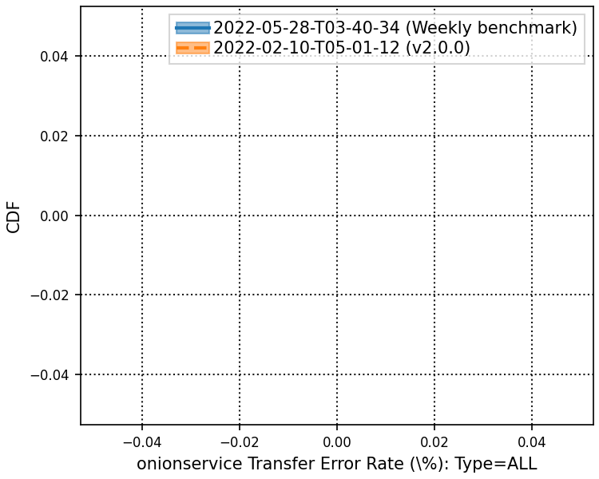

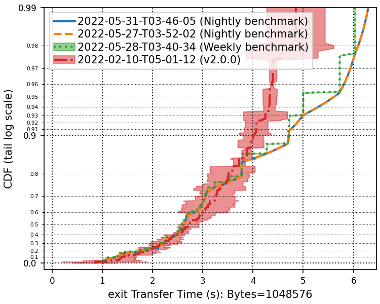

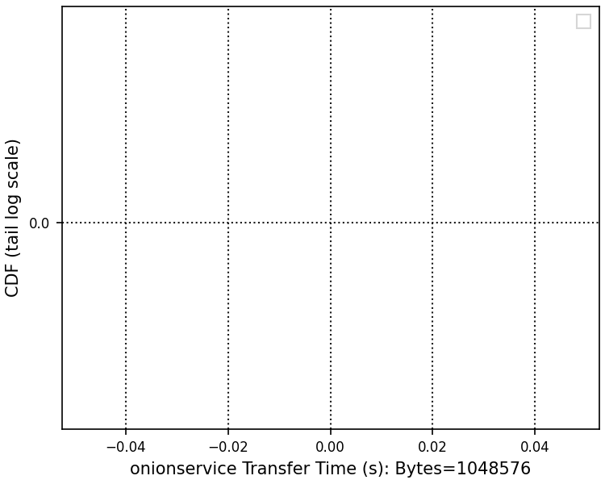

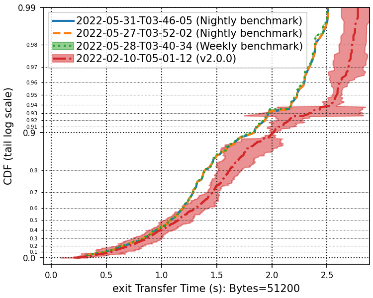

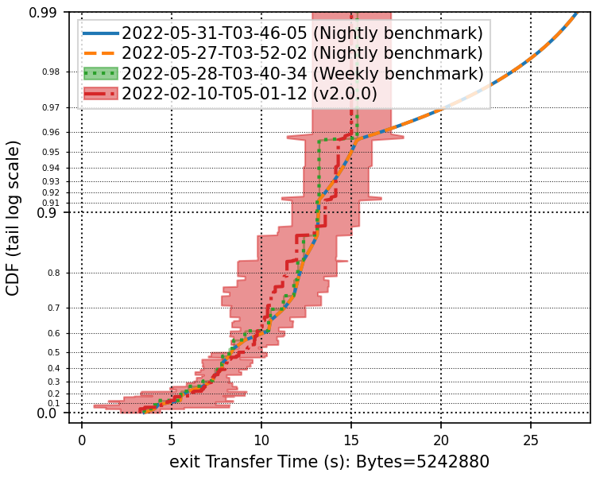

