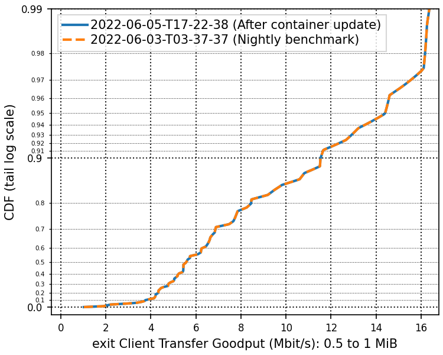
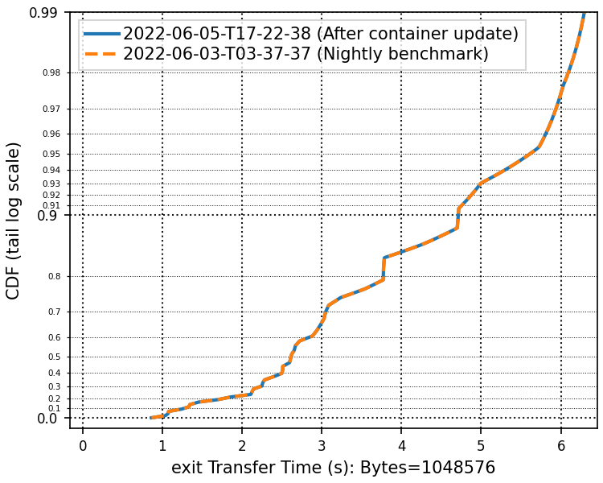

# 2022-06-05-T17-22-38

| Key | Value |
|-----|-------|
| benchmark-sha | d3ce39a260a4f5d3d80d0ac48311f9526fec9207 |
| comment | Re-running a previous simulation after updating the container image version, the package mirror, and the host's kernel. |
| compare-to | 2022-06-03-T03-37-37 |
| compare-to-resolved | 2022-06-03-T03-37-37 |
| container | debian:bullseye-20220527-slim |
| dry-run | false |
| oniontrace-ref | f271ead90526b29b3dd7218ce6e56813e3b4dce3 |
| repeat | 1 |
| results-dir | tor |
| runtime-args | --parallelism 24 --progress true --use-preload-openssl-crypto true |
| rust-version | rustc 1.61.0 (fe5b13d68 2022-05-18) |
| shadow-label | After container update |
| shadow-ref | b07525bbbd22f0494e579287f2a8cd229480873f |
| shadow-sha | b07525bbbd22f0494e579287f2a8cd229480873f |
| sim-id | 2022-06-05-T17-22-38 |
| sim-to-run | tornet-0.05 |
| tgen-ref | f28daefc20857c20e964aca6e970f69e2dce0edb |
| timestamp | 1654449758 |
| tor-ref | tor-0.4.6.10 |
| tornettools-ref | fa36f57ebc4db81559132c5cd8cd7bfc2f92406f |
| trigger | workflow_dispatch |
| update-symlink |  |
| workflow-name | Manual Tor Benchmark |

