# 2022-07-08-T21-19-45

| Key | Value |
|-----|-------|
| benchmark-sha | 7a1a15729b13175076a599be19a0ec6d763b4fa6 |
| comment |  |
| compare-to | nightly, weekly, 2022-06-06-T23-09-40 |
| compare-to-resolved | 2022-07-08-T03-55-40, 2022-07-02-T03-58-44, 2022-06-06-T23-09-40 |
| container | debian:bullseye-20220527-slim |
| dry-run | false |
| oniontrace-ref | f271ead90526b29b3dd7218ce6e56813e3b4dce3 |
| repeat | 1 |
| results-dir | tor |
| runtime-args | --parallelism 24 --use-preload-openssl-crypto true |
| rust-version | rustc 1.62.0 (a8314ef7d 2022-06-27) |
| shadow-label | PR 2267 |
| shadow-ref | pull/2267/head |
| shadow-sha | efc52d715b93170877c288fe3e352e84bc84c7ab |
| sim-id | 2022-07-08-T21-19-45 |
| sim-to-run | tornet-0.05 |
| tgen-ref | bcb36ea3797ca0029aa9a7fb3b7b8f24d47bfb17 |
| timestamp | 1657315185 |
| tor-ref | tor-0.4.7.7 |
| tornettools-ref | 5ee84cef2690143f6adf2667d1db9fd5f7d7d3a4 |
| trigger | workflow_dispatch |
| update-symlink |  |
| workflow-name | Manual Tor Benchmark |

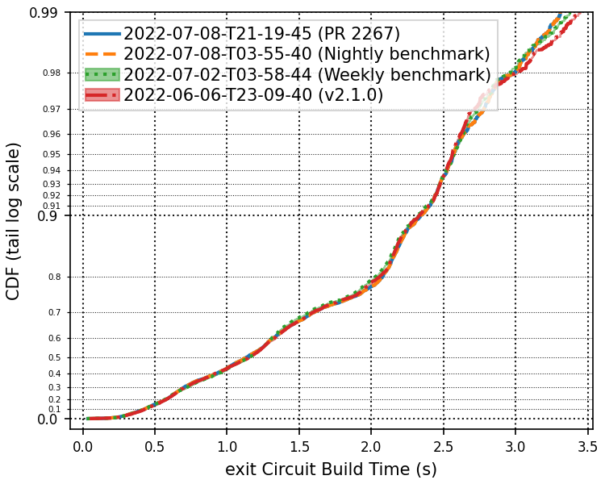

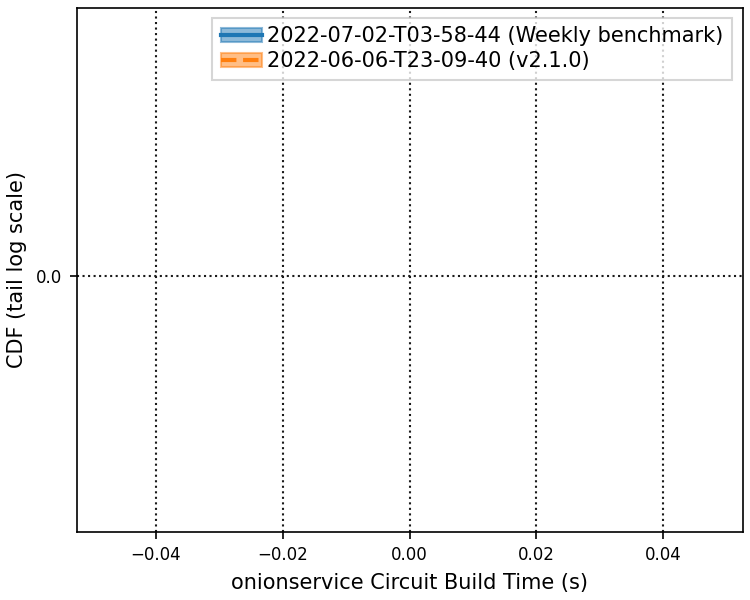

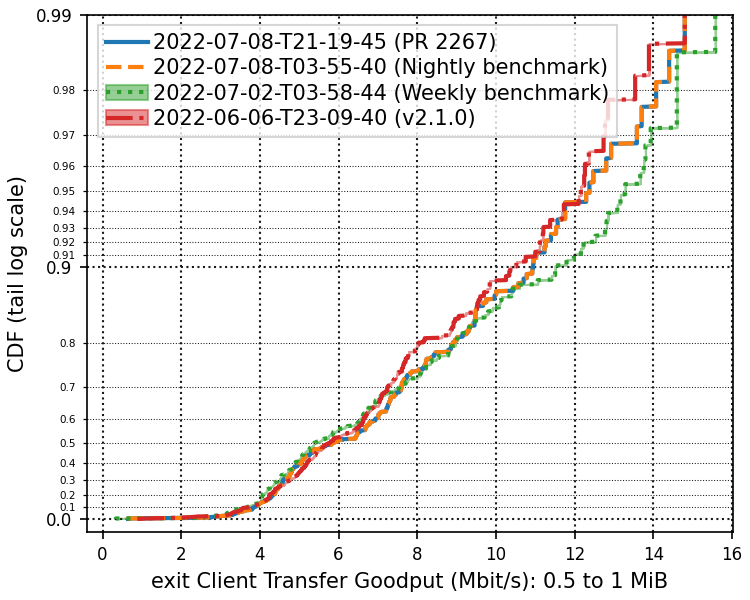

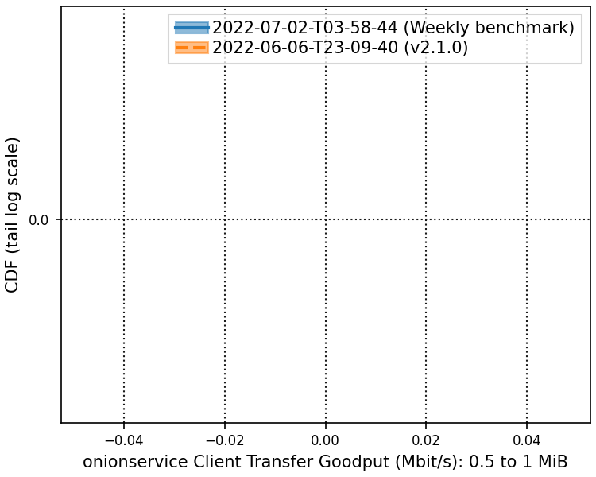

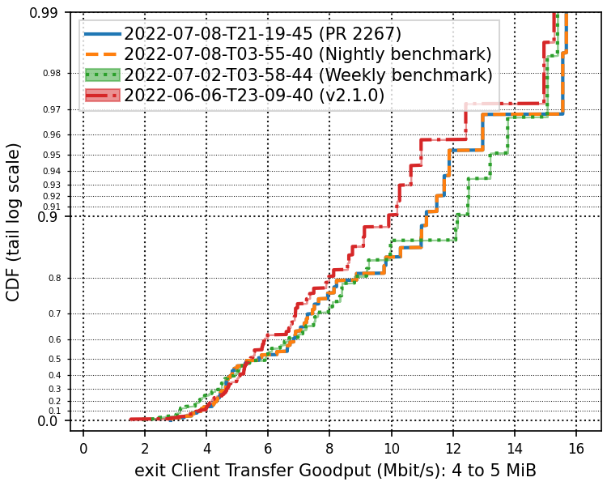

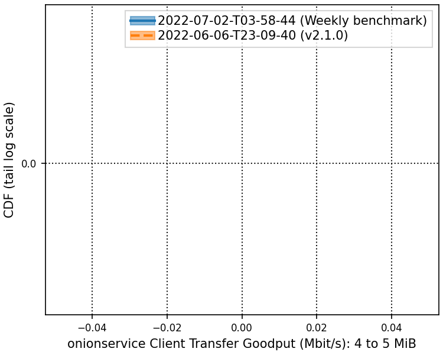

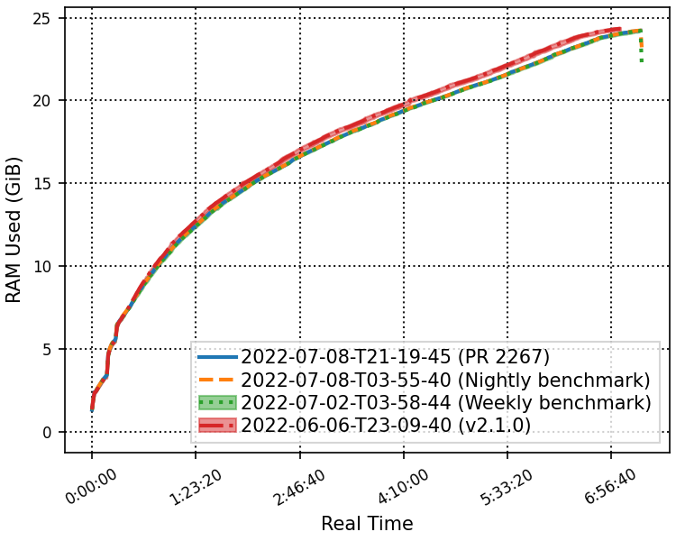

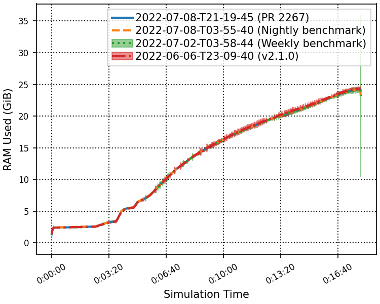

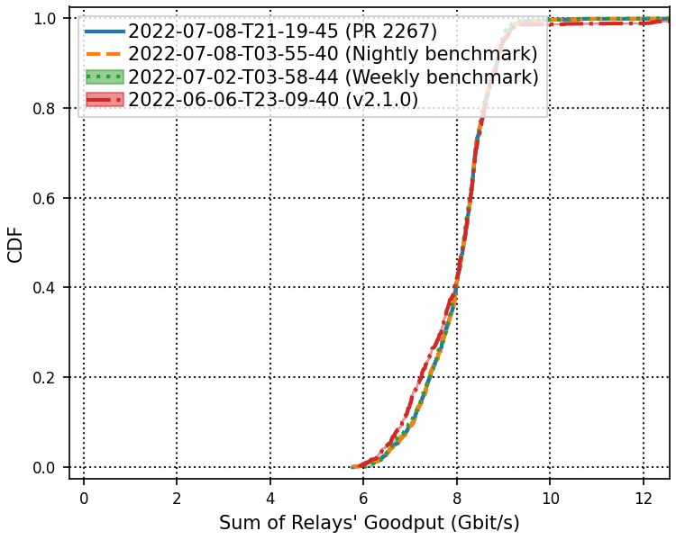

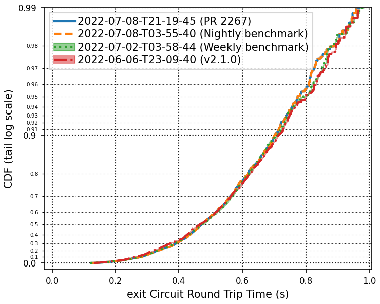

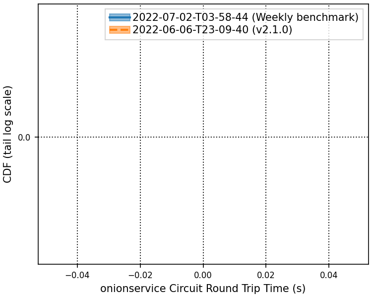

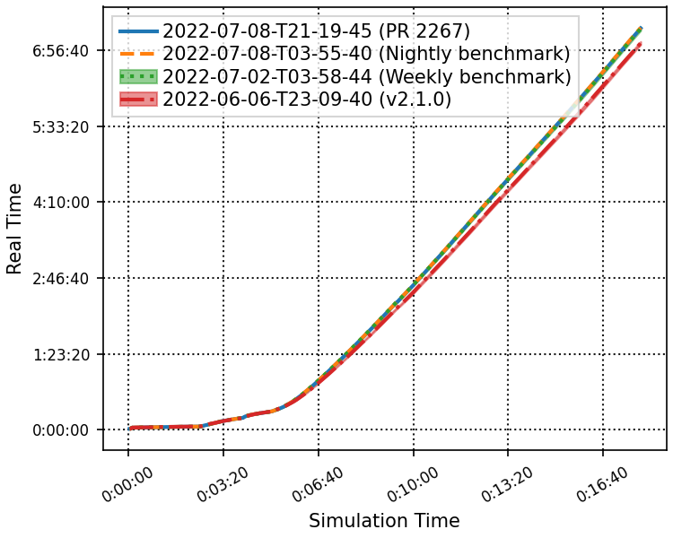

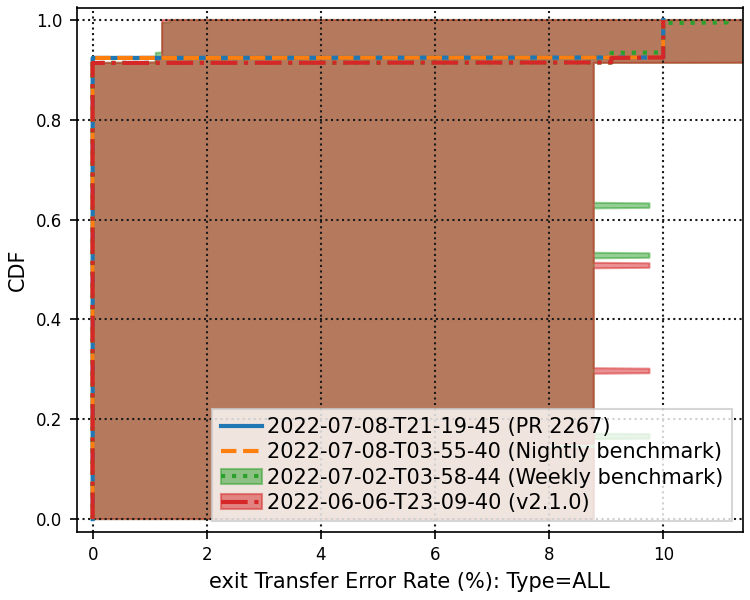

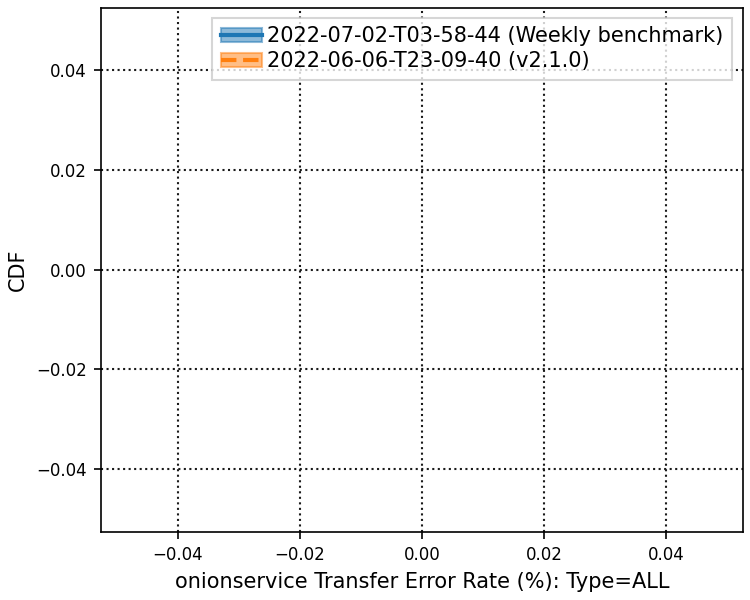

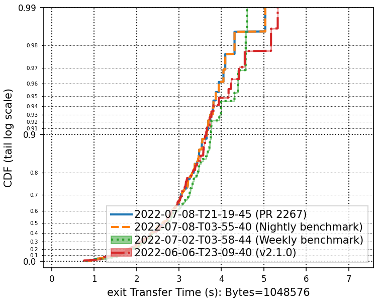

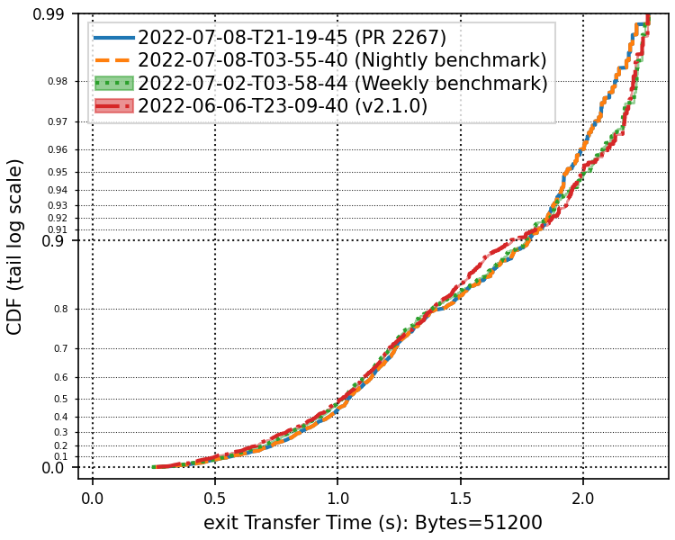

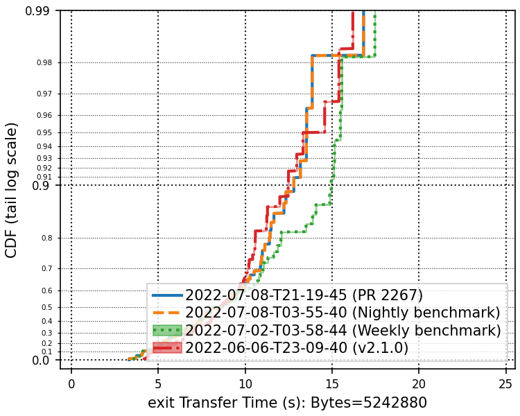

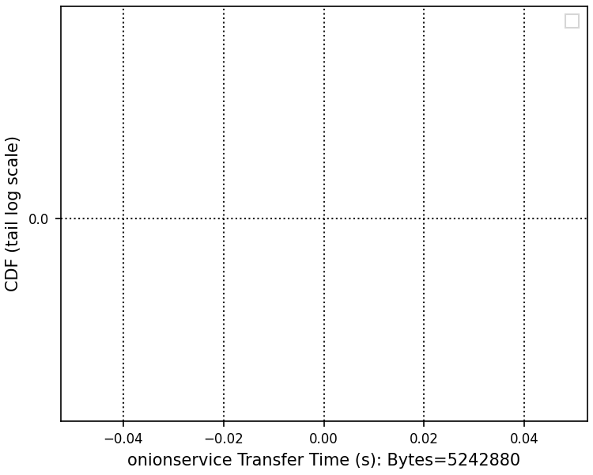
