# 2022-07-29-T04-01-53

| Key | Value |
|-----|-------|
| benchmark-sha | c97ea73b641043c19a664aaa569298af04e2c3ba |
| comment | Nightly benchmark of the main branch |
| compare-to | nightly, weekly, 2022-06-06-T23-09-40 |
| compare-to-resolved | 2022-07-28-T03-57-50, 2022-07-23-T03-50-17, 2022-06-06-T23-09-40 |
| container | debian:bullseye-20220527-slim |
| dry-run | false |
| oniontrace-ref | f271ead90526b29b3dd7218ce6e56813e3b4dce3 |
| repeat | 1 |
| results-dir | tor |
| runtime-args | --parallelism 24 --use-preload-openssl-crypto true |
| rust-version | rustc 1.62.1 (e092d0b6b 2022-07-16) |
| shadow-label | Nightly benchmark |
| shadow-ref | main |
| shadow-sha | 85946ac80c52bbb7a23178425db6aab97aa03ff0 |
| sim-id | 2022-07-29-T04-01-53 |
| sim-to-run | tornet-0.05 |
| tgen-ref | bcb36ea3797ca0029aa9a7fb3b7b8f24d47bfb17 |
| timestamp | 1659067313 |
| tor-ref | tor-0.4.7.7 |
| tornettools-ref | 5ee84cef2690143f6adf2667d1db9fd5f7d7d3a4 |
| trigger | schedule |
| update-symlink | nightly |
| workflow-name | Nightly Tor Benchmark |

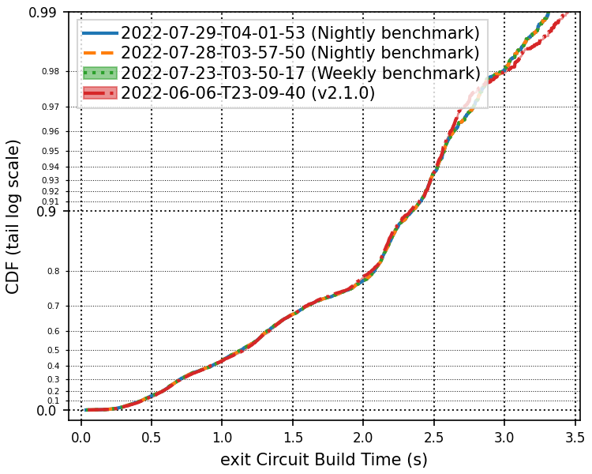

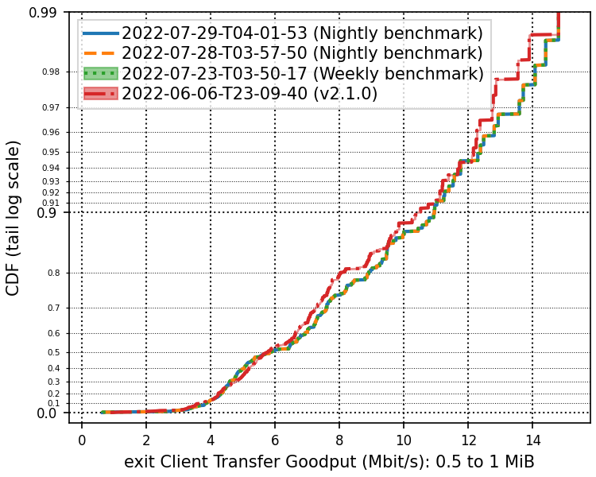

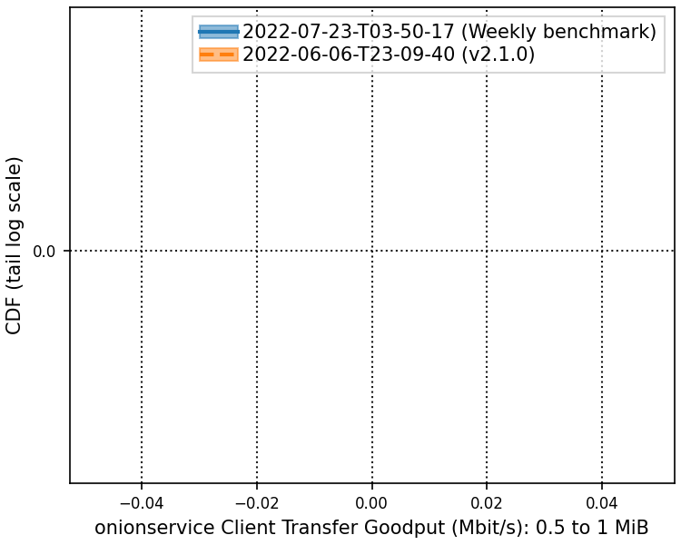

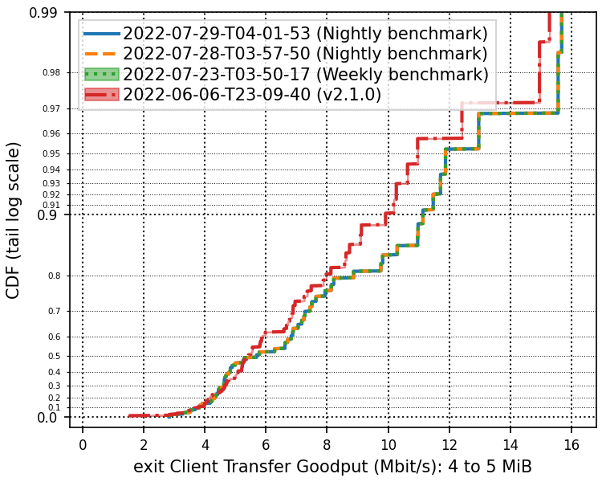

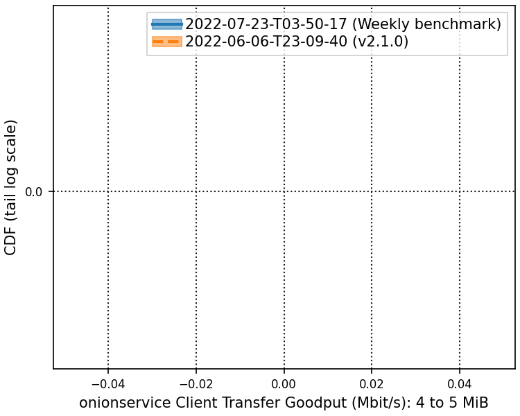

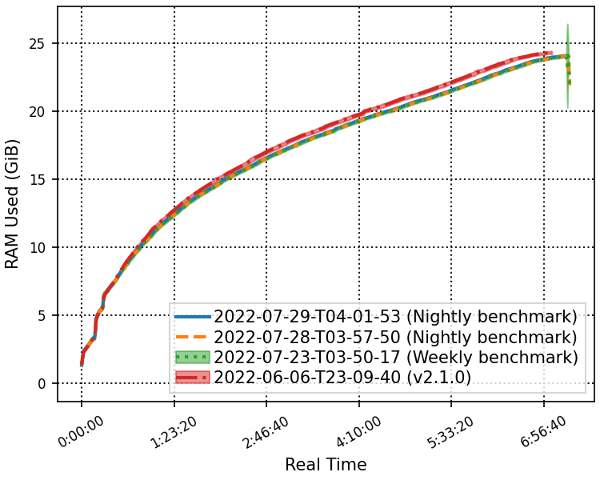

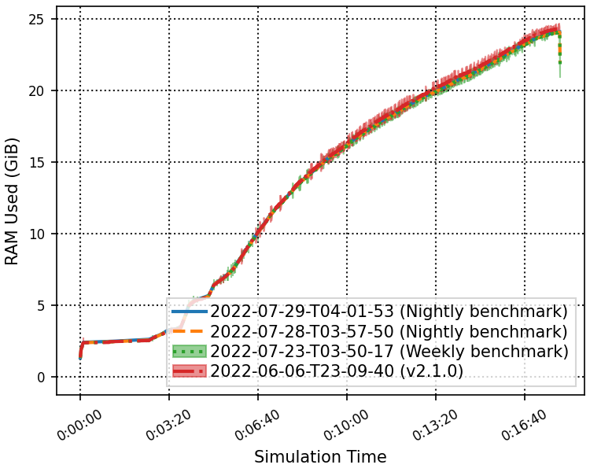

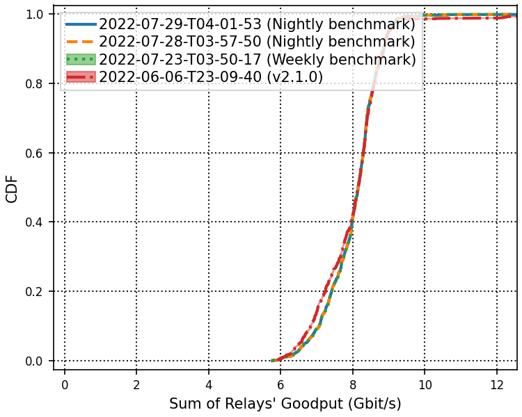

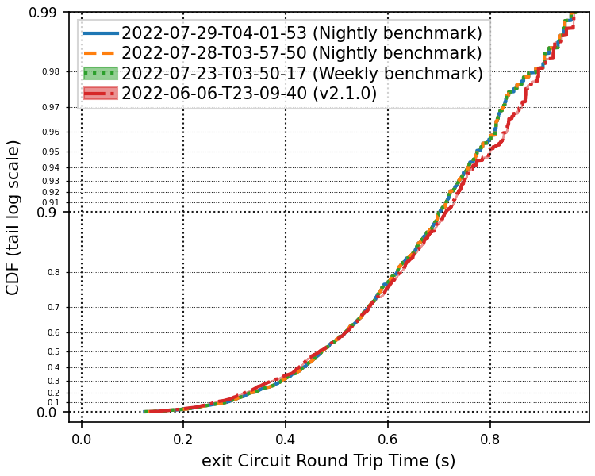

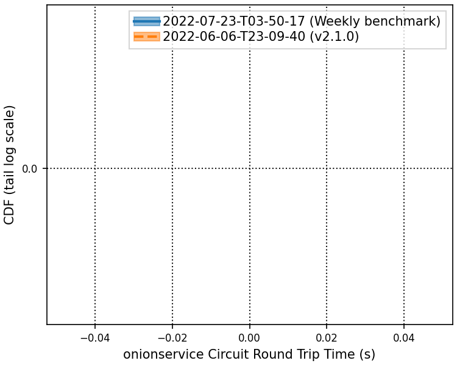

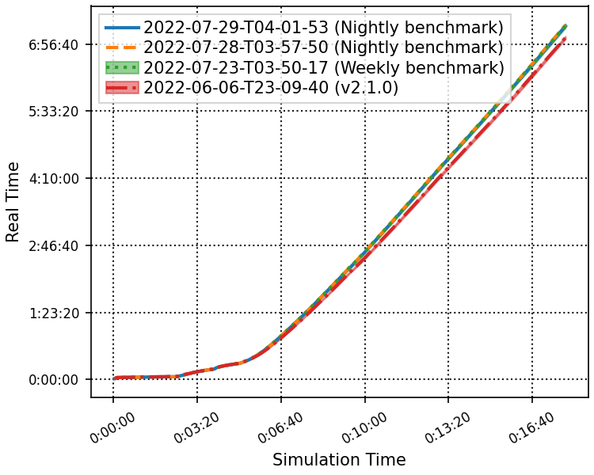

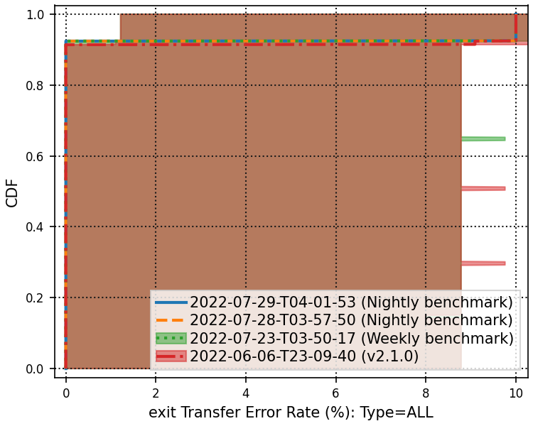

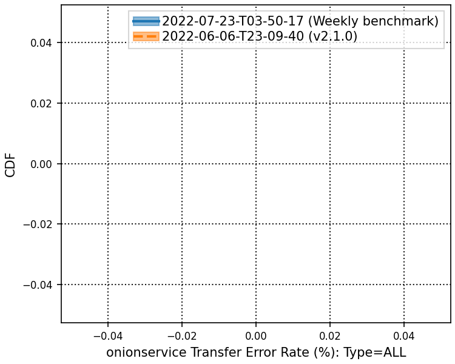

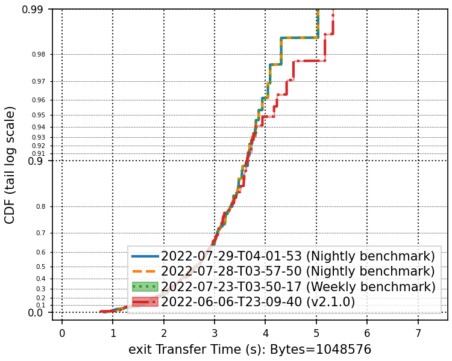

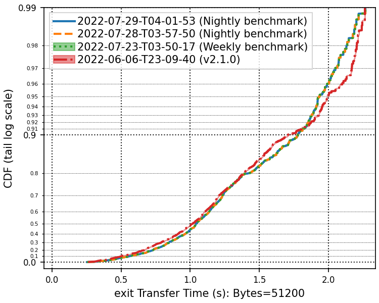

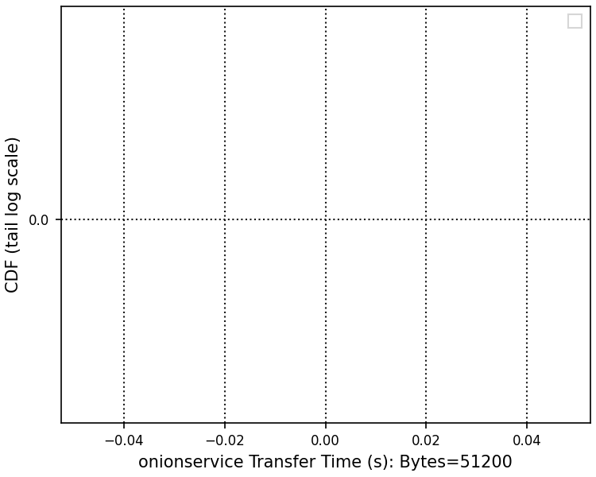

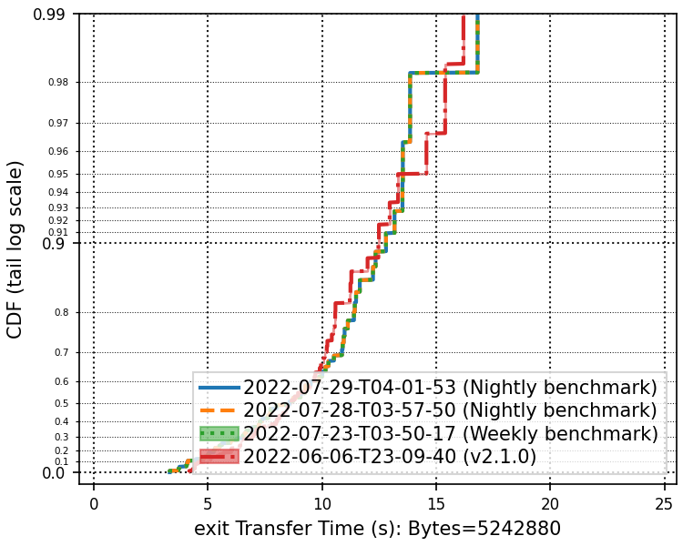

