# 2022-10-15-T01-27-14

| Key | Value |
|-----|-------|
| benchmark-sha | cef261c3e14972938f76012197285c2007238b27 |
| comment | Move Router+CoDel to Rust |
| compare-to | nightly, weekly, 2022-06-06-T23-09-40 |
| compare-to-resolved | 2022-10-14-T06-39-34, 2022-10-08-T03-56-05, 2022-06-06-T23-09-40 |
| container | debian:bullseye-20220527-slim |
| dry-run | false |
| oniontrace-ref | f271ead90526b29b3dd7218ce6e56813e3b4dce3 |
| repeat | 1 |
| results-dir | tor |
| runtime-args | --parallelism 24 --use-preload-openssl-crypto true |
| rust-version | rustc 1.64.0 (a55dd71d5 2022-09-19) |
| shadow-label | PR #2473 |
| shadow-ref | pull/2473/head |
| shadow-sha | 7ab8b8fd6f43d4e7e3cd6c563a115d029bb0f9fa |
| sim-id | 2022-10-15-T01-27-14 |
| sim-to-run | tornet-0.05 |
| tgen-ref | bcb36ea3797ca0029aa9a7fb3b7b8f24d47bfb17 |
| timestamp | 1665797234 |
| tor-ref | tor-0.4.7.7 |
| tornettools-ref | 5ee84cef2690143f6adf2667d1db9fd5f7d7d3a4 |
| trigger | workflow_dispatch |
| update-symlink |  |
| workflow-name | Manual Tor Benchmark |

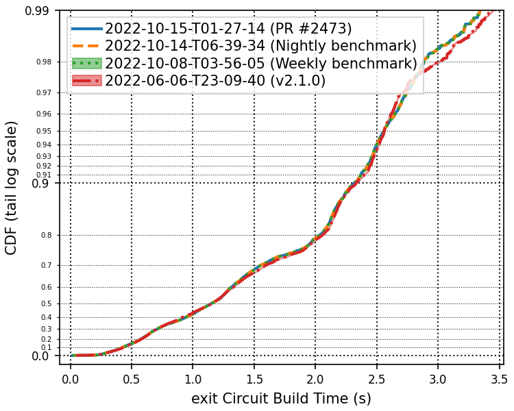

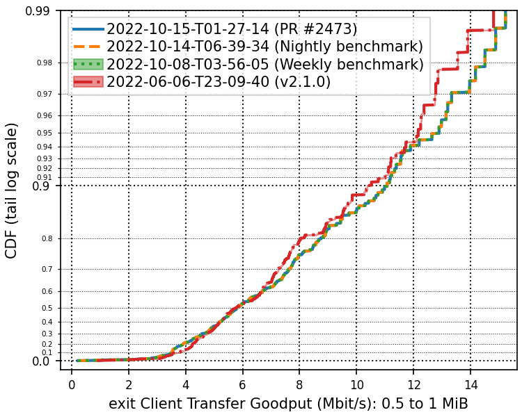

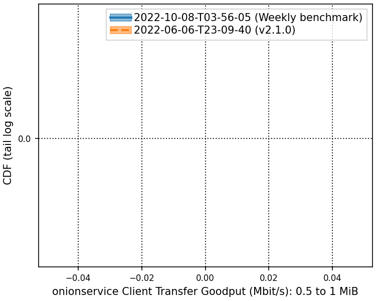

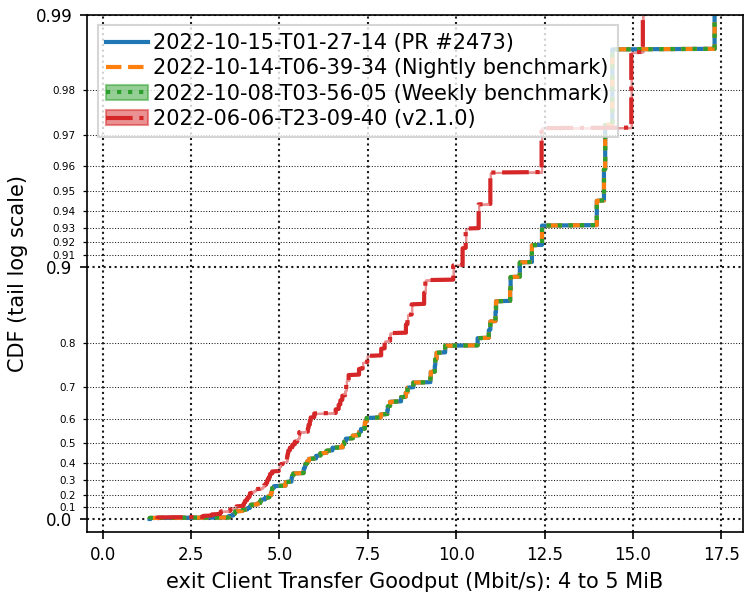

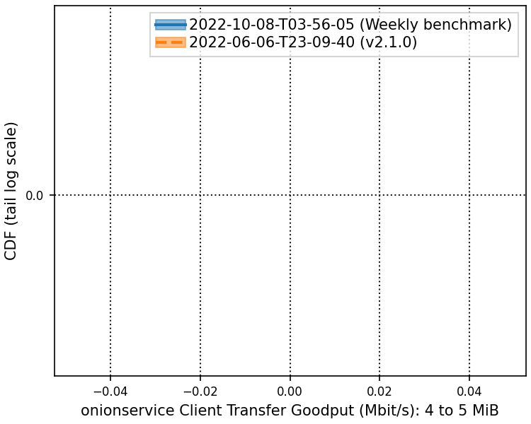

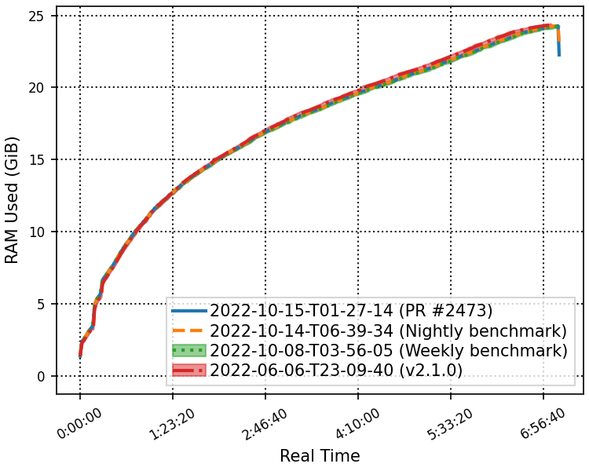

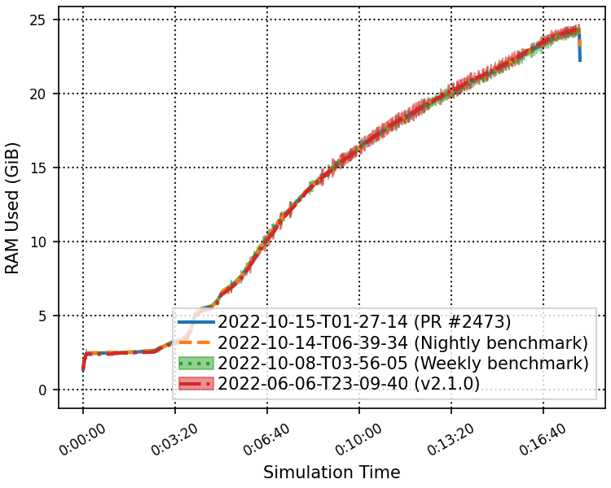

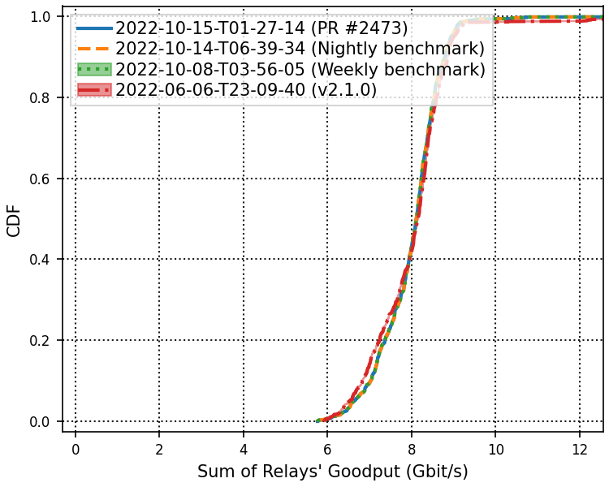

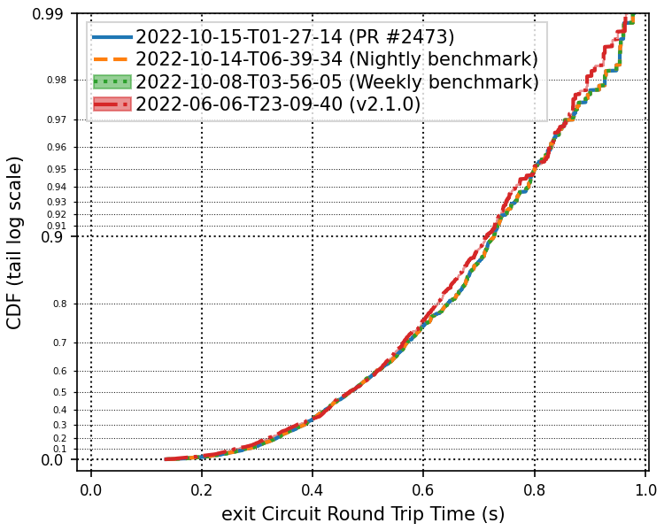

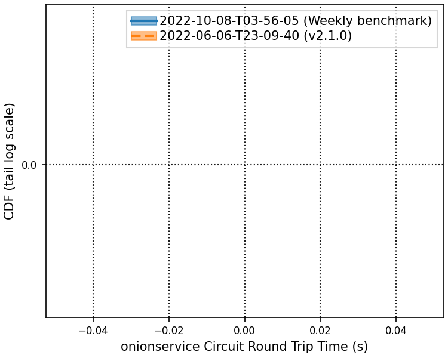

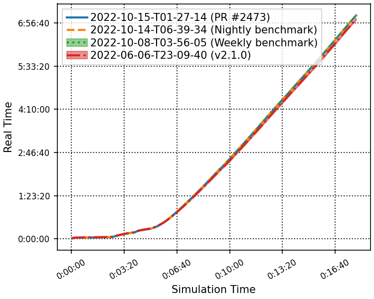

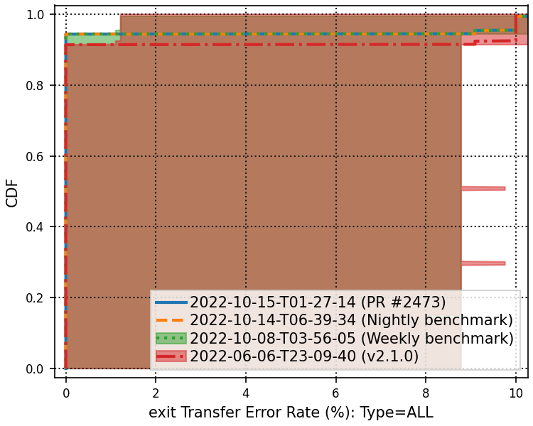

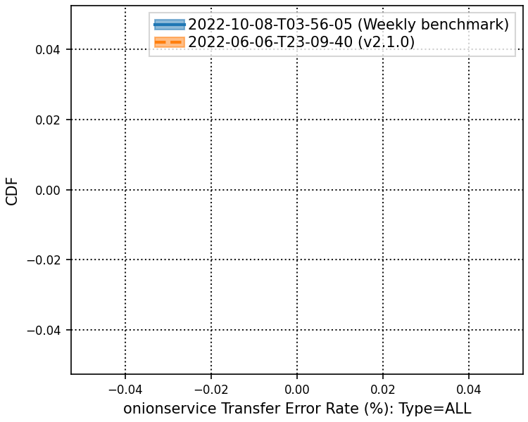

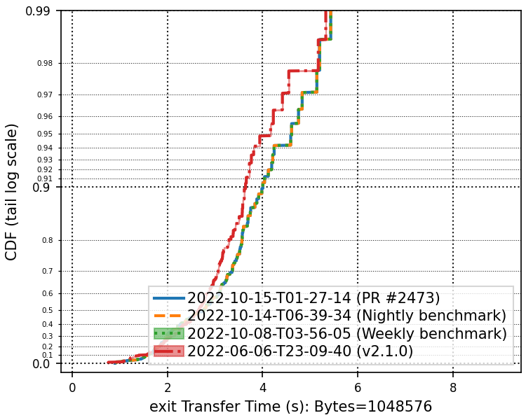

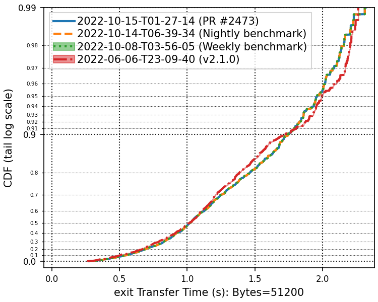

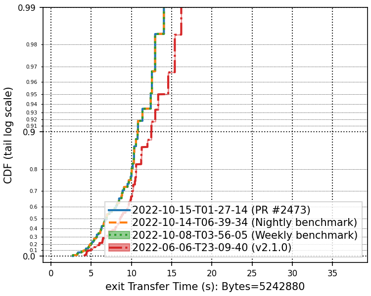

