# 2022-11-07-T14-56-21

| Key | Value |
|-----|-------|
| benchmark-sha | 9bbd7a1aef61cd641898dc136074af88b241f4d8 |
| comment | Prioritize packet events over local events |
| compare-to | nightly, weekly, 2022-06-06-T23-09-40 |
| compare-to-resolved | 2022-11-04-T03-56-46, 2022-11-05-T03-45-38, 2022-06-06-T23-09-40 |
| container | debian:bullseye-20220527-slim |
| dry-run | false |
| oniontrace-ref | f271ead90526b29b3dd7218ce6e56813e3b4dce3 |
| repeat | 1 |
| results-dir | tor |
| runtime-args | --parallelism 24 --use-preload-openssl-crypto true |
| rust-version | rustc 1.65.0 (897e37553 2022-11-02) |
| shadow-label | PR #2522 |
| shadow-ref | pull/2522/head |
| shadow-sha | 873ed9cbf8f1d4bd2c2ec478fcd2a7390c78e47f |
| sim-id | 2022-11-07-T14-56-21 |
| sim-to-run | tornet-0.05 |
| tgen-ref | bcb36ea3797ca0029aa9a7fb3b7b8f24d47bfb17 |
| timestamp | 1667832981 |
| tor-ref | tor-0.4.7.7 |
| tornettools-ref | 5ee84cef2690143f6adf2667d1db9fd5f7d7d3a4 |
| trigger | workflow_dispatch |
| update-symlink |  |
| workflow-name | Manual Tor Benchmark |

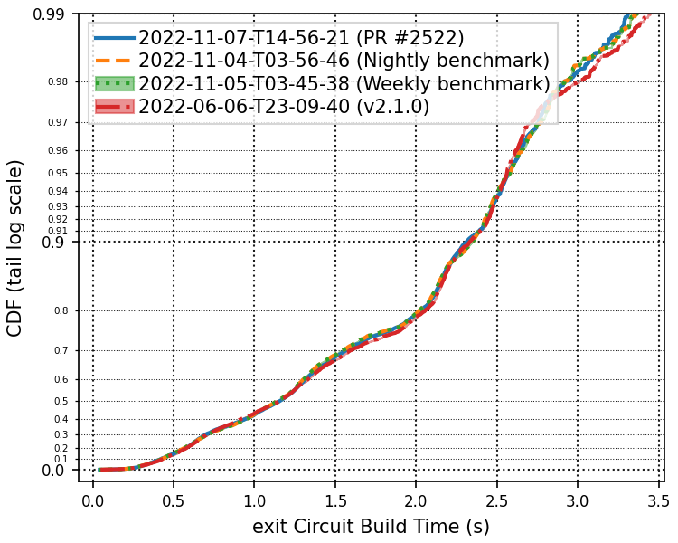

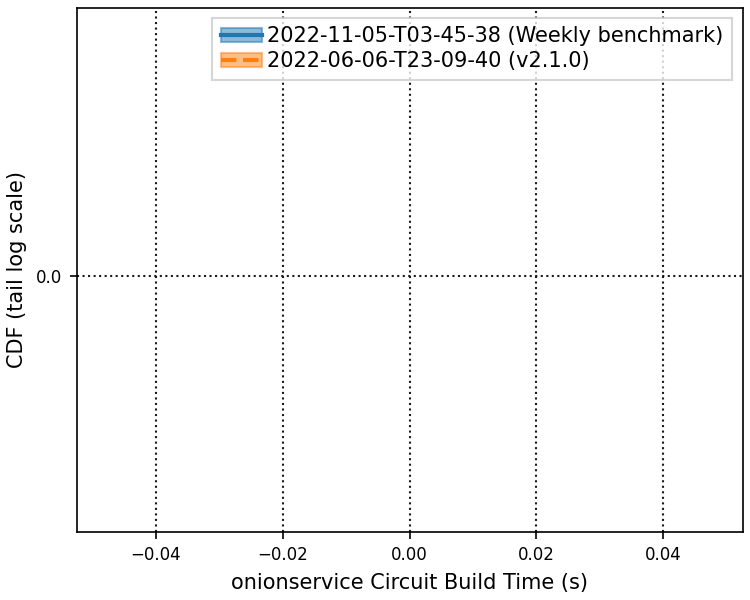

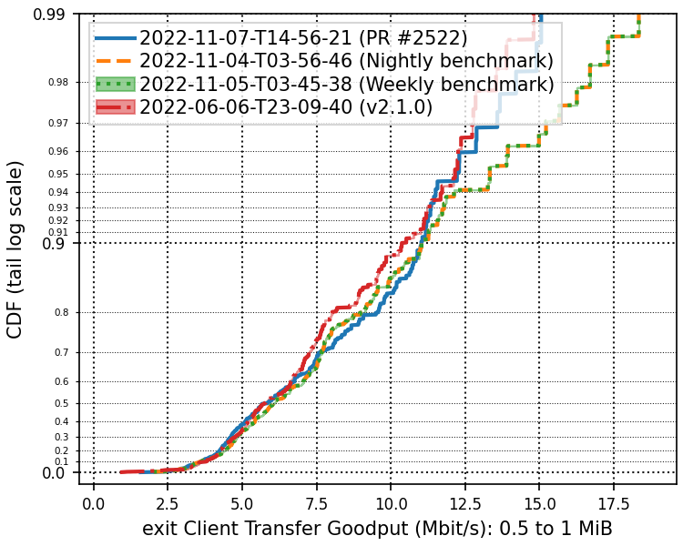

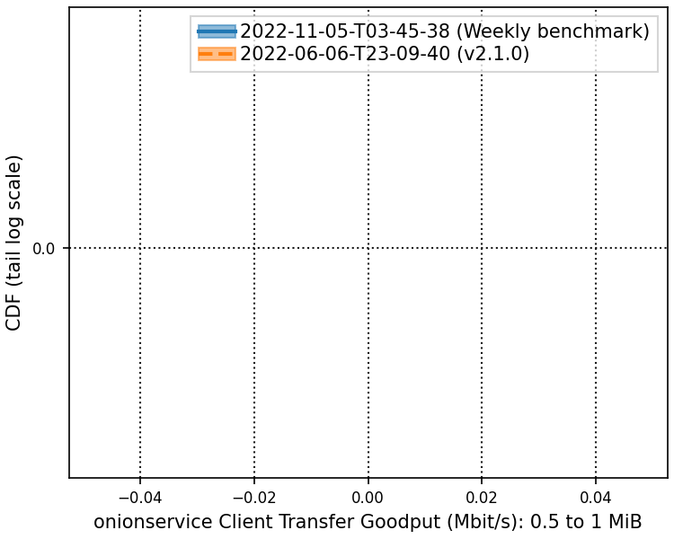

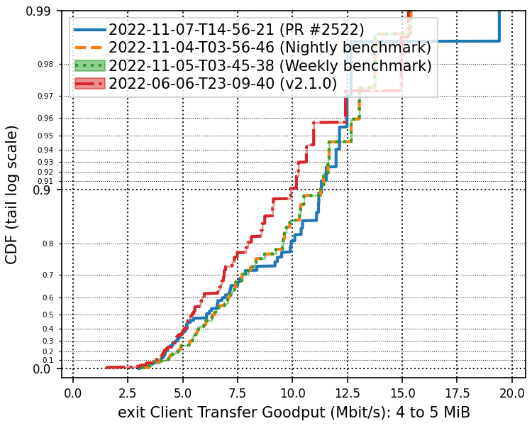

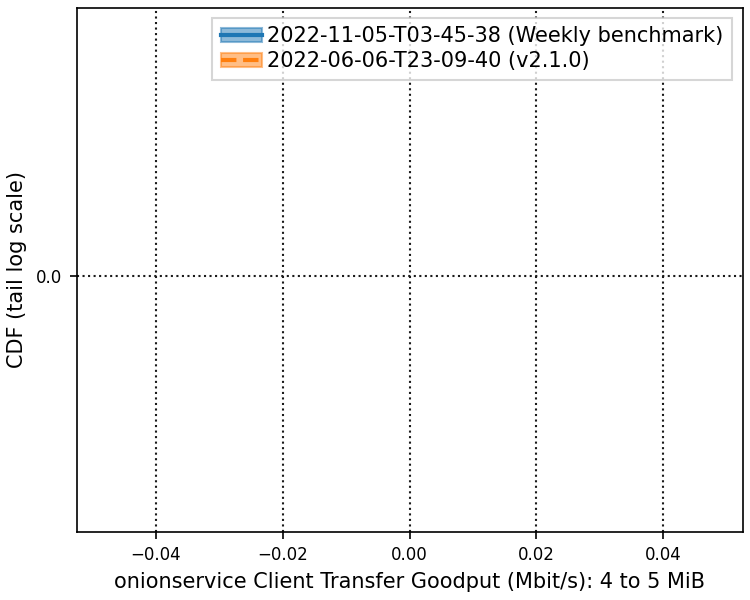

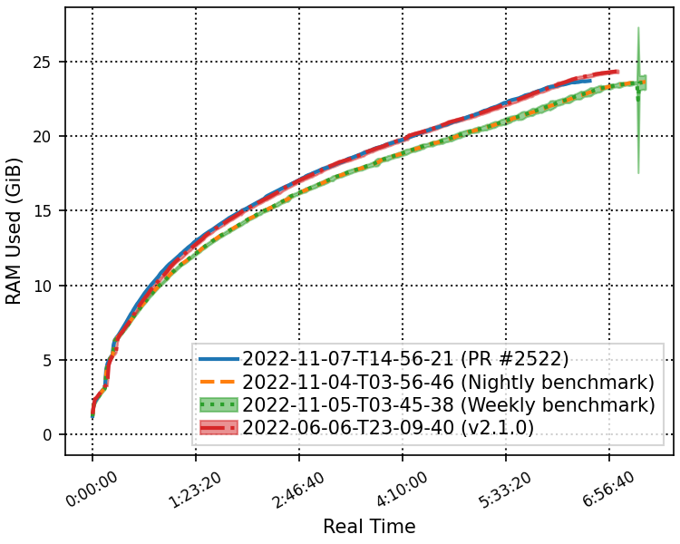

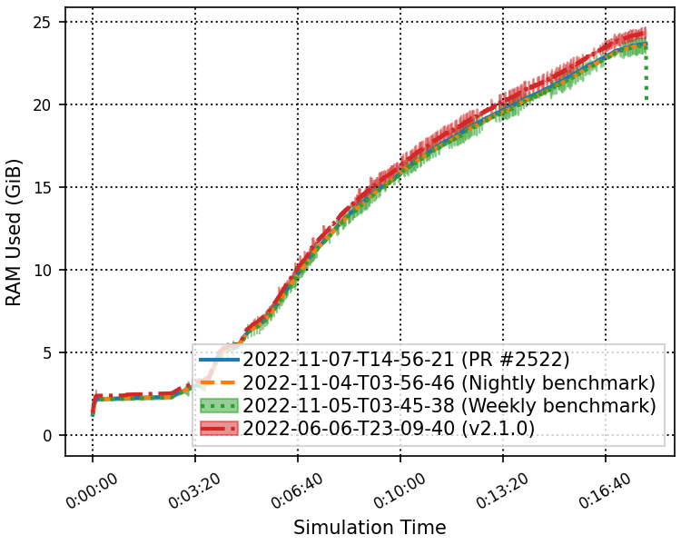

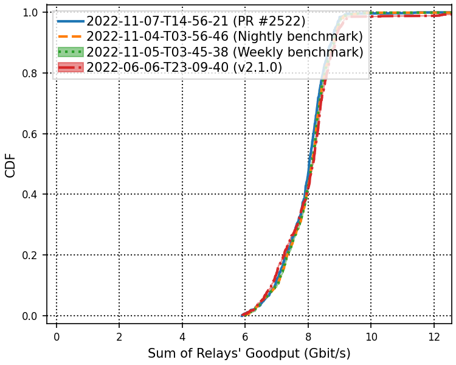

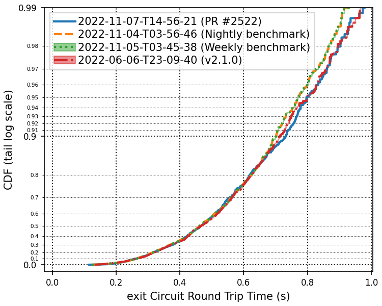

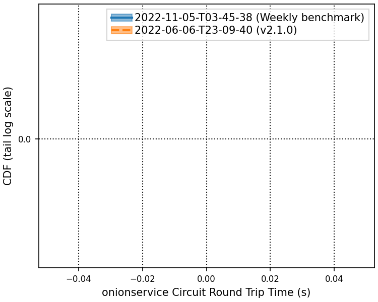

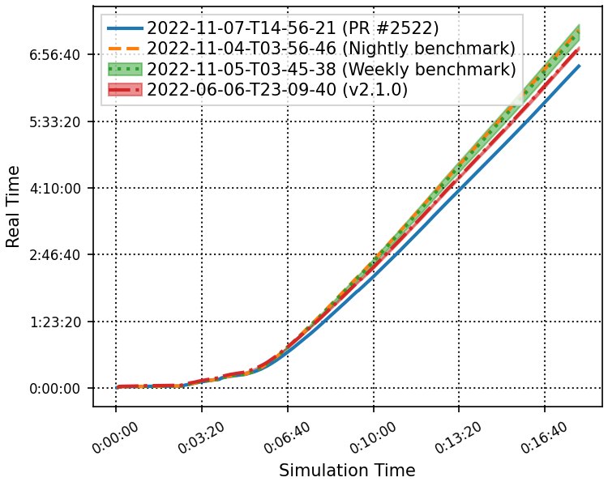

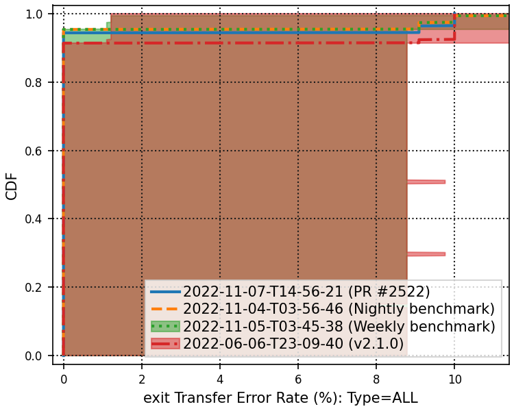

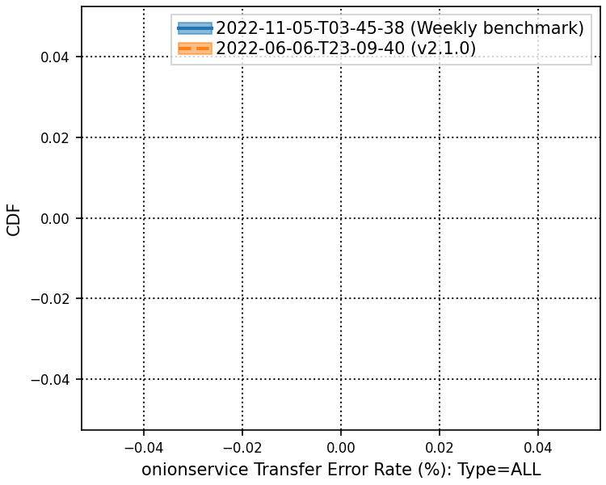

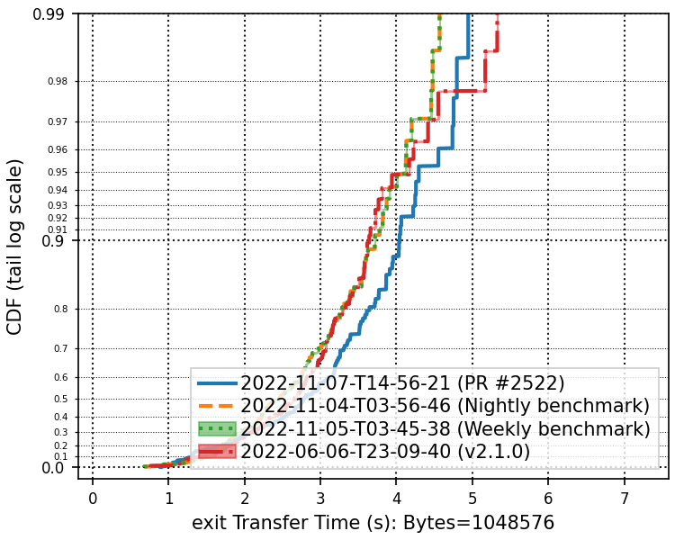

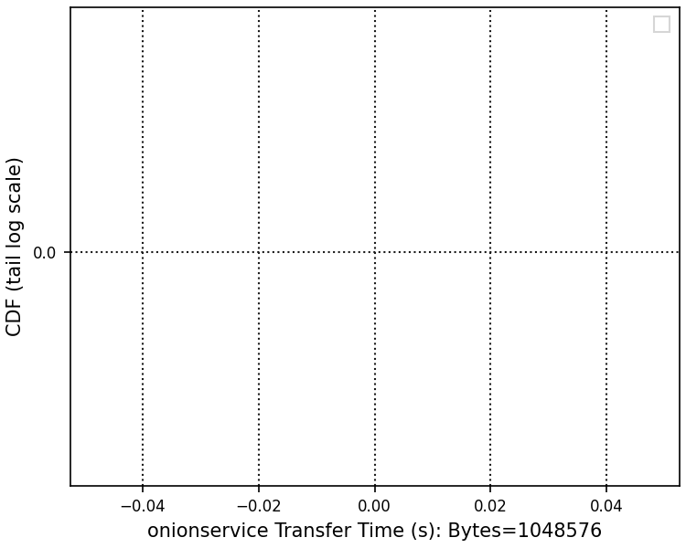

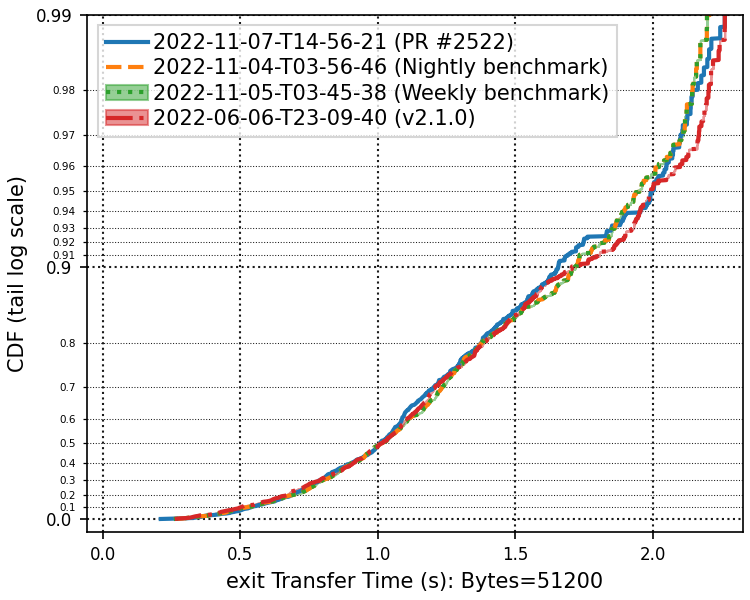

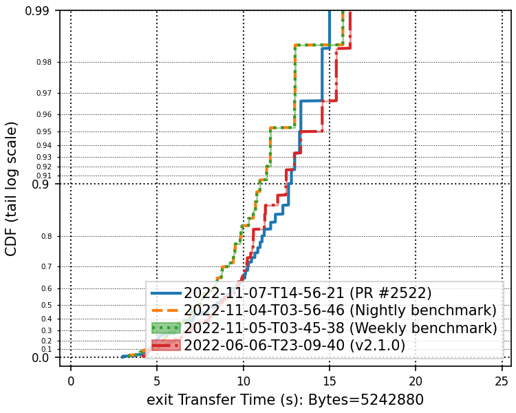

