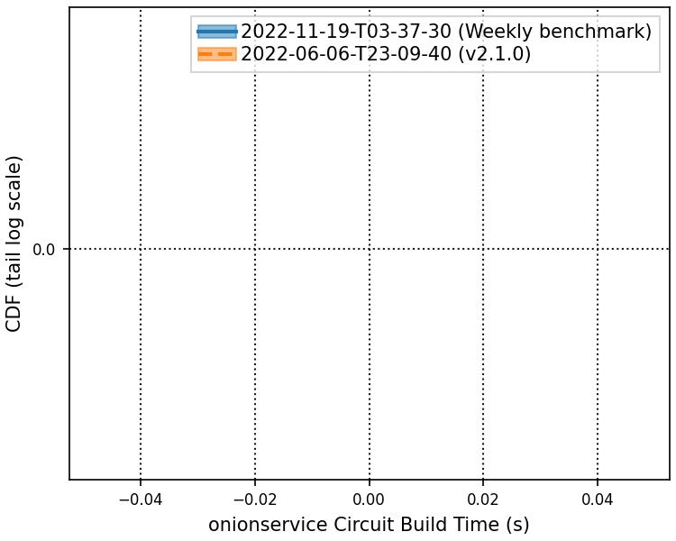
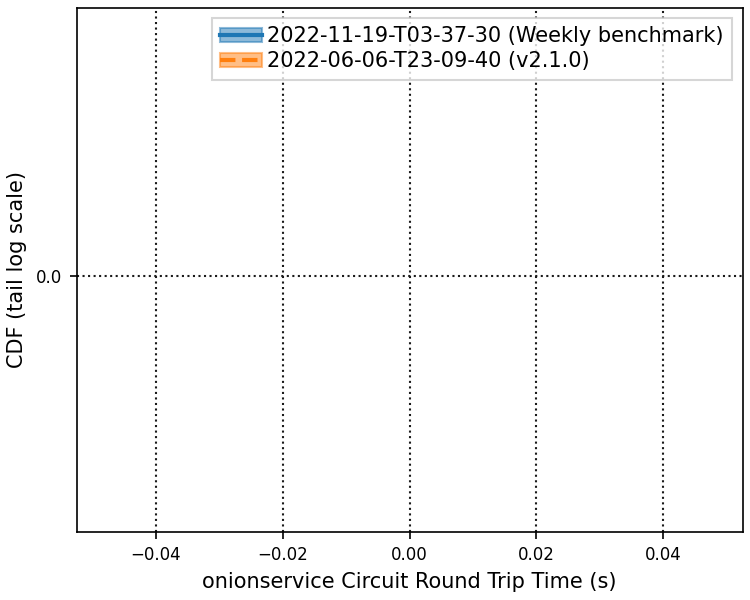
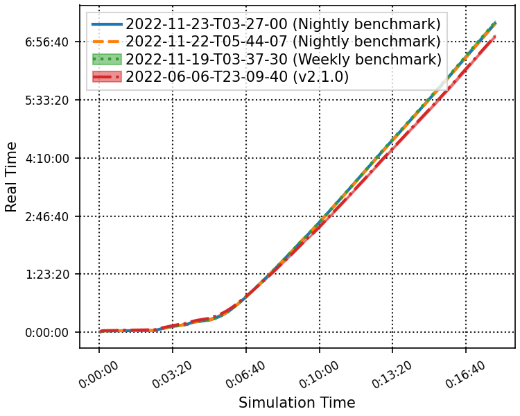
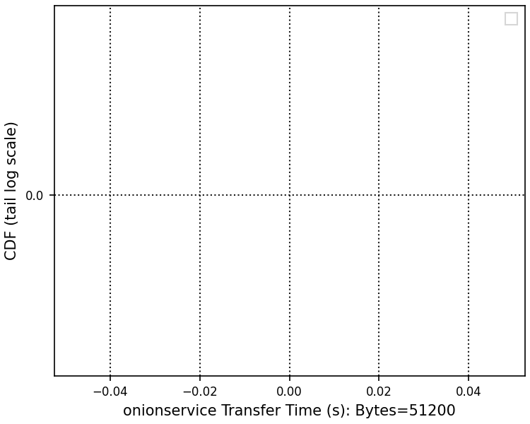

# 2022-11-23-T03-27-00

| Key | Value |
|-----|-------|
| benchmark-sha | 861689770d35eb866995a5ccd849349d0840b952 |
| comment | Nightly benchmark of the main branch |
| compare-to | nightly, weekly, 2022-06-06-T23-09-40 |
| compare-to-resolved | 2022-11-22-T05-44-07, 2022-11-19-T03-37-30, 2022-06-06-T23-09-40 |
| container | debian:bullseye-20220527-slim |
| dry-run | false |
| oniontrace-ref | f271ead90526b29b3dd7218ce6e56813e3b4dce3 |
| repeat | 1 |
| results-dir | tor |
| runtime-args | --parallelism 24 --use-preload-openssl-crypto true |
| rust-version | rustc 1.65.0 (897e37553 2022-11-02) |
| shadow-label | Nightly benchmark |
| shadow-ref | main |
| shadow-sha | 76a457306da2322fcdb26c104e04de79e11c2936 |
| sim-id | 2022-11-23-T03-27-00 |
| sim-to-run | tornet-0.05 |
| tgen-ref | bcb36ea3797ca0029aa9a7fb3b7b8f24d47bfb17 |
| timestamp | 1669174020 |
| tor-ref | tor-0.4.7.7 |
| tornettools-ref | 5ee84cef2690143f6adf2667d1db9fd5f7d7d3a4 |
| trigger | schedule |
| update-symlink | nightly |
| workflow-name | Nightly Tor Benchmark |

[plots/oniontrace.viz.pdf](plots/oniontrace.viz.pdf)

[plots/tgen.viz.pdf](plots/tgen.viz.pdf)

[plots/tornet.plot.pages.pdf](plots/tornet.plot.pages.pdf)

