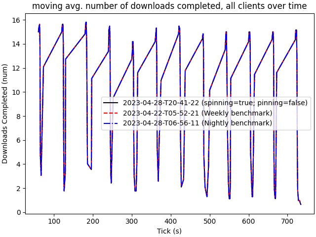

# 2023-04-28-T20-41-22

| Key | Value |
|-----|-------|
| benchmark-sha | 7893f228ef83bd5b815beba60715b21c1079f782 |
| comment |  |
| compare-to | weekly, nightly |
| compare-to-resolved | 2023-04-22-T05-52-21, 2023-04-28-T06-56-11 |
| container | debian:bullseye-20220527-slim |
| dry-run | false |
| oniontrace-ref | 9e0e83ceb0765bc915a2888bcc02e68a5a9b848f |
| repeat | 1 |
| results-dir | tor |
| runtime-args | --parallelism 24 --use-preload-openssl-crypto true --use-worker-spinning true --use-cpu-pinning false |
| rust-version |  |
| shadow-label | spinning=true; pinning=false |
| shadow-ref | 76d497f3f68a911c0322bb8c06e8c45782cc7007 |
| shadow-sha | 76d497f3f68a911c0322bb8c06e8c45782cc7007 |
| sim-id | 2023-04-28-T20-41-22 |
| sim-to-run | tornet-0.05 |
| tgen-ref | 3d7788bad362b4487d1145da93ab2fdb73c9b639 |
| timestamp | 1682714482 |
| tor-ref | tor-0.4.7.7 |
| tornettools-ref | 2748d1245fdc5d5b20f9977c9a9d2394e64750bf |
| trigger | workflow_dispatch |
| update-symlink |  |
| workflow-name | Manual Tor Benchmark |

[plots/oniontrace.viz.pdf](plots/oniontrace.viz.pdf)

[plots/shadow.results.pdf](plots/shadow.results.pdf)

[plots/tgen.viz.pdf](plots/tgen.viz.pdf)

[plots/tornet.plot.pages.pdf](plots/tornet.plot.pages.pdf)

