# 2023-09-26-T00-22-03

| Key | Value |
|-----|-------|
| benchmark-sha | [0c59307e232cf71be9fe6cb7d973b7acea09ae7d](https://github.com/shadow/benchmark/commit/0c59307e232cf71be9fe6cb7d973b7acea09ae7d) |
| comment | New epoll descriptor and syscall handler |
| compare-to | nightly, weekly, 2023-05-13-T10-54-26 |
| compare-to-resolved | [2023-09-22-T04-09-45](/tor/2023-09-22-T04-09-45/README.md), [2023-09-23-T04-18-54](/tor/2023-09-23-T04-18-54/README.md), [2023-05-13-T10-54-26](/tor/2023-05-13-T10-54-26/README.md) |
| container | debian:bullseye-20230502-slim |
| dry-run | false |
| oniontrace-ref | 3696db43288c8a116e8a1cff42a9c698d1d4ab33 |
| repeat | 1 |
| results-dir | tor |
| runner-label | cora |
| runtime-args | --parallelism 32 |
| rust-version | rustc 1.72.0 (5680fa18f 2023-08-23) |
| shadow-label | PR #3125 |
| shadow-ref | pull/3125/head |
| shadow-sha | [187e89bc5567e3d02673cebf7572fe06035b0bc8](https://github.com/shadow/shadow/commit/187e89bc5567e3d02673cebf7572fe06035b0bc8) |
| sim-id | 2023-09-26-T00-22-03 |
| sim-to-run | tornet-0.15 |
| tgen-ref | 30c95bbe723ebe5e4d068adfd975b094e00dbe10 |
| timestamp | 1695687723 |
| tor-ref | tor-0.4.7.13 |
| tornettools-ref | c240e72bf1dfbe76bb1cfbcca5ecb7d9e2fdfbf9 |
| trigger | workflow_dispatch |
| update-symlink |  |
| workflow-name | Manual Tor Benchmark |

[plots/oniontrace.viz.pdf](plots/oniontrace.viz.pdf)

[plots/shadow.results.pdf](plots/shadow.results.pdf)

[plots/tgen.viz.pdf](plots/tgen.viz.pdf)

[plots/tornet.plot.pages.pdf](plots/tornet.plot.pages.pdf)

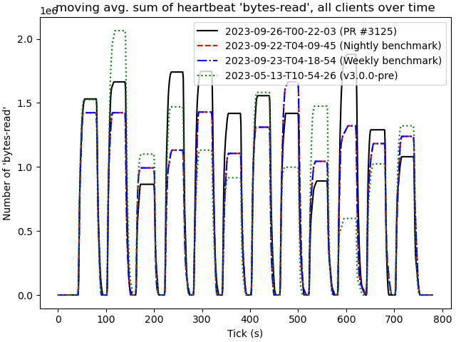

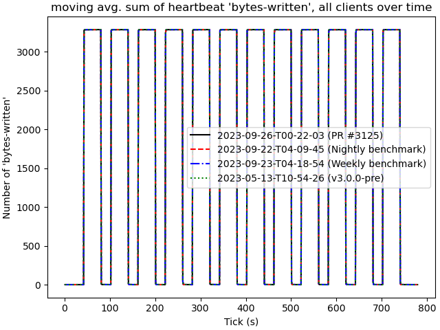

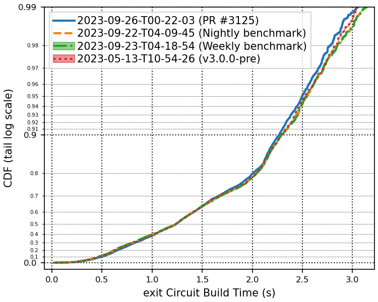

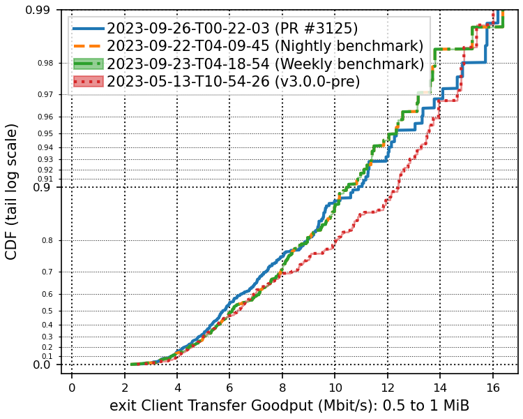

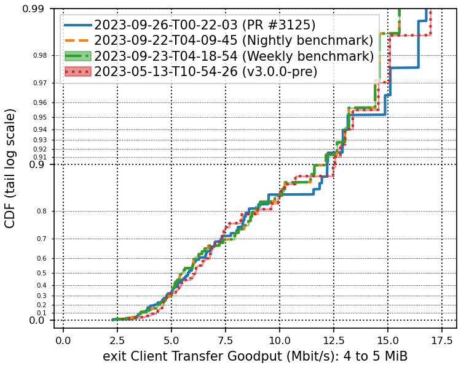

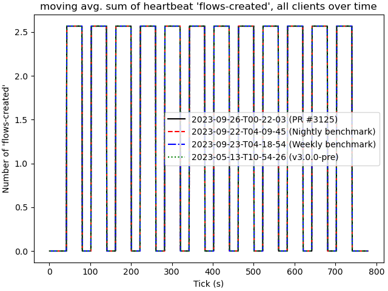

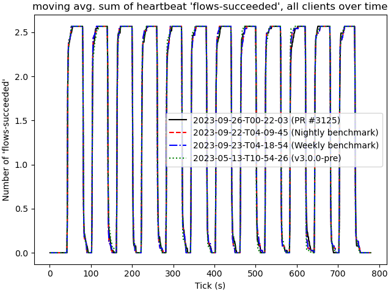

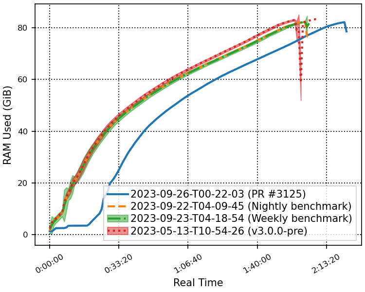

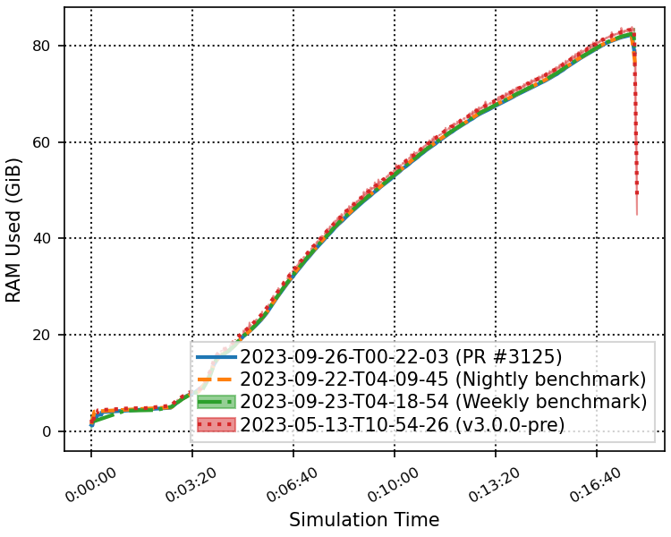

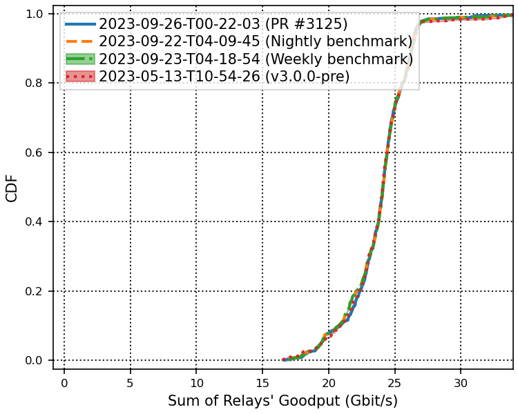

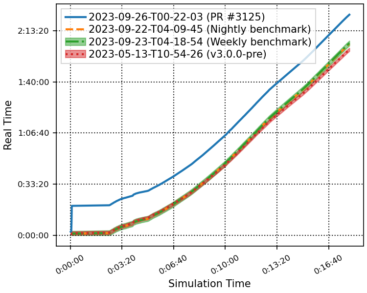

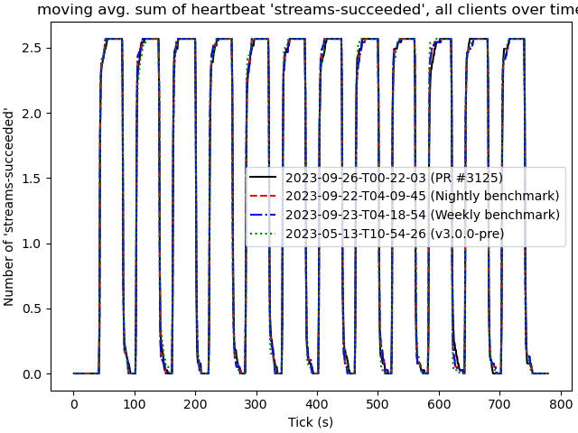

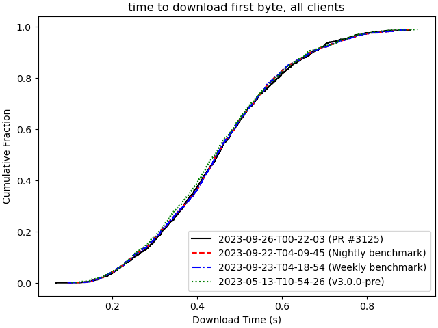

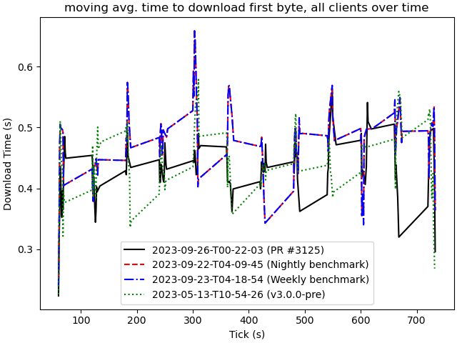

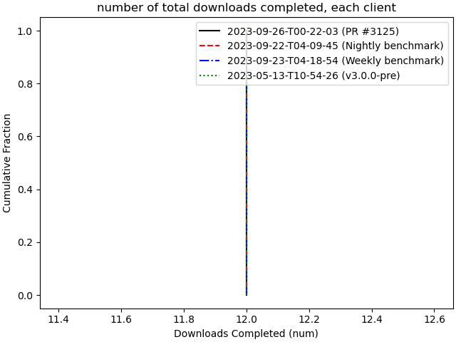

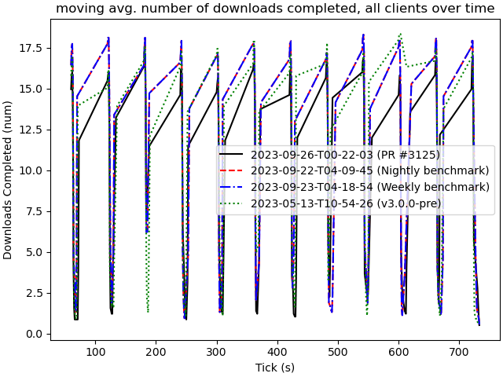

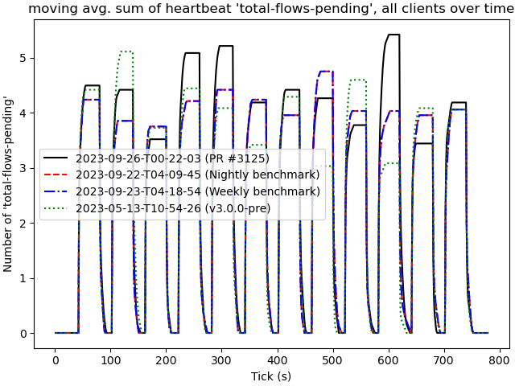

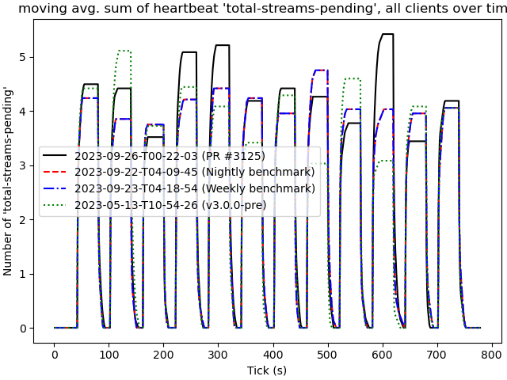

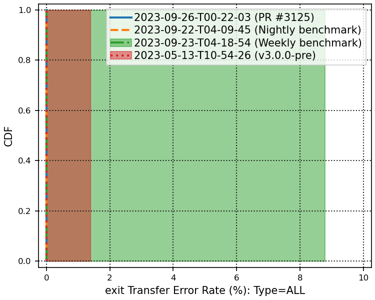

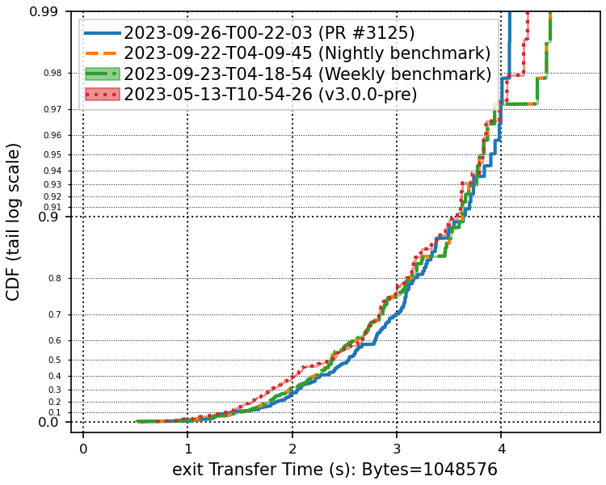

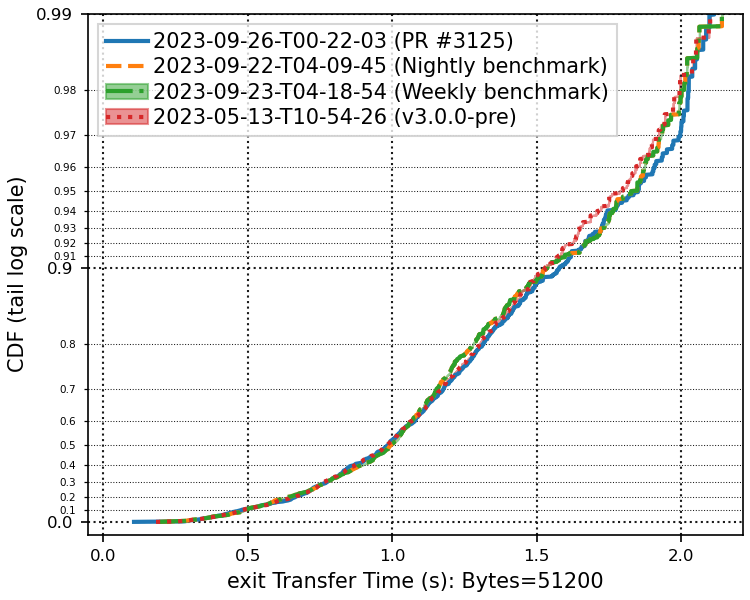

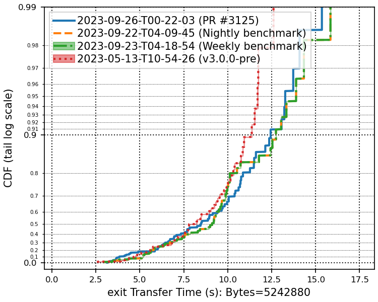
