# 2023-11-22-T04-10-31

| Key | Value |
|-----|-------|
| benchmark-sha | [0affa2fbd5b850d2c4aa1866eb57e35fadd87c77](https://github.com/shadow/benchmark/commit/0affa2fbd5b850d2c4aa1866eb57e35fadd87c77) |
| comment | Nightly benchmark of the main branch |
| compare-to | nightly, weekly, 2023-05-13-T10-54-26 |
| compare-to-resolved | [2023-11-21-T04-10-43](/tor/2023-11-21-T04-10-43/README.md), [2023-11-18-T04-20-36](/tor/2023-11-18-T04-20-36/README.md), [2023-05-13-T10-54-26](/tor/2023-05-13-T10-54-26/README.md) |
| container | debian:bullseye-20230502-slim |
| dry-run | false |
| oniontrace-ref | 3696db43288c8a116e8a1cff42a9c698d1d4ab33 |
| repeat | 1 |
| results-dir | tor |
| runner-label | cora |
| runtime-args | --parallelism 32 |
| rust-version | rustc 1.74.0 (79e9716c9 2023-11-13) |
| shadow-label | Nightly benchmark |
| shadow-ref | main |
| shadow-sha | [5ac8c7a6a813c61e91e4bc69461231d1c5ccc2cb](https://github.com/shadow/shadow/commit/5ac8c7a6a813c61e91e4bc69461231d1c5ccc2cb) |
| sim-id | 2023-11-22-T04-10-31 |
| sim-to-run | tornet-0.15 |
| tgen-ref | 30c95bbe723ebe5e4d068adfd975b094e00dbe10 |
| timestamp | 1700626231 |
| tor-ref | tor-0.4.7.13 |
| tornettools-ref | c240e72bf1dfbe76bb1cfbcca5ecb7d9e2fdfbf9 |
| trigger | schedule |
| update-symlink | nightly |
| workflow-name | Nightly Tor Benchmark |

[plots/oniontrace.viz.pdf](plots/oniontrace.viz.pdf)

[plots/shadow.results.pdf](plots/shadow.results.pdf)

[plots/tgen.viz.pdf](plots/tgen.viz.pdf)

[plots/tornet.plot.pages.pdf](plots/tornet.plot.pages.pdf)

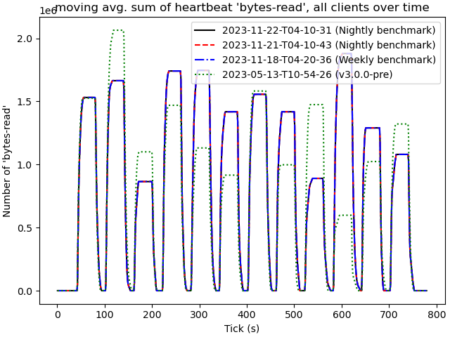

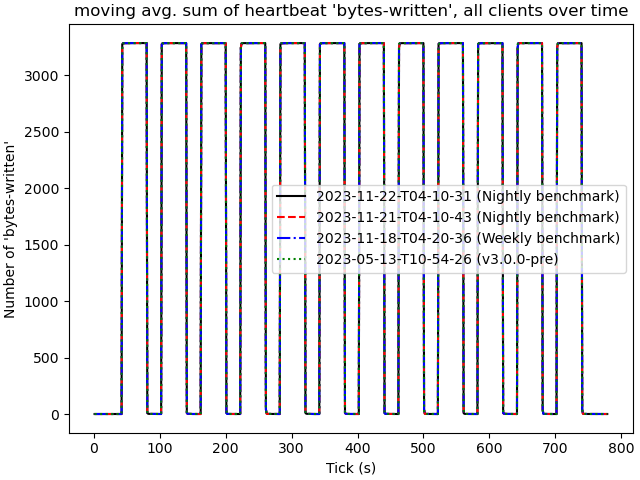

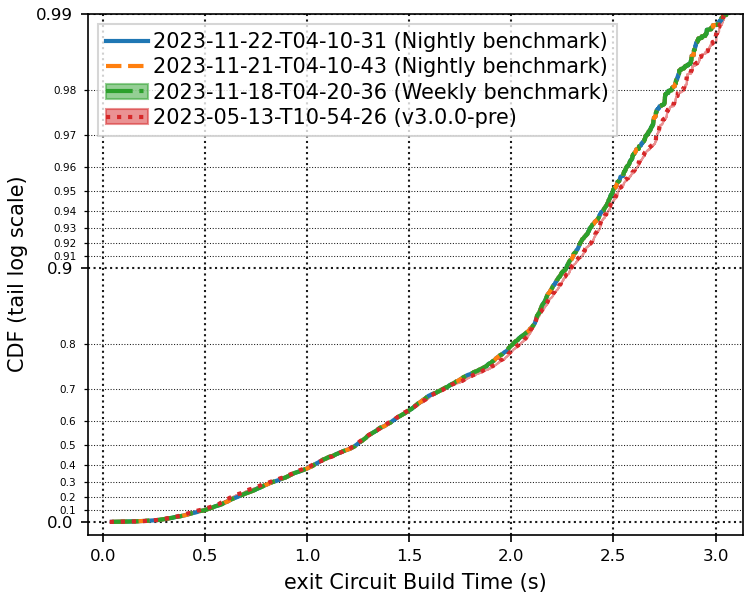

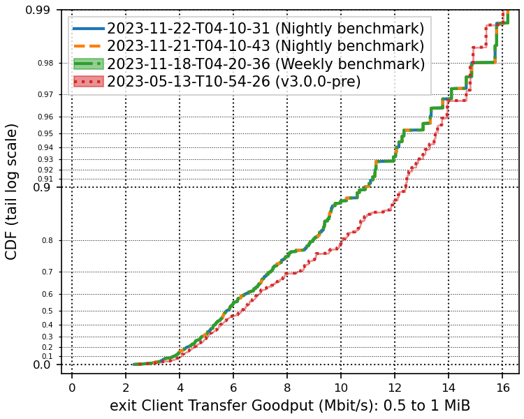

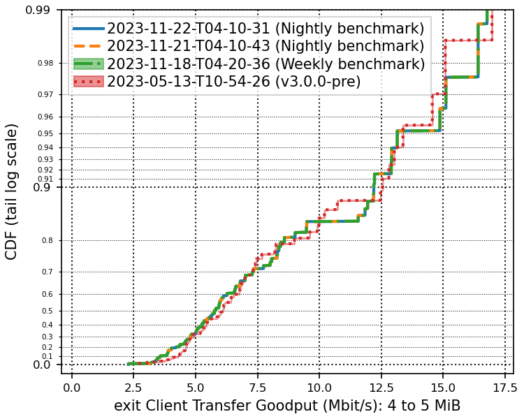

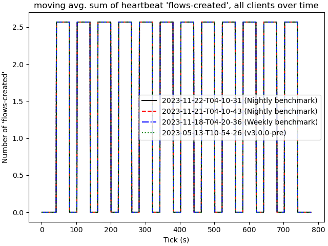

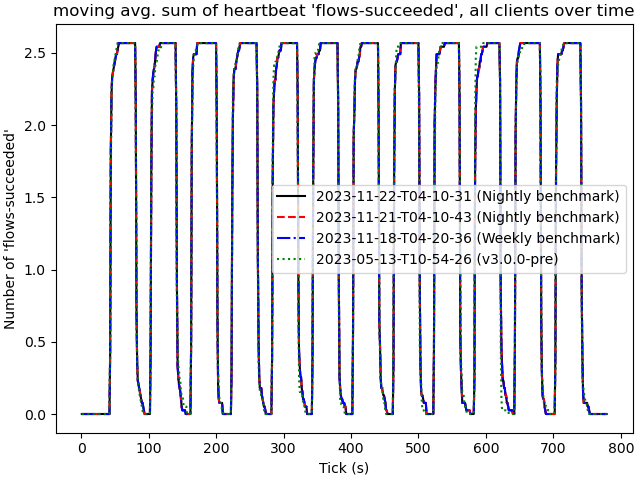

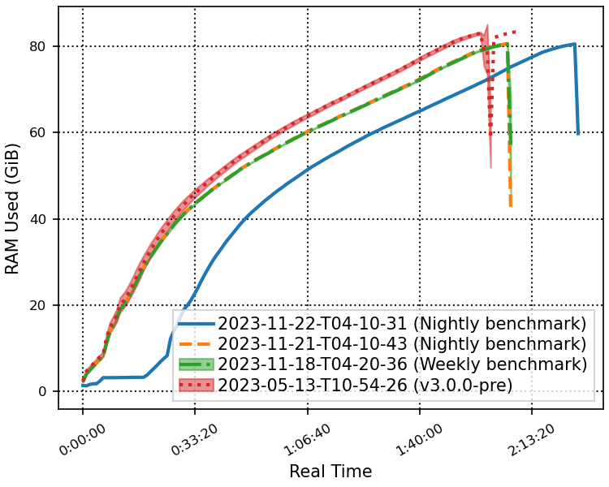

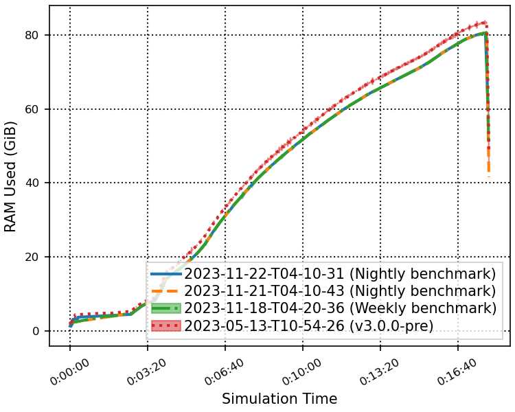

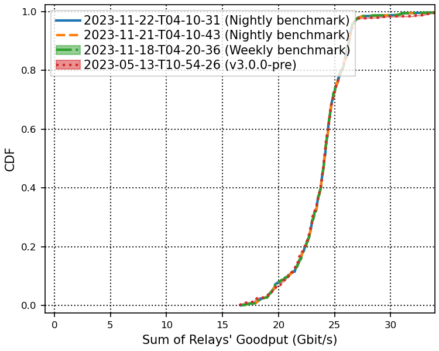

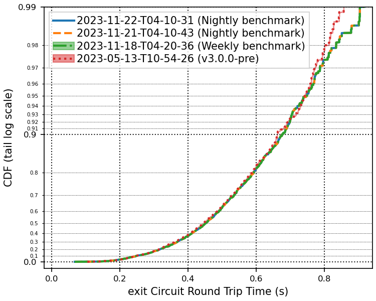

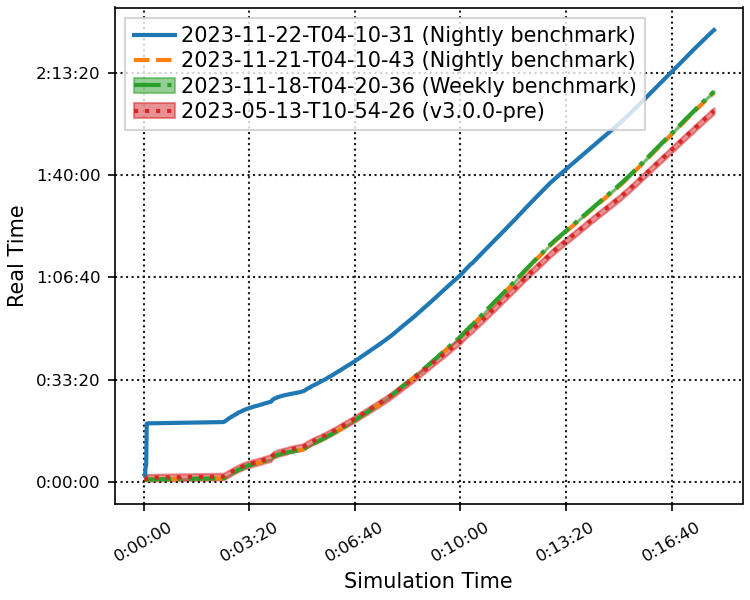

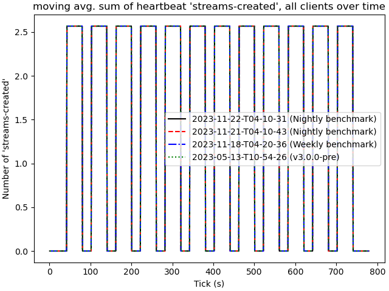

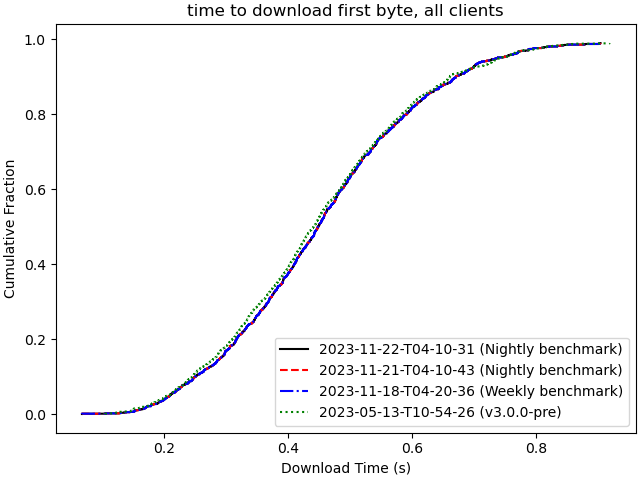

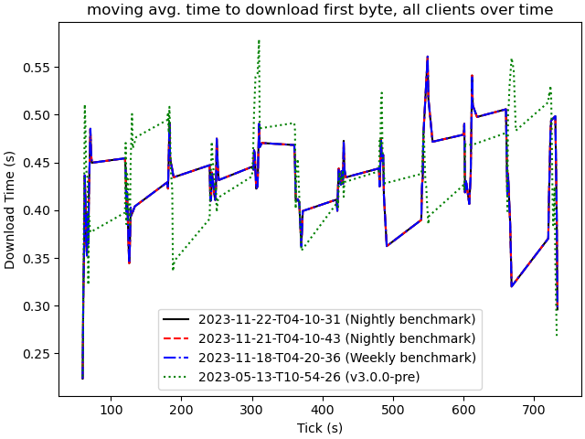

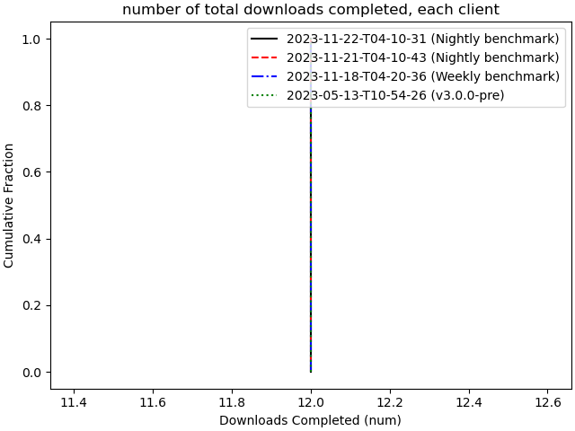

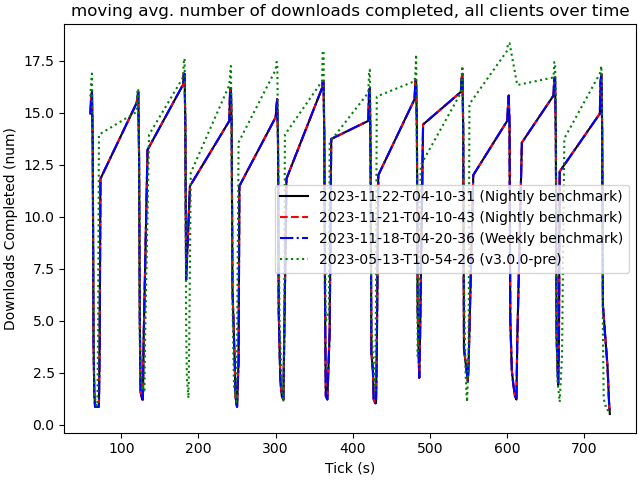

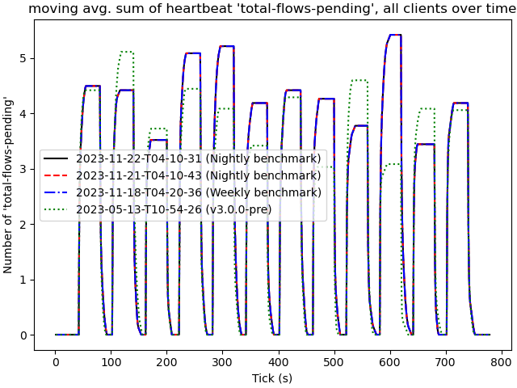

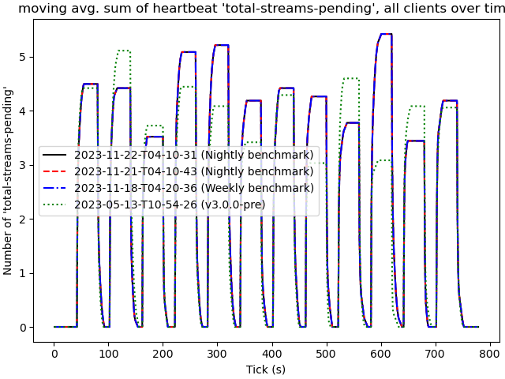

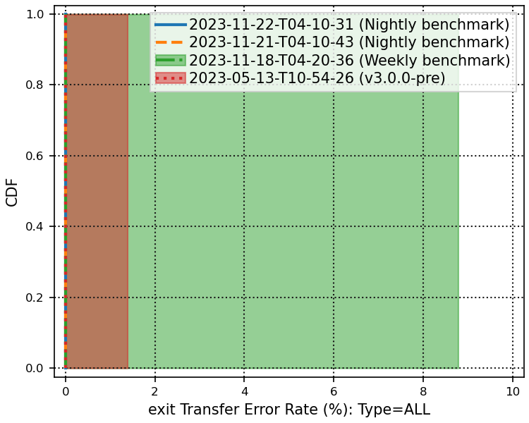

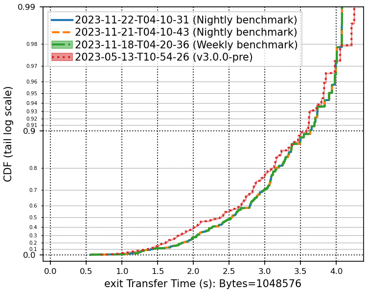

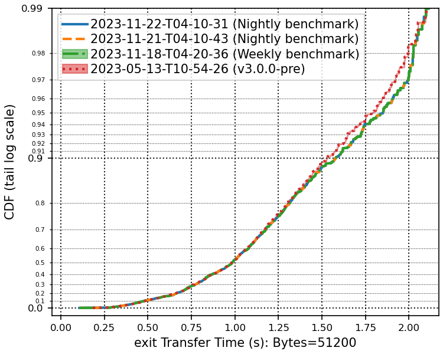

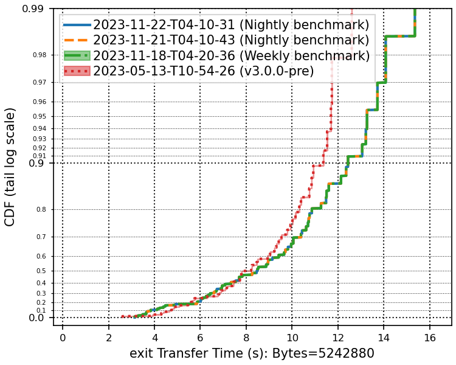
