# 2025-02-13-T22-25-31

| Key | Value |
|-----|-------|
| benchmark-sha | [cb46d0a4abd2615ea58facbc47a481512f09697d](https://github.com/shadow/benchmark/commit/cb46d0a4abd2615ea58facbc47a481512f09697d) |
| comment | Stop counting PacketRc objects to improve performance |
| compare-to | nightly, weekly, 2024-01-01-T02-18-28 |
| compare-to-resolved | [2025-02-13-T04-13-27](/tor/2025-02-13-T04-13-27/README.md), [2025-02-08-T04-24-21](/tor/2025-02-08-T04-24-21/README.md), [2024-01-01-T02-18-28](/tor/2024-01-01-T02-18-28/README.md) |
| container | debian:bookworm-20231218-slim |
| dry-run | false |
| oniontrace-ref | 3696db43288c8a116e8a1cff42a9c698d1d4ab33 |
| repeat | 1 |
| results-dir | tor |
| runner-label | cora |
| runtime-args | --parallelism 32 |
| rust-version | rustc 1.83.0 (90b35a623 2024-11-26) |
| shadow-label | PR #3492 no pktrc cnt |
| shadow-ref | pull/3492/head |
| shadow-sha | [56ed3bc4f0a19b6aa578218a22326b5e247d9d7f](https://github.com/shadow/shadow/commit/56ed3bc4f0a19b6aa578218a22326b5e247d9d7f) |
| sim-id | 2025-02-13-T22-25-31 |
| sim-to-run | tornet-0.15 |
| tgen-ref | 816d68cd3d0ff7d0ec71e8bbbae24ecd6a636117 |
| timestamp | 1739485531 |
| tor-ref | tor-0.4.7.13 |
| tornettools-ref | 9716a8682483f363e4bc9f9503f6871536e7b846 |
| trigger | workflow_dispatch |
| update-symlink |  |
| workflow-name | Manual Tor Benchmark |

[plots/oniontrace.viz.pdf](plots/oniontrace.viz.pdf)

[plots/tgen.viz.pdf](plots/tgen.viz.pdf)

[plots/tornet.plot.pages.pdf](plots/tornet.plot.pages.pdf)

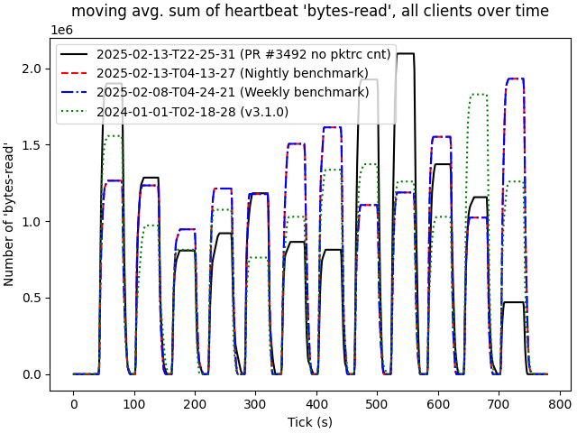

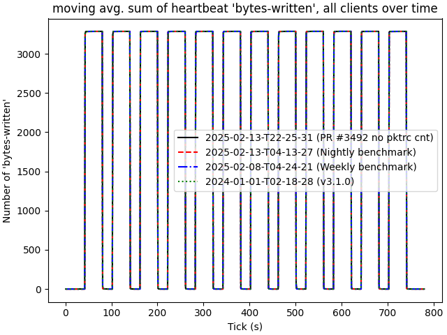

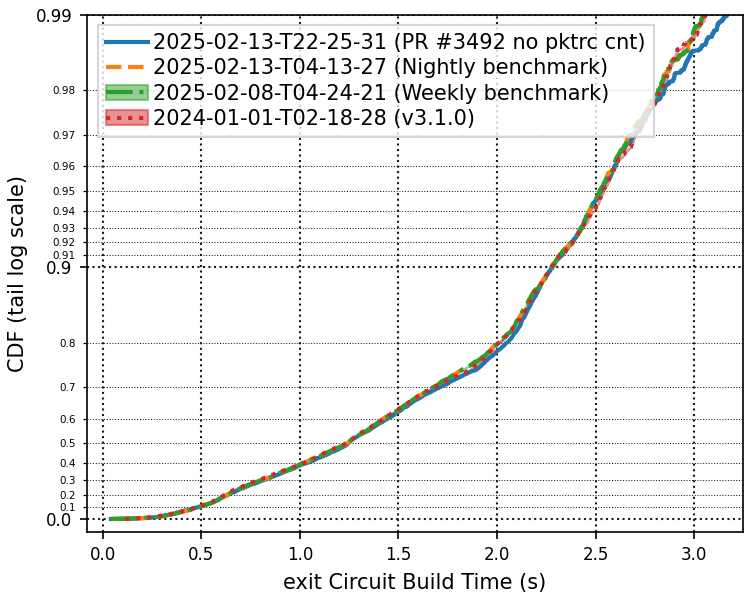

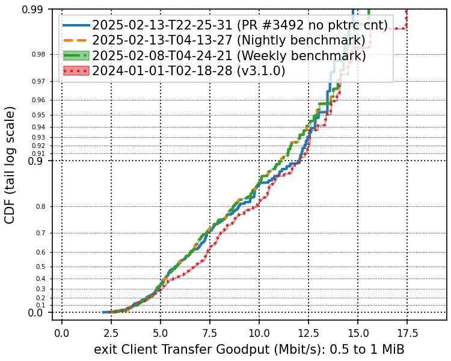

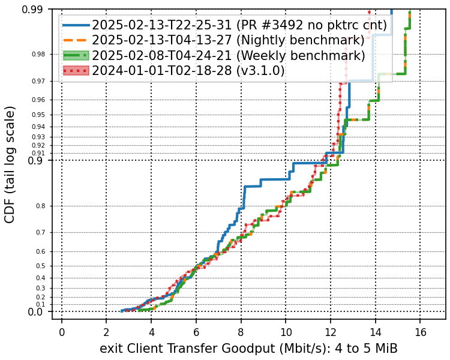

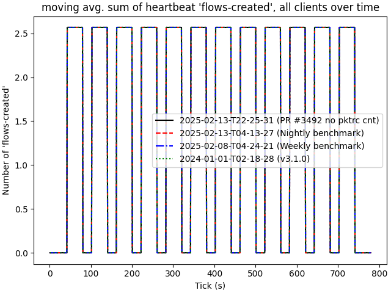

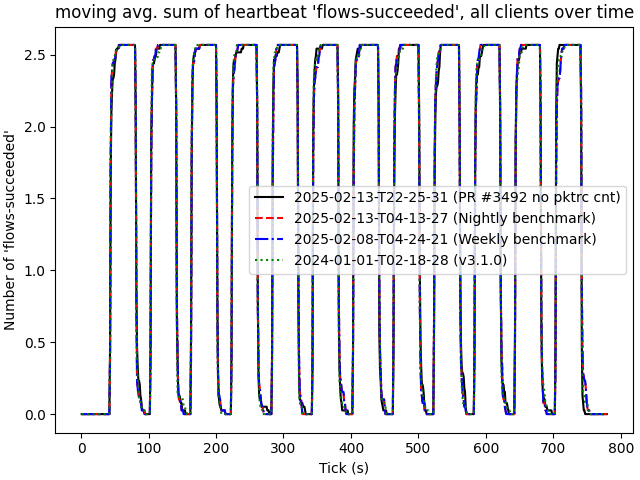

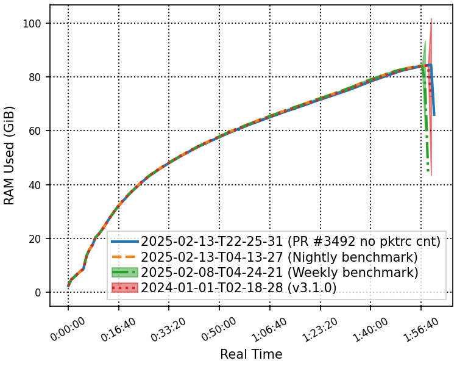

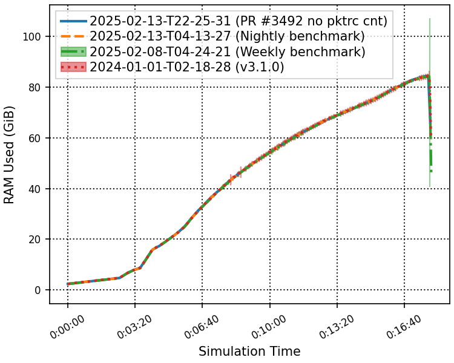

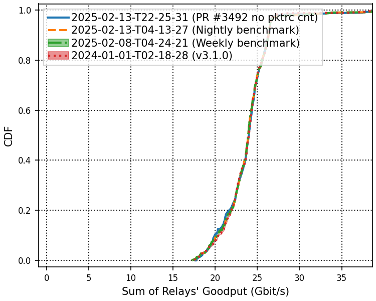

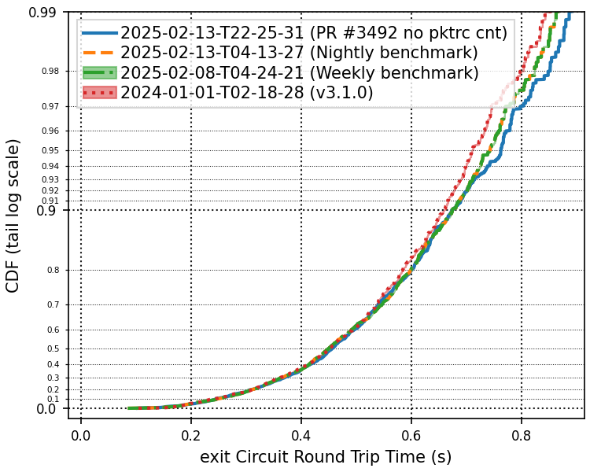

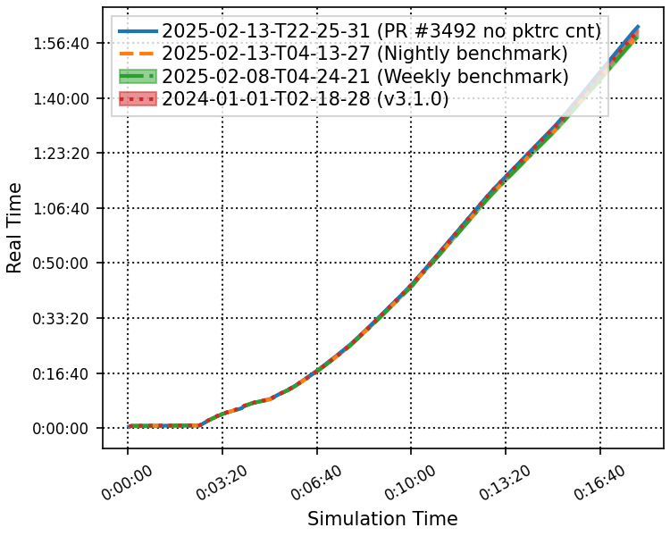

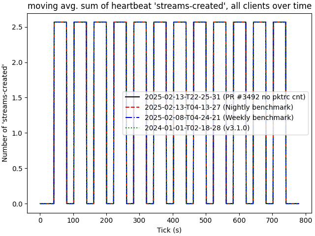

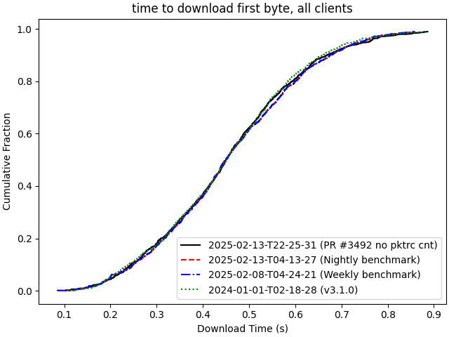

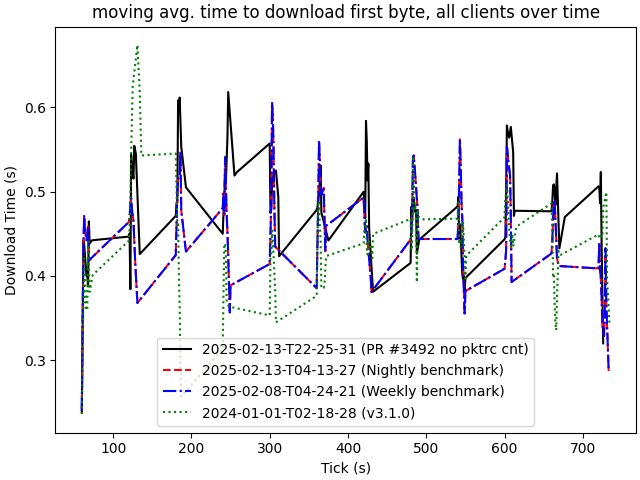

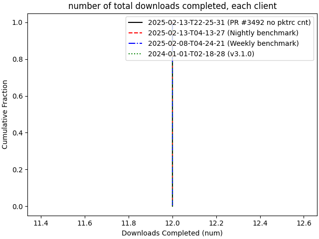

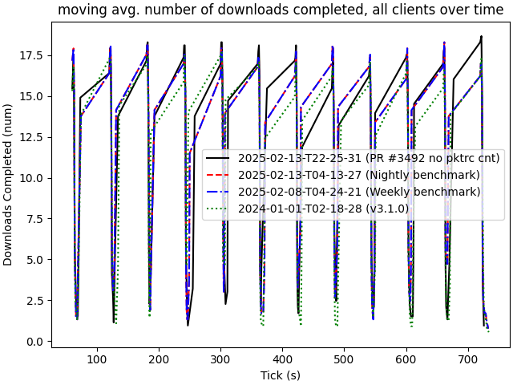

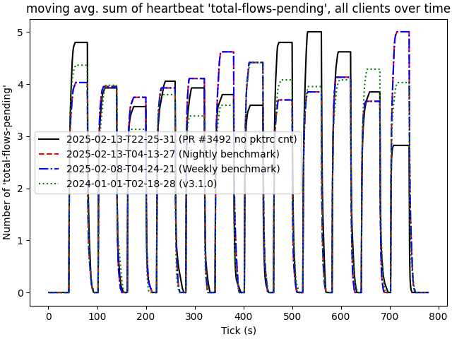

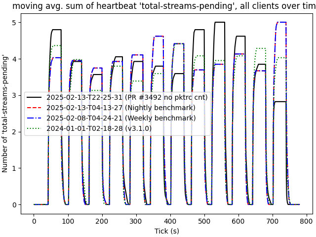

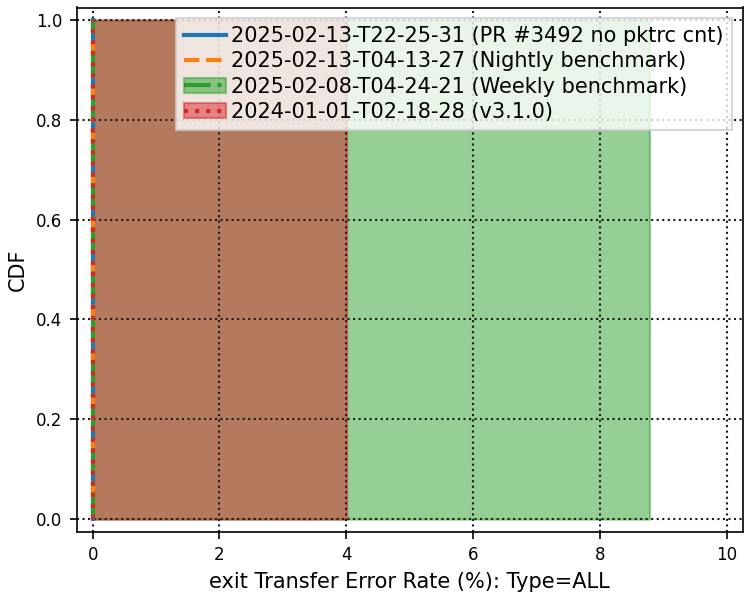

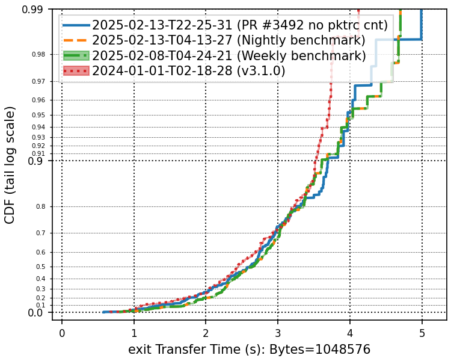

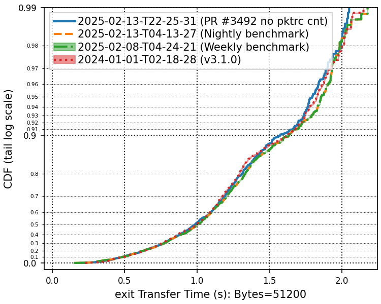

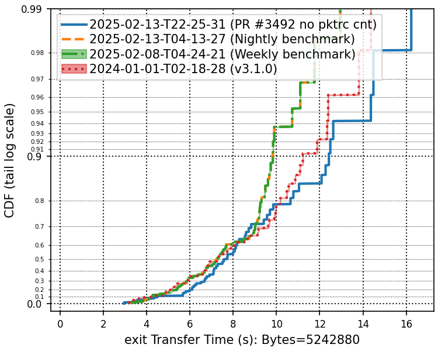
