# 2026-09-19-T08-42-45

| Key | Value |
|-----|-------|
| benchmark-sha | [53186ae295c35ca05a7e222e5baee82ae1f8eb7a](https://github.com/shadow/benchmark/commit/53186ae295c35ca05a7e222e5baee82ae1f8eb7a) |
| comment | Weekly benchmark of the main branch |
| compare-to | nightly, weekly, 2024-01-01-T02-18-28 |
| compare-to-resolved | [2026-09-18-T08-37-16](/tor/2026-09-18-T08-37-16/README.md), [2026-09-12-T08-32-31](/tor/2026-09-12-T08-32-31/README.md), [2024-01-01-T02-18-28](/tor/2024-01-01-T02-18-28/README.md) |
| container | debian:bookworm-20231218-slim |
| dry-run | false |
| oniontrace-ref | 3696db43288c8a116e8a1cff42a9c698d1d4ab33 |
| repeat | 3 |
| results-dir | tor |
| runner-label | cora |
| runtime-args | --parallelism 32 |
| rust-version | rustc 1.95.0 (59807616e 2026-04-14) |
| shadow-label | Weekly benchmark |
| shadow-ref | main |
| shadow-sha | [8919c6e09962a42c47f11add9e4aa5f3ed87341d](https://github.com/shadow/shadow/commit/8919c6e09962a42c47f11add9e4aa5f3ed87341d) |
| sim-id | 2026-09-19-T08-42-45 |
| sim-to-run | tornet-0.15 |
| tgen-ref | 816d68cd3d0ff7d0ec71e8bbbae24ecd6a636117 |
| timestamp | 1789807365 |
| tor-ref | tor-0.4.7.13 |
| tornettools-ref | 9716a8682483f363e4bc9f9503f6871536e7b846 |
| trigger | schedule |
| update-symlink | weekly |
| workflow-name | Weekly Tor Benchmark |

[plots/oniontrace.viz.pdf](plots/oniontrace.viz.pdf)

[plots/tgen.viz.pdf](plots/tgen.viz.pdf)

[plots/tornet.plot.pages.pdf](plots/tornet.plot.pages.pdf)

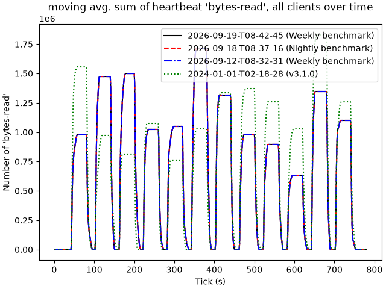

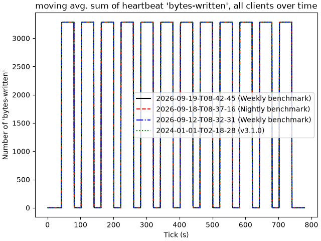

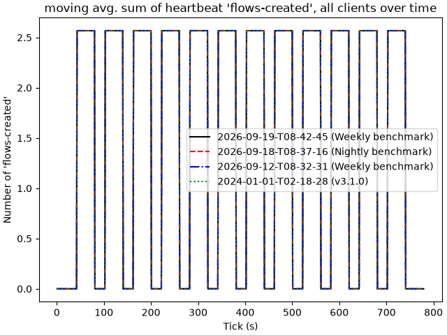

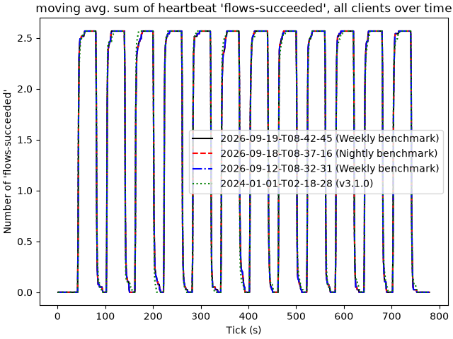

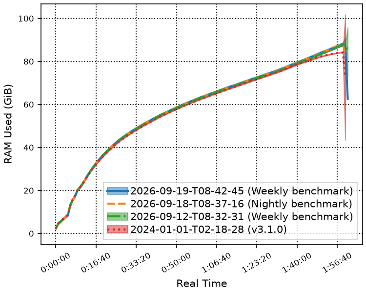

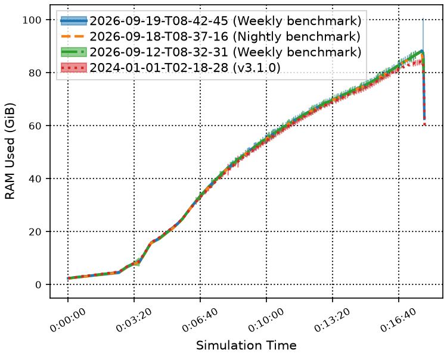

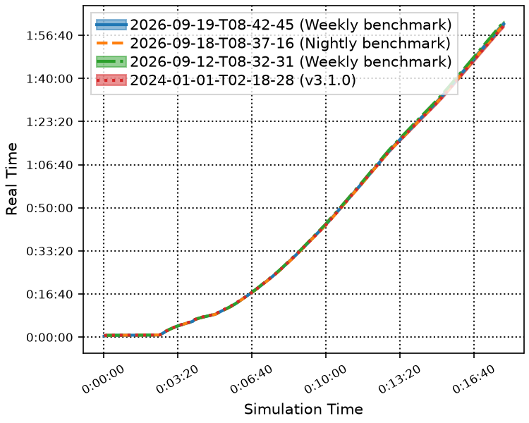

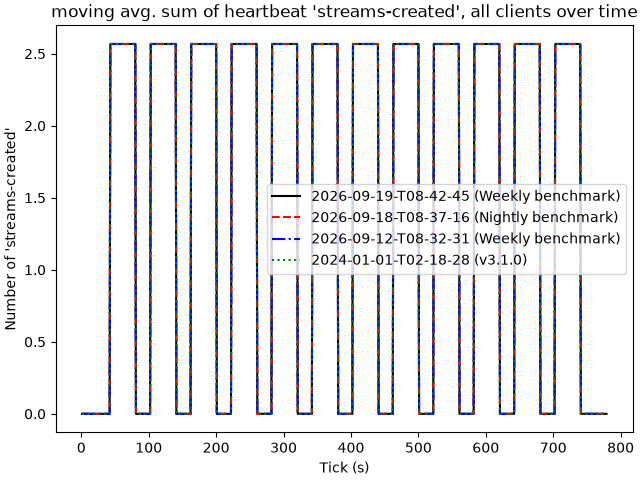

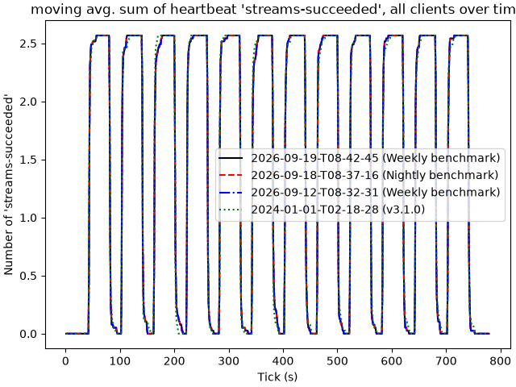

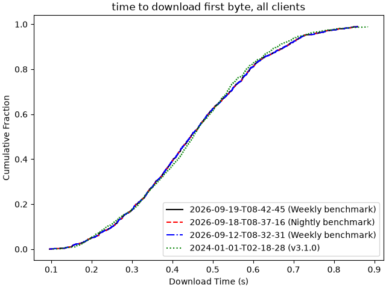

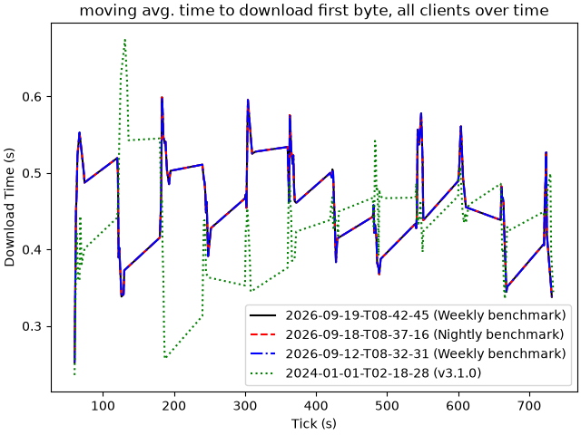

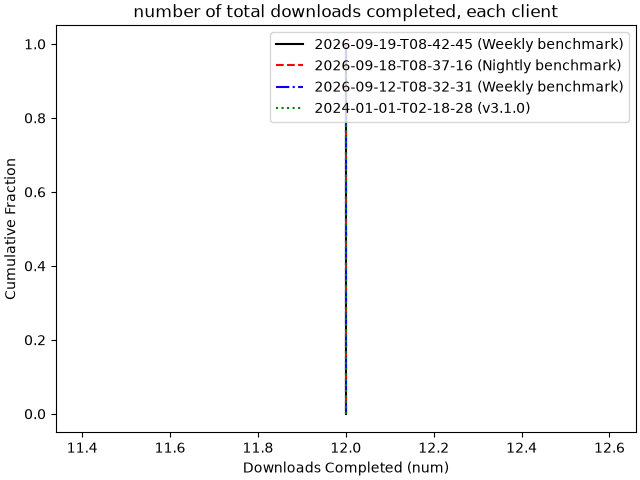

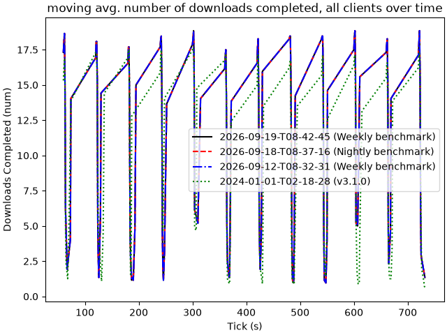

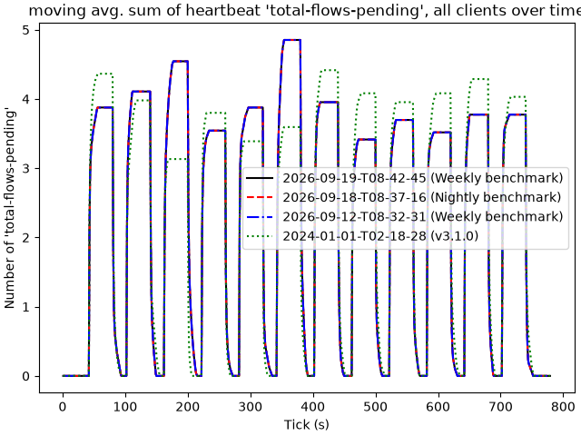

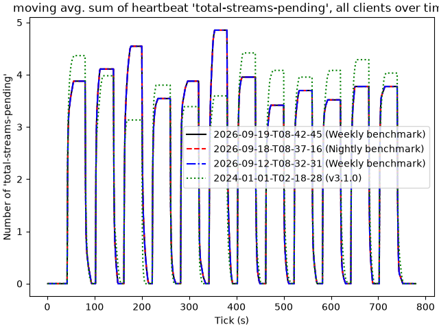
